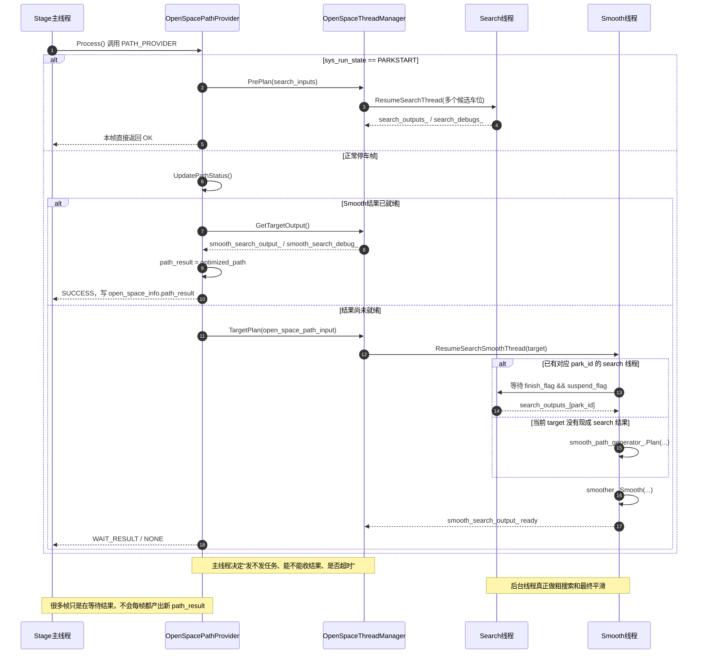

# 18 ValetParkingStageParking 超详细流程图总览

## 概述

本文档的目标不是再单独解释某一个 solver，而是把 `ValetParkingStageParking` 从 Stage 入口、任务分流、线程调度、粗路径生成、平滑、路径分段、速度采样、轨迹发布，一直串到当前工作区可见的最低层函数。

本轮基于源码再次交叉核对后的核心结论如下：

1. `ValetParkingStageParking` 本身不是轨迹求解器，它是 **停车阶段总调度器**，负责把 `FunctionManager` 输入映射为 `parking_type`，再调用 `Stage::ExecuteTaskOnOpenSpace()` 跑 `OPEN_SPACE` 子任务链。
2. 普通 open space 分支的真实主链是：

   `ROI_DECIDER -> PATH_PROVIDER -> PATH_PARTITION -> SPEED_OPTIMIZER -> Stage 发布轨迹`

3. `PATH_PROVIDER` 不是单线程同步算完整路径，它内部通过 `OpenSpaceThreadManager` 分成：

   - 多个 search thread 预搜索/按目标搜索
   - 一个 smooth thread 收口粗路径并做 NLP 平滑

4. `OpenSpacePathGenerator::GenerateCoarsePath()` 才是粗路径搜索总分发点，当前工作区可见它会按条件调用：

   - `ILQR::Plan()`
   - `GeometricPath::Plan()`
   - `GeometryPathGenerator::Plan()`
   - `HybridAStar::Plan()`

5. 当前链路里存在两个不同层次的“partition”：

   - `OpenSpacePathGenerator` 内部的 `PathGenerator::PathPartition`，它是 **粗路径切成 gear 段**
   - `OpenSpacePathPartition::Process()`，它是 **任务级路径仲裁/终点判定/HMI 状态收口**

6. `OpenSpaceSpeedOptimizer` 的最低层不是一个单函数优化器，而是一条：

   `PathHandle::Process -> ST 曲线采样 -> StSampleCost 打分 -> 选最优曲线 -> CombinePathAndSpeed`

7. 直行 `DIRECT_FORWARD / DIRECT_BACKWARD` 是一条独立支路，跳过普通 `ROI / PATH_PROVIDER / PATH_PARTITION`，由 `OpenSpaceStraightPathProvider` 直接生成直线路径或 stop path，再进入速度层。

> 当前工作区已经能把“流程最低层”落到 `HybridAStar / GeometryPathGenerator / GeometricPath / ILQR / NlpPathSmoother / StCurve / StSampleCost` 这一层；更底层数学公式和动作基元推导不在本文重复，而直接回指现有 `04` 到 `08` 号文档。

---

## 架构流程

### 1. Stage 到最低层函数的总调用树

```text
ValetParkingStageParking::Process
|- set stage_type / is_on_open_space_trajectory
|- IsParkingBrakeCondition
|- SetParkingType
`- Stage::ExecuteTaskOnOpenSpace
   |- 普通 open space 分支
   |  |- OpenSpaceRoiDecider::Process
   |  |  |- SensorStateDecider
   |  |  |- UpdateReplanInfo
   |  |  |- UpdateSpeedBumpInfo
   |  |  |- GetParkingSpots
   |  |  |- open_space_obstacle_->UpdateOpenSpaceInfoForSpd
   |  |  |- UpdateWheelMaskToOpenSpace
   |  |  |- open_space_obstacle_->Init
   |  |  |- InputValidCheck
   |  |  |- SetOpenSpacePathInfo
   |  |  |- UpdateTargetPathInfo
   |  |  `- Frame::OpenSpaceCollisionCheck
   |  |
   |  |- OpenSpacePathProvider::Process
   |  |  |- PARKSTART -> PrePlan
   |  |  |  |- LoadOptimizerData(for each park id)
   |  |  |  |- OpenSpaceThreadManager::PrePlan
   |  |  |  |  `- search thread -> OpenSpacePathGenerator::Plan
   |  |  |  |     |- TransInputToLocalFrame
   |  |  |  |     |- RemoveCollisionVirtualObs
   |  |  |  |     |- GenerateCoarsePath
   |  |  |  |     |  |- ILQR::Plan / GeometricPath::Plan /
   |  |  |  |     |  |  GeometryPathGenerator::Plan / HybridAStar::Plan
   |  |  |  |     |- PathGenerator::PathPartition
   |  |  |  |     `- PathDeNormal
   |  |  |  `- GetParkOutput
   |  |  `- 非 PARKSTART -> PlanningOnPathThread
   |  |     |- PreCheck
   |  |     |- 构造 splice_path
   |  |     |- LoadOptimizerData(target id)
   |  |     |- OpenSpaceThreadManager::TargetPlan
   |  |     |  `- smooth thread
   |  |     |     |- 等待对应 search thread 完成 或 直接 search
   |  |     |     |- OpenSpacePathSmoother::Smooth
   |  |     |     |  |- XYRoadPreprocessor
   |  |     |     |  `- NlpSolver
   |  |     |     `- UpdateDebugInfo
   |  |     |- GetTargetOutput
   |  |     `- CheckPathValid
   |  |
   |  |- OpenSpacePathPartition::Process
   |  |  |- UpdateParam
   |  |  |- UpdatePathDecision
   |  |  |- TASK_FINISH / PREPARE_FINISH / TRACK_ABNORMAL / NO_VALID_PATH /
   |  |  |  CHOOSE_HISTORY_PATH / CHOOSE_NEW_PATH 分支
   |  |  |- AdjustRelativeS
   |  |  |- UpdateInfoForPreFinishCondition
   |  |  `- UpdateStatusBasedPartitionResult
   |  |
   |  |- OpenSpaceSpeedOptimizer::Process
   |  |  |- InitInteractiveStage
   |  |  |- SpeedPlanPreCheck
   |  |  |- UpdateSpeedPlanInputInfo
   |  |  |- PathHandle::Process
   |  |  |  |- UpdateCollisionInfo
   |  |  |  |- UpdateInteractiveStage
   |  |  |  |- CutOffPathByCollisionInfo
   |  |  |  |- UpdateSpeedLimits
   |  |  |  `- UpdateDebugInfo
   |  |  |- interactive_stage != INIT ? GenerateStopTrajectory
   |  |  |- UpdateSampleParams
   |  |  |- GenerateTrajectory
   |  |  |  |- SampleStCurves
   |  |  |  |- GetBestCurveIdx
   |  |  |  |  `- StSampleCost::CalCurveCost
   |  |  |  |- best_curve.Discrete
   |  |  |  |  `- StCurve::Discrete
   |  |  |  |- CombinePathAndSpeed
   |  |  |  `- backup fail -> GenerateStopTrajectory
   |  |  `- set speed_optimizer_trajectory
   |  |
   |  `- Stage 收口
   |     |- publishable_trajectory_data
   |     |- target_gear
   |     `- parking_status / finish 判定
   |
   `- 直行 DIRECT_* 分支
      |- OpenSpaceStraightPathProvider::Process
      |  |- NeedStopDecision
      |  |- UpdateOpenSpaceStartPoint
      |  `- GenerateDirectMovingPath
      |- OpenSpaceSpeedOptimizer::Process
      `- Stage 以“命令失活 + 车辆静止”结束
```

### 2. 整体 ASCII 超详细流程图

```text
┌──────────────────────────────────────────────────────────────────────────────┐
│ [A] ValetParkingStageParking::Process(frame)                               │
│ 输入: sys_mode / sys_command / sys_run_state / sys_warning_info / vehicle  │
│      / previous frame / task_list_                                         │
└──────────────────────────────────┬───────────────────────────────────────────┘
                                   ↓
┌──────────────────────────────────────────────────────────────────────────────┐
│ [A0] 写入口标志                                                            │
│ 1. avp_fct_out.stage_type = PARKING                                        │
│ 2. open_space_info.is_on_open_space_trajectory = true                      │
└──────────────────────────────────┬───────────────────────────────────────────┘
                                   ↓
┌──────────────────────────────────────────────────────────────────────────────┐
│ [A1] next_stage_ == NO_STAGE ?                                             │
├──────────────────────────────────────────────────────────────────────────────┤
│ 是: GeneratePauseTrajectory -> SetTargetGear(P) -> parking_status=FINISH   │
│     -> FinishScenario()                                                     │
│ 否: 继续                                                                    │
└──────────────────────────────────┬───────────────────────────────────────────┘
                                   ↓
┌──────────────────────────────────────────────────────────────────────────────┐
│ [A2] IsParkingBrakeCondition(avp_in) ?                                     │
├──────────────────────────────────────────────────────────────────────────────┤
│ 条件1: sys_run_state == STRAIGHTBRAKE                                       │
│      -> parking_type = NOSTATE -> GeneratePauseTrajectory -> return RUNNING │
│ 条件2: sys_run_state == PAUSE && sys_warning_info != WAIT_OBSTALE_0xA       │
│      -> GeneratePauseTrajectory -> return RUNNING                           │
│ 否则: 继续                                                                  │
└──────────────────────────────────┬───────────────────────────────────────────┘
                                   ↓
┌──────────────────────────────────────────────────────────────────────────────┐
│ [A3] SetParkingType(): sys_command -> parking_type                         │
├──────────────────────────────────────────────────────────────────────────────┤
│ SYSTEMON / PARKINCONTROL  -> PARKING_IN                                    │
│ LEFT / RIGHT / FRONT / BACK PARKOUT -> PARKING_OUT_*                       │
│ FORWARDCONTROL / BACKWARDCONTROL -> DIRECT_FORWARD / DIRECT_BACKWARD       │
│ TESTCONTROLMODE -> TEST_CONTROL_MODE                                       │
│ NNSCONTROL / NTPCONTROL -> PARKING_OUT_NNS                                 │
│ BRAKECONTROL && sys_mode==RPA && PARKSTART -> PARKING_IN                   │
│ default -> 保持已有 parking_type                                           │
└──────────────────────────────────┬───────────────────────────────────────────┘
                                   ↓
┌──────────────────────────────────────────────────────────────────────────────┐
│ [A4] parking_type == NOSTATE ?                                             │
├──────────────────────────────────────────────────────────────────────────────┤
│ 是: frame.SetTargetGear(vehicle_state.gear) -> return ERROR                │
│ 否: 进入 Stage::ExecuteTaskOnOpenSpace(frame)                              │
└──────────────────────────────────┬───────────────────────────────────────────┘
                                   ↓
┌──────────────────────────────────────────────────────────────────────────────┐
│ [B] Stage::ExecuteTaskOnOpenSpace(frame)                                   │
│ 输入: task_list_ / parking_type / sys_run_state / speed_optimizer_traj     │
├──────────────────────────────────────────────────────────────────────────────┤
│ [B0] is_straight_path = parking_type in {DIRECT_FORWARD, DIRECT_BACKWARD}  │
│ [B1] 只执行名字包含 OPEN_SPACE 的 task                                     │
│      - 直行: 跳过 ROI / PATH_PROVIDER / PATH_PARTITION                     │
│      - 普通: 跳过 STRAIGHT_PATH                                            │
└───────────────────────┬───────────────────────────────────────┬──────────────┘
                        │ 普通 OPEN_SPACE                        │ DIRECT_* 直行
                        ↓                                        ↓

┌────────────────────────────────────┐          ┌────────────────────────────────────┐
│ [C] 任务1: ROI Decider            │          │ [Z] 直行任务: StraightPathProvider │
│ OpenSpaceRoiDecider::Process()    │          │ OpenSpaceStraightPathProvider::    │
│                                    │          │ Process()                          │
└────────────────┬───────────────────┘          └────────────────┬───────────────────┘
                 ↓                                                 ↓
┌────────────────────────────────────┐          ┌────────────────────────────────────┐
│ [C0-C4] ROI 预处理                 │          │ [Z0] parking_type == DIRECT_* ?    │
├────────────────────────────────────┤          ├────────────────────────────────────┤
│ 1. frame 空指针保护                │          │ 否 -> return STRAIGHTPATH_ERROR    │
│ 2. PARKSTART -> PARKING 时 Reset   │          │ 是 -> move_direction = +/-1        │
│ 3. 初始化 vehicle_state_ /         │          │     chosen_path.gear = D / R       │
│    parking_type_ / freespace       │          └────────────────┬───────────────────┘
│ 4. SensorStateDecider()            │                           ↓
│ 5. UpdateReplanInfo()              │          ┌────────────────────────────────────┐
│ 6. UpdateSpeedBumpInfo()           │          │ [Z1] NeedStopDecision() ?          │
└────────────────┬───────────────────┘          ├────────────────────────────────────┤
                 ↓                              │ 条件1: target_gear != current gear │
┌────────────────────────────────────┐          │ 条件2: vel方向与命令方向相反且未静止│
│ [C5] 获取车位信息                  │          └───────────────┬────────────────────┘
│ GetParkingSpots()                  │                          │ 是
├────────────────────────────────────┤                          ↓
│ 1. 只在 APA 类 parking_type 下装载 │          ┌────────────────────────────────────┐
│ 2. 需要 HasParkingLotOutArray      │          │ [Z2] 停车路径分支                  │
│ 3. open_space_path_info_id =       │          │ 1. is_stop_path = true             │
│    opt_parking_seq()               │          │ 2. UpdateOpenSpaceStartPoint()     │
│ 4. TransParkLotsToOpenSpace()      │          │ 3. GenerateStopPath()              │
└────────────────┬───────────────────┘          └───────────────┬────────────────────┘
                 ↓                                              │ 否
┌────────────────────────────────────┐                          ↓
│ [C6] 感知车位 -> 规划车位          │          ┌────────────────────────────────────┐
├────────────────────────────────────┤          │ [Z3] 直线几何路径分支              │
│ 1. 校验 parking_seq / 顶点数量     │          │ 1. 初始化 original_point / dir     │
│ 2. 解析 TOP_LEFT/BOTTOM_* 顶点     │          │ 2. UpdateOpenSpaceStartPoint()     │
│ 3. 解析 STOP_LEFT / STOP_RIGHT     │          │ 3. GenerateDirectMovingPath()      │
│ 4. 处理 UNFREE / INCOMPLETE /      │          │    - kStepSize = 0.1m              │
│    POSITION_ERROR                  │          │    - FLAGS_direct_move_length      │
│ 5. 记录 is_narrow_spot / sensor    │          └───────────────┬────────────────────┘
│ 6. is_right_side =                 │                          │
│    IsParkLotInRightSide()          │                          │
└────────────────┬───────────────────┘                          │
                 ↓                                              │
┌────────────────────────────────────┐                          │
│ [C6.1] 判断车位类型                │                          │
│ park_type = ?                      │                          │
└─┬─────────────────┬────────────┬───┘                          │
  │                 │            │                              │
  │ VERTICAL        │ OBLIQUE    │ LATERAL                      │
  ↓                 ↓            ↓                              │
┌────────────────────────────────────┐                          │
│ [C6.2] 判断车位方向                │                          │
│ is_right_side = ?                  │                          │
│ ← IsParkLotInRightSide()           │                          │
└─┬──────────────────────┬───────────┘                          │
  │ 右侧车位             │ 左侧车位                             │
  ↓                      ↓                                     │
┌────────────────────┐  ┌────────────────────┐                  │
│ 右侧场景模板       │  │ 左侧场景模板       │                  │
│ RIGHT_* scenario   │  │ LEFT_* scenario    │                  │
└────────┬───────────┘  └────────┬───────────┘                  │
         └────────────────┬──────┘                              │
                          ↓                                     │
┌──────────────────────────────────────────────────────────────────────────────┐
│ [C6.3] 确定 parking_scenario_type_ptr                                       │
├──────────────────────────────────────────────────────────────────────────────┤
│ 入位: RIGHT/LEFT_VERTICAL_PARKING_IN / *_OBLIQUE_PARKING_IN / *_LATERAL_IN │
│ 出位: RIGHT/LEFT_VERTICAL_PARKING_OUT / *_OBLIQUE_PARKING_OUT              │
│      FORWARD/BACKWARD_VERTICAL_PARKING_OUT / *_LATERAL_PARKING_OUT         │
│ 其他: TEST_CONTROL_MODE -> CONTROL_CALIBRATION_MODE                         │
└──────────────────────────────────┬───────────────────────────────────────────┘
                                   ↓
┌────────────────────────────────────┐
│ [C7] 同步障碍与轮挡信息            │
├────────────────────────────────────┤
│ 1. UpdateOpenSpaceInfoForSpd()     │
│ 2. UpdateWheelMaskToOpenSpace()    │
│ 3. open_space_obstacle_->Init()    │
└────────────────┬───────────────────┘
                 ↓
┌────────────────────────────────────┐
│ [C8] 输入合法性检查                │
│ InputValidCheck()                  │
├────────────────────────────────────┤
│ 1. opt_parking_id 必须存在         │
│ 2. parking_lot.status == NORMAL    │
│ 3. NNS_ADJUST 需要 end_pose 完整   │
└────────────────┬───────────────────┘
                 ↓
┌────────────────────────────────────┐
│ [C9] 构造路径输入容器              │
│ SetOpenSpacePathInfo()             │
├────────────────────────────────────┤
│ 输出: open_space_path_info_map[id] │
│ 字段: path_strategy / obstacles /  │
│ roi / end_point / dest_region      │
└────────────────┬───────────────────┘
                 ↓
┌────────────────────────────────────┐
│ [C10] 更新目标位姿                 │
│ UpdateTargetPathInfo()             │
├────────────────────────────────────┤
│ park_type == LATERAL ?             │
│  - 是 -> SetLateralSlotEndPose()   │
│  - 否 -> SetNonLateralSlotEndPose()│
└────────────────┬───────────────────┘
                 ↓
┌────────────────────────────────────┐
│ [C11] ROI 碰撞检查                 │
│ Frame::OpenSpaceCollisionCheck()   │
├────────────────────────────────────┤
│ 冲突 -> ROI 阶段直接报错返回       │
│ 不冲突 -> 进入 PathProvider        │
└────────────────┬───────────────────┘
                 ↓
┌────────────────────────────────────┐
│ [D] 任务2: Path Provider           │
│ OpenSpacePathProvider::Process()   │
└────────────────┬───────────────────┘
                 ↓
┌────────────────────────────────────┐
│ [D0] 入口分支                      │
│ sys_run_state == PARKSTART &&      │
│ parking_type != NNS_ADJUST ?       │
└─┬──────────────────────┬───────────┘
  │ 是                   │ 否
  ↓                      ↓
┌────────────────────────────────────┐          ┌────────────────────────────────────┐
│ [D0.1] PrePlan 主链                │          │ [D1] PreCheck() 前检查             │
├────────────────────────────────────┤          ├────────────────────────────────────┤
│ 1. UpdateCurTaskReplanStatus()     │          │ 1. 计算 lateral park-out buffer    │
│ 2. 遍历 open_space_path_info_map   │          │ 2. extra_buffer > 0 ?              │
│ 3. LoadOptimizerData(each path_id) │          │ 3. 构造 adc_polygon / low_fs_poly  │
│ 4. ThreadManager::PrePlan()        │          │ 4. overlap 检查                    │
│ 5. search thread -> PathGenerator  │          │ 5. 空间不足 -> ERROR               │
│ 6. GetParkOutput(debug/cache)      │          │ 6. 通过 -> 进入正式线程规划        │
│ 7. return OK，本帧不发布 path_result│          └────────────────┬───────────────────┘
└────────────────┬───────────────────┘                           ↓
                 │                              ┌────────────────────────────────────┐
                 │                              │ [D2] PlanningOnPathThread()        │
                 │                              ├────────────────────────────────────┤
                 │                              │ 1. 构造 splice_path                │
                 │                              │ 2. LoadOptimizerData(target id)    │
                 │                              │ 3. ThreadManager::TargetPlan()     │
                 │                              │ 4. plan_thread_status = RUNNING    │
                 │                              └────────────────┬───────────────────┘
                 │                                               ↓
                 │                              ┌────────────────────────────────────┐
                 │                              │ [D2.1] search/smooth 线程收口      │
                 │                              ├────────────────────────────────────┤
                 │                              │ 已有 search 结果 ?                 │
                 │                              │  - 是 -> 等待并复制 search output  │
                 │                              │  - 否 -> 直接 search / smooth      │
                 │                              │ 统一 -> smoother.Smooth()          │
                 │                              │      -> GetTargetOutput()          │
                 │                              └────────────────┬───────────────────┘
                 └──────────────────────────────┬─────────────────┘
                                                ↓
┌──────────────────────────────────────────────────────────────────────────────┐
│ [D3] UpdatePathStatus() 状态机                                              │
├──────────────────────────────────────────────────────────────────────────────┤
│ plan_thread_status_ == OFF:                                                 │
│ 1. replan_status_ > 0 -> UpdateReplanInfo()                                 │
│ 2. status = WAIT_RESULT                                                     │
│ 3. 重置 thread_start_time / no_valid_path_start_time                        │
│                                                                              │
│ plan_thread_status_ == RUNNING:                                             │
│ 1. 默认 status = WAIT_RESULT                                                │
│ 2. GetTargetOutput 成功 && has_smoothed && error_msg.empty() ?             │
│    - 是 -> CheckPathValid()                                                 │
│         * 成功 -> SUCCESS                                                   │
│         * segment >= FLAGS_apa_gear_shift_limit -> PATH_SEGMENT_OVER_LIMIT  │
│         * 起点不匹配 -> START_POINT_MISMATCH                                │
│    - 否且 error_msg 非空 -> SEARCH_FAILED                                   │
│ 3. 长时间无有效路径 -> OVER_TIME                                            │
└────────────────┬─────────────────────────────────────────────────────────────┘
                 ↓
┌────────────────────────────────────┐
│ [E] 任务3: 粗路径生成              │
│ OpenSpacePathGenerator::Plan()     │
└────────────────┬───────────────────┘
                 ↓
┌────────────────────────────────────┐
│ [E0] 预处理                        │
├────────────────────────────────────┤
│ 1. output.Reset()                  │
│ 2. TransInputToLocalFrame()        │
│ 3. warm_start_path 归一化          │
│ 4. collision / trace / ref line    │
│    局部坐标归一化                  │
│ 5. RemoveCollisionVirtualObs()     │
└────────────────┬───────────────────┘
                 ↓
┌────────────────────────────────────┐
│ [E1] GenerateCoarsePath() 路由     │
│ path_strategy.disable_search ?     │
└─┬──────────────────────┬───────────┘
  │ 是                   │ 否
  ↓                      ↓
┌────────────────────┐   ┌────────────────────────────────────┐
│ default warm start │   │ park_direction == PARKIN &&        │
│ result             │   │ ILQR::Plan() success ?             │
└────────┬───────────┘   └───────────────┬────────────────────┘
         │                                │ 是
         │                                ↓
         │               ┌────────────────────────────────────┐
         │               │ ILQR::Plan()                      │
         │               └───────────────┬────────────────────┘
         │                                │ 否
         │                                ↓
         │               ┌────────────────────────────────────┐
         │               │ use_geometry_strategy = ?          │
         │               └─┬──────────────┬─────────────┬─────┘
         │                 │              │             │
         │                 │ ONLY_USE     │ USE_FIRST   │ USE_LAST/BOTH/default
         │                 ↓              ↓             ↓
         │   ┌────────────────────┐ ┌────────────────┐ ┌──────────────────────┐
         │   │ GeometricPath::Plan│ │ GeometricPath  │ │ GeometryPathGenerator│
         │   └────────┬───────────┘ │ -> fail then   │ │ + HybridAStar::Plan  │
         │            │             │ HybridAStar    │ └──────────┬───────────┘
         │            │             └──────┬─────────┘            │
         │            └────────────────────┴──────────────────────┘
         │                                 ↓
         │                    ┌──────────────────────────────┐
         │                    │ trace_adjust ?               │
         │                    │ -> CombineTraceAdjustPath()  │
         │                    └──────────────┬───────────────┘
         └───────────────────────────────────┘
                                              ↓
┌────────────────────────────────────┐
│ [E2] 粗路径收口                    │
├────────────────────────────────────┤
│ 1. PathGenerator::PathPartition()  │
│ 2. 失败 -> error_msg 返回          │
│ 3. 成功 -> PathDeNormal()          │
│ 4. 输出 partitioned_path           │
└────────────────┬───────────────────┘
                 ↓
┌────────────────────────────────────┐
│ [F] 任务4: 路径平滑                │
│ OpenSpacePathSmoother::Smooth()    │
└────────────────┬───────────────────┘
                 ↓
┌────────────────────────────────────┐
│ [G] 任务5: 路径仲裁                │
│ OpenSpacePathPartition::Process()  │
└────────────────┬───────────────────┘
                 ↓
┌────────────────────────────────────┐
│ [G0] UpdatePathDecision() 候选装配 │
├────────────────────────────────────┤
│ 1. 读取 history_path / path_result │
│ 2. PathMatch(history / new)        │
│ 3. UpdateCollisionDistance()       │
│ 4. alternative_path -> PathDecider │
└────────────────┬───────────────────┘
                 ↓
┌────────────────────────────────────┐
│ [G0.1] PathDecider() 先选路径源    │
└─┬──────────────┬─────────────┬─────┘
  │ 无有效路径    │ CHOOSE_     │ CHOOSE_
  │ -> NO_VALID   │ HISTORY_PATH│ NEW_PATH
  ↓               ↓             ↓
┌────────────────────┐ ┌────────────────────┐ ┌────────────────────┐
│ SetStopPath(pub)   │ │ 保留 history path  │ │ 保留 new path      │
│ decision=NO_VALID  │ │ decision=CHOOSE_   │ │ decision=CHOOSE_   │
│ _PATH              │ │ HISTORY_PATH       │ │ NEW_PATH           │
└────────┬───────────┘ └────────┬───────────┘ └────────┬───────────┘
         └────────────────┬─────┴─────────────┬────────┘
                          ↓
┌────────────────────────────────────┐
│ [G1] IsTaskFinish() 完成判定       │
├────────────────────────────────────┤
│ PARKING_IN / TEST_CONTROL_MODE     │
│ -> GetAdcStatus -> FinishCheck     │
│ PARKING_OUT_* -> IsSatisfyParkOut  │
│ PARKING_OUT_NNS -> IsVehOnRoad     │
│ NNS_ADJUST -> false                │
│ 输出: destination_reached          │
└────────────────┬───────────────────┘
                 ↓
┌────────────────────────────────────┐
│ [G2] 终态/异常优先级覆写           │
│ IsTaskFinish / IsTrackAbnormal /   │
│ PREFINISH_BRAKING ?                │
└─┬──────────────┬─────────────┬─────┬──────────────┘
  │ TASK_FINISH   │ TRACK_      │ PREPARE_         │ 否
  │               │ ABNORMAL    │ FINISH           │ 保留 G0.1 结果
  ↓               ↓             ↓                  ↓
┌────────────────┐ ┌────────────────┐ ┌────────────────┐ ┌──────────────────┐
│ SetStopPath(P) │ │ SetStopPath(pub)│ │ decision=      │ │ 沿用 NO_VALID /  │
│ decision=TASK_ │ │ decision=TRACK_ │ │ PREPARE_FINISH │ │ CHOOSE_HISTORY / │
│ FINISH         │ │ ABNORMAL        │ │                │ │ CHOOSE_NEW       │
└────────┬───────┘ └────────┬───────┘ └────────┬───────┘ └─────────┬────────┘
         └──────────────────┬──────────────┬───┴───────────────────┘
                            ↓
┌──────────────────────────────────────────────────────────────────────────────┐
│ [G3] switch(openspace_path_decision) 写回                                   │
├──────────────────────────────────────────────────────────────────────────────┤
│ TASK_FINISH    -> park_bar_percent=11 / nns_distance=0 / parking_status=MF │
│                    / is_stop_path=true                                      │
│ PREPARE_FINISH -> park_bar_percent=10 / nns_distance=1                     │
│ TRACK_ABNORMAL -> UpdateReplanStatus(TRACK_ABNORMAL) / is_stop_path=true   │
│ NO_VALID_PATH  -> UpdateReplanStatus(NO_VALID_PATH) / is_stop_path=true    │
│ CHOOSE_HISTORY -> UpdateHistoryPath() / UpdateParkDisplay()                │
│ CHOOSE_NEW     -> UpdateHistoryPath() / UpdateParkDisplay()                │
└────────────────┬─────────────────────────────────────────────────────────────┘
                 ↓
┌────────────────────────────────────┐
│ [G4] 公共收口                      │
├────────────────────────────────────┤
│ 1. AdjustRelativeS()               │
│ 2. UpdateInfoForPreFinishCondition │
│ 3. UpdateStatusBasedPartitionResult│
│ 4. avp_to_hmi.is_mirror_fold       │
└────────────────┬───────────────────┘
                 │
                 ├──────────────────────────────────────────────────────┐
                 │                                                      │
                 ↓                                                      ↓
┌────────────────────────────────────┐          ┌────────────────────────────────────┐
│ 普通 OPEN_SPACE 几何路径输出       │          │ DIRECT_* 几何路径输出              │
│ chosen_partitioned_path            │          │ chosen_partitioned_path / stop path│
└────────────────┬───────────────────┘          └────────────────┬───────────────────┘
                 └──────────────────────────────┬─────────────────┘
                                                ↓
┌──────────────────────────────────────────────────────────────────────────────┐
│ [H] 任务6: Speed Optimizer                                                  │
│ OpenSpaceSpeedOptimizer::Process(frame)                                     │
└──────────────────────────────────┬───────────────────────────────────────────┘
                                   ↓
┌────────────────────────────────────┐
│ [H0] 速度层入口                    │
├────────────────────────────────────┤
│ 1. complete_path = chosen_path     │
│ 2. gear = chosen_path.gear         │
│ 3. trajectory_gear.second = gear   │
│ 4. InitInteractiveStage(gear)      │
│ 5. SpeedPlanPreCheck()             │
│ 6. UpdateSpeedPlanInputInfo()      │
└────────────────┬───────────────────┘
                 ↓
┌────────────────────────────────────┐
│ [H1] SpeedPlanPreCheck 通过 ?      │
└─┬──────────────────────┬───────────┘
  │ 否                   │ 是
  ↓                      ↓
┌────────────────────┐   ┌────────────────────────────────────┐
│ GenerateStopTraj   │   │ [H2] PathHandle::Process()         │
│ 直接输出停轨迹     │   ├────────────────────────────────────┤
└────────┬───────────┘   │ 1. UpdateCollisionInfo()           │
         │               │ 2. UpdateInteractiveStage()        │
         │               │ 3. CutOffPathByCollisionInfo()     │
         │               │ 4. UpdateSpeedLimits()             │
         │               │ 5. UpdateDebugInfo()               │
         │               └────────────────┬───────────────────┘
         │                                ↓
         │               ┌────────────────────────────────────┐
         │               │ [H2.1] InteractiveStage 状态机     │
         │               ├────────────────────────────────────┤
         │               │ INIT + 近碰撞 -> WAITREPLAN /      │
         │               │                WAITOBSTACLE        │
         │               │ WAITREPLAN -> INIT / WAITOBSTACLE  │
         │               │ WAITOBSTACLE -> RUNNING            │
         │               │ RUNNING -> 保持 RUNNING / 仿真回INIT│
         │               └────────────────┬───────────────────┘
         │                                ↓
         │               ┌────────────────────────────────────┐
         │               │ [H3] interactive_stage == INIT ?  │
         │               └─┬──────────────────────┬───────────┘
         │                 │ 否                   │ 是
         │                 ↓                      ↓
         │      ┌────────────────────┐  ┌────────────────────────────────────┐
         │      │ GenerateStopTraj   │  │ [H4] ST 采样主链                   │
         │      │ 交互态未放行则停   │  ├────────────────────────────────────┤
         │      └────────┬───────────┘  │ 1. UpdateSampleParams()            │
         │               │              │ 2. SampleStCurves()                │
         │               │              │ 3. GetBestCurveIdx()               │
         │               │              │    - thread_count = clamp(...)     │
         │               │              │    - StSampleCost::CalCurveCost()  │
         │               │              │ 4. best_curve.Discrete()           │
         │               │              │    -> StCurve::Discrete()          │
         │               │              │ 5. CombinePathAndSpeed()           │
         │               │              └────────────────┬───────────────────┘
         │               │                               ↓
         │               │              ┌────────────────────────────────────┐
         │               │              │ [H4.1] SampleTrajectory 成功 ?    │
         │               │              └─┬──────────────────────┬───────────┘
         │               │                │ 否                   │ 是
         │               │                ↓                      ↓
         │               │    ┌──────────────────────────────┐  ┌─────────────────┐
         │               │    │ GenerateBackUpTrajectory()   │  │ 输出 speed_     │
         │               │    └──────────────┬───────────────┘  │ optimizer_traj  │
         │               │                   ↓                  └──────┬──────────┘
         │               │    ┌────────────────────────────────────┐     │
         │               │    │ backup success ?                   │     │
         │               │    └─┬──────────────────────┬───────────┘     │
         │               │      │ 否                   │ 是              │
         │               │      ↓                      ↓                │
         │               │ ┌───────────────┐   ┌─────────────────┐     │
         │               │ │ StopTrajectory │   │ 输出 speed_     │     │
         │               │ └──────┬────────┘   │ optimizer_traj  │     │
         │               └────────┴────────────┴─────────────────┴─────┘
         └───────────────────────────────────────────────────────────────┐
                                                                         ↓
┌──────────────────────────────────────────────────────────────────────────────┐
│ [I] Stage 收口与 finish 判定                                                │
├──────────────────────────────────────────────────────────────────────────────┤
│ 1. publishable_trajectory_data = speed_optimizer_trajectory                 │
│ 2. frame.SetTargetGear(gear)                                                │
│ 3. speed_task_interactive_stage -> avp_fct_out.parking_status               │
│ 4. IsReadyToFinishStage(frame):                                             │
│    - PARKING_OUT_NNS -> destination_reached -> PARKINGFINISHED             │
│    - 普通泊车 -> standstill && destination_reached -> MISSIONFINISHED      │
│    - DIRECT_* -> 命令失活 && standstill -> MISSIONFINISHED                 │
│ 5. sys_mode in {ISM,NTP} -> next_stage = VALET_PARKING_CRUISE              │
│    其他 -> FinishScenario()                                                 │
└──────────────────────────────────────────────────────────────────────────────┘
```

#### ASCII 字段增强版（关键框 IN/OUT）

这一版把同一条主链压缩成“关键框 + 关键输入/输出”。上面的主图负责看控制流，这一版负责看字段怎么一站一站往下传；两张图一起读，能同时看清“谁在控流程”和“谁在改信号”。

```text
┌──────────────────────────────────────────────────────────────────────────────┐
│ [A] Stage 入口                                                              │
│ IN : fct_avp_in.sys_mode / sys_command / sys_run_state / sys_warning_info   │
│ OUT: avp_fct_out.stage_type / avp_status.parking_type / avp_fct_out.status  │
└────────────────────┬─────────────────────────────────────────────────────────┘
                     ↓
┌──────────────────────────────────────────────────────────────────────────────┐
│ [B] Task 分发                                                               │
│ IN : parking_type / sys_run_state / task_list_                              │
│ OUT: OPEN_SPACE task 链 或 DIRECT_* 直行链                                  │
└───────────────┬───────────────────────────────────────────────┬──────────────┘
                │                                               │
                ↓                                               ↓
┌────────────────────────────────────┐          ┌────────────────────────────────────┐
│ [C] ROI Decider                    │          │ [Z] StraightPathProvider           │
│ IN : parking_type / vehicle_state  │          │ IN : DIRECT_* parking_type /       │
│      / opt_parking_seq / free_space│          │      vehicle_state / start_point   │
│ OUT: path_info_id / path_info_map  │          │ OUT: chosen_partitioned_path /     │
│      / end_pose / dest_region      │          │      is_stop_path                  │
└────────────────┬───────────────────┘          └────────────────┬───────────────────┘
                 ↓                                              │
┌────────────────────────────────────┐                          │
│ [D] PathProvider                   │                          │
│ IN : path_info_id / path_info_map  │                          │
│      / planning_start_point        │                          │
│ OUT: path_result / is_reach_       │                          │
│      precise_target                │                          │
└────────────────┬───────────────────┘                          │
                 ↓                                              │
┌────────────────────────────────────┐                          │
│ [E] PathGenerator                  │                          │
│ IN : start_point / end_pose /      │                          │
│      xy_bounds / obstacles /       │                          │
│      dest_region / path_strategy   │                          │
│ OUT: partitioned_path / path_type /│                          │
│      replan_status / error_msg     │                          │
└────────────────┬───────────────────┘                          │
                 ↓                                              │
┌────────────────────────────────────┐                          │
│ [F] PathSmoother                   │                          │
│ IN : partitioned_path /            │                          │
│      obj_segments / dest_region    │                          │
│ OUT: smoothed partitioned_path /   │                          │
│      has_smoothed / error_msg      │                          │
└────────────────┬───────────────────┘                          │
                 ↓                                              │
┌──────────────────────────────────────────────────────────────────────────────┐
│ [G] PathPartition                                                            │
│ IN : path_result / parking_type / vehicle_state                              │
│ OUT: chosen_partitioned_path / destination_reached / is_stop_path / HMI      │
└────────────────────┬─────────────────────────────────────────────────────────┘
                     ↓
┌──────────────────────────────────────────────────────────────────────────────┐
│ [G0] 路径源选择                                                             │
│ IN : history_path / new path_result / previous_frame / guard flag            │
│ OUT: NO_VALID_PATH / CHOOSE_HISTORY_PATH / CHOOSE_NEW_PATH                   │
└────────────────────┬─────────────────────────────────────────────────────────┘
                     ↓
┌──────────────────────────────────────────────────────────────────────────────┐
│ [G1] 完成/异常覆写                                                         │
│ IN : chosen_path / parking_type / task_finish_status_                        │
│ OUT: TASK_FINISH / PREPARE_FINISH / TRACK_ABNORMAL / destination_reached     │
└────────────────────┬─────────────────────────────────────────────────────────┘
                     ↓
┌──────────────────────────────────────────────────────────────────────────────┐
│ [G2] 业务写回                                                               │
│ IN : final decision                                                          │
│ OUT: park_bar_percent / nns_distance / is_mirror_fold / replan / stop path   │
└───────────────┬───────────────────────────────────────────────┬──────────────┘
                │                                               │
                ↓                                               ↓
┌────────────────────────────────────┐          ┌────────────────────────────────────┐
│ OPEN_SPACE chosen_path             │          │ DIRECT_* chosen_path / stop path   │
└────────────────┬───────────────────┘          └────────────────┬───────────────────┘
                 └──────────────────────────────┬─────────────────┘
                                                ↓
┌──────────────────────────────────────────────────────────────────────────────┐
│ [H] SpeedOptimizer                                                          │
│ IN : chosen_partitioned_path / is_stop_path / parking_type / obstacles      │
│ OUT: speed_optimizer_trajectory / speed_task_interactive_stage / collision  │
│      risk / future_collision_point / replan_triggered_by_speed_plan         │
└────────────────────┬─────────────────────────────────────────────────────────┘
                     ↓
┌──────────────────────────────────────────────────────────────────────────────┐
│ [I] Stage 收口                                                              │
│ IN : speed_optimizer_trajectory / interactive_stage / destination_reached    │
│ OUT: publishable_trajectory_data / target_gear / parking_status / next_stage │
└──────────────────────────────────────────────────────────────────────────────┘
```

#### ASCII 字段增强版（二）H 速度层字段级子分支

这一版只把 `H` 速度层继续向下拆。重点不是再讲一遍“速度层会采样”，而是把 **内部 `interactive_stage_` 怎么流转、`is_stop_path` 在哪里短路、`speed_task_interactive_stage` 和 `future_collision_point` 在哪里真正落到 `open_space_info`** 画清楚。

```text
┌──────────────────────────────────────────────────────────────────────────────┐
│ [H] OpenSpaceSpeedOptimizer::Process(frame)                                 │
│ IN : chosen_partitioned_path.first / chosen_partitioned_path.second         │
│      open_space_info.is_stop_path / PlanningStartPoint / vehicle_state      │
│ OUT: speed_optimizer_trajectory / internal interactive_stage_               │
└──────────────────────────────────┬───────────────────────────────────────────┘
                                   ↓
┌──────────────────────────────────────────────────────────────────────────────┐
│ [H0] 装载几何路径与档位                                                     │
│ OUT: complete_path / gear / trajectory_gear.second                          │
└──────────────────────────────────┬───────────────────────────────────────────┘
                                   ↓
┌──────────────────────────────────────────────────────────────────────────────┐
│ [H0.1] InitInteractiveStage(gear)                                           │
│ IN : gear / 上一帧 interactive_stage_ / fct_avp_in.sys_run_state            │
│ OUT: internal interactive_stage_                                            │
│      -> speed_plan_collision_info.speed_task_inter_stage(初写)              │
└──────────────────────────────────┬───────────────────────────────────────────┘
                                   ↓
┌──────────────────────────────────────────────────────────────────────────────┐
│ [H1] SpeedPlanPreCheck()                                                    │
│ IN : complete_path / gear / open_space_info.is_stop_path                    │
│ OUT: pre_check_msg                                                          │
└─┬───────────────────────────────────────────────┬────────────────────────────┘
  │ msg 非空                                       │ msg 为空
  ↓                                                ↓
┌───────────────────────┐              ┌───────────────────────────────────────┐
│ GenerateStopTrajectory│              │ [H2] UpdateSpeedPlanInputInfo()      │
│ OUT: 停轨迹           │              │ IN : gear / is_gear_changed /         │
│      speed_optimizer_ │              │      parking_type / sys_mode          │
│      trajectory       │              │ OUT: is_forward_ / speed_bound_info   │
└───────────────────────┘              │      / is_rpa_direct_mode /           │
                                       │      start_point.v=0,a=0(若换挡)      │
                                       └──────────────────┬────────────────────┘
                                                          ↓
┌──────────────────────────────────────────────────────────────────────────────┐
│ [H3] PathHandle::Process()                                                  │
│ IN : complete_path / obstacles / freespace / vehicle_state / partitioned    │
│      paths / is_forward_ / is_rpa_direct_mode / speed_bound_info / mirror   │
│ OUT: candidate_path / internal interactive_stage_ / collision debug fields   │
└──────────────────────────────────┬───────────────────────────────────────────┘
                                   ↓
┌──────────────────────────────────────────────────────────────────────────────┐
│ [H3.1] CutOffPathByWheelMask()                                              │
│ OUT: collision_check_path / wheel_mask_distance /                           │
│      speed_plan_collision_info.is_stop_near_wheel_mask(失败或近停时)        │
└──────────────────────────────────┬───────────────────────────────────────────┘
                                   ↓
┌──────────────────────────────────────────────────────────────────────────────┐
│ [H3.2] UpdateCollisionInfo()                                                │
│ OUT: collision_type / first_collision_index / curr_collision_distance        │
└──────────────────────────────────┬───────────────────────────────────────────┘
                                   ↓
┌──────────────────────────────────────────────────────────────────────────────┐
│ [H3.3] CutOffPathByCollisionInfo()                                          │
│ OUT: candidate_path                                                         │
└──────────────────────────────────┬───────────────────────────────────────────┘
                                   ↓
┌──────────────────────────────────────────────────────────────────────────────┐
│ [H3.4] UpdateInteractiveStage()                                             │
│ IN : is_vehicle_still / is_rpa_direct_mode / collision_info / prev stage    │
│ OUT: internal interactive_stage_ = INIT / WAITREPLAN / WAITOBSTACLE /       │
│      RUNNING                                                                 │
└──────────────────────────────────┬───────────────────────────────────────────┘
                                   ↓
┌──────────────────────────────────────────────────────────────────────────────┐
│ [H3.5] UpdateSpeedLimits()                                                  │
│ OUT: spd_limit_points / speed limits by s                                   │
└──────────────────────────────────┬───────────────────────────────────────────┘
                                   ↓
┌──────────────────────────────────────────────────────────────────────────────┐
│ [H3.6] UpdateDebugInfo() 真正落字段                                          │
│ OUT: speed_plan_collision_info.speed_task_inter_stage                        │
│      speed_plan_collision_info.collision_type / collision_distance           │
│      open_space_info.future_collision_point                                 │
│      open_space_info.replan_triggered_by_speed_plan                         │
│      open_space_info.current_path_has_collision_risk                        │
│      speed_plan_collision_info.is_stop_near_wheel_mask                      │
└──────────────────────────────────┬───────────────────────────────────────────┘
                                   ↓
┌────────────────────────────────────┐
│ [H4] internal interactive_stage_  │
│      == INIT ?                     │
└─┬──────────────────────┬───────────┘
  │ 否                   │ 是
  ↓                      ↓
┌────────────────────┐   ┌────────────────────────────────────┐
│ GenerateStopTraj   │   │ [H5] ST 采样 / GenerateTrajectory  │
│ OUT: 停轨迹        │   │ OUT: speed_optimizer_trajectory    │
│      speed_        │   │      (t / s / v / a)               │
│      optimizer_traj│   └────────────────┬───────────────────┘
└────────┬───────────┘                    ↓
         └────────────────────────────────┴─────────────────────┐
                                                                ↓
┌──────────────────────────────────────────────────────────────────────────────┐
│ [H6] 速度层最终对外字段                                                     │
│ OUT: open_space_info.speed_optimizer_trajectory                              │
│      open_space_info.speed_plan_collision_info.speed_task_inter_stage        │
│      open_space_info.future_collision_point                                  │
│      open_space_info.replan_triggered_by_speed_plan                          │
└──────────────────────────────────────────────────────────────────────────────┘
```

读这张图时要特别分清两件事：第一，`interactive_stage_` 是速度层内部状态，只有经过 `UpdateDebugInfo()` 才会同步成外部可见的 `speed_task_inter_stage`；第二，`is_stop_path` 在 `SpeedPlanPreCheck()` 就可能把整条采样链短路掉，所以它比后面的 ST 采样更早决定“这帧能不能继续走”。

#### H 速度层专用 ASCII 大图（只讲 PathHandle 内部）

这一版继续只下钻 `PathHandle::Process()`。目的不是重复上一张图，而是把 `PathHandle` 这个真正决定 **碰撞信息、等待状态、限速、风险标记** 的内部控制点单独拆开。

```text
┌──────────────────────────────────────────────────────────────────────────────┐
│ [PH] PathHandle::Process()                                                  │
│ IN : complete_path / obstacles / freespace_out_array / vehicle_state        │
│      is_vehicle_still / is_forward / is_rpa_direct_mode / speed_bound_info  │
│      is_mirror_fold / open_space_info.partitioned_paths                     │
│ OUT: candidate_path / interactive_stage / speed_plan_collision_info /       │
│      future_collision_point / current_path_has_collision_risk               │
└──────────────────────────────────┬───────────────────────────────────────────┘
                                   ↓
┌──────────────────────────────────────────────────────────────────────────────┐
│ [PH0] Init(structured_info)                                                 │
│ OUT: 根据 open_space_env_structured_info 初始化 PathHandle 内部状态          │
└──────────────────────────────────┬───────────────────────────────────────────┘
                                   ↓
┌──────────────────────────────────────────────────────────────────────────────┐
│ [PH1] CutOffPathByWheelMask()                                               │
│ IN : path / is_forward / is_parking_inwards / consider_wheel_mask / box     │
│ OUT: collision_check_path / wheel_mask_distance                             │
└─┬───────────────────────────────────────────────┬────────────────────────────┘
  │ 失败                                            │ 成功
  ↓                                                 ↓
┌────────────────────────────────────┐   ┌────────────────────────────────────┐
│ speed_plan_collision_info.        │   │ [PH2] UpdateCollisionInfo()        │
│ is_stop_near_wheel_mask = true    │   │ IN : collision_check_path /        │
│ return msg                        │   │      obstacles / freespace /       │
└────────────────────────────────────┘   │      ignore idx / partitioned_paths│
                                         │ OUT: collision_info               │
                                         └────────────────┬───────────────────┘
                                                          ↓
┌──────────────────────────────────────────────────────────────────────────────┐
│ [PH2.1] UpdateCollisionInfo() 内部实际做的事                                 │
├──────────────────────────────────────────────────────────────────────────────┤
│ 1. UpdateValidObstacleInfo()                                                │
│ 2. UpdateCollisionBuffer()                                                  │
│ 3. CalLateralBufferByControlDiff()                                          │
│ 4. Static / Moving / OutsideWheelMask / FreeSpaceSegment 碰撞检查           │
│ 5. CollisionInfoDecision() -> collision_type / first_collision_index        │
│ 6. UpdatePathCollisionRiskCount()                                           │
│ 7. bigger_buffer_safe_count / is_use_middle_buffer_ 更新                     │
└──────────────────────────────────┬───────────────────────────────────────────┘
                                   ↓
┌──────────────────────────────────────────────────────────────────────────────┐
│ [PH3] CutOffPathByCollisionInfo()                                           │
│ OUT: candidate_path                                                         │
│      collision_info.curr_collision_distance = first_collision_point.s       │
└──────────────────────────────────┬───────────────────────────────────────────┘
                                   ↓
┌──────────────────────────────────────────────────────────────────────────────┐
│ [PH4] UpdateInteractiveStage()                                              │
│ IN : is_vehicle_still / is_rpa_direct_mode / collision_info / prev stage    │
│ OUT: interactive_stage                                                      │
└─┬──────────────────────┬──────────────────────┬──────────────────────────────┘
  │ INIT                 │ WAITREPLAN           │ WAITOBSTACLE / RUNNING
  ↓                      ↓                      ↓
┌────────────────────┐  ┌────────────────────┐  ┌──────────────────────────────┐
│ 近距离碰撞且静止 ? │  │ restore running ?  │  │ WAITOBSTACLE 满足最小等待 -> │
│ -> WAITREPLAN 或   │  │ -> INIT            │  │ RUNNING                      │
│    WAITOBSTACLE    │  │ moving obs / 超时  │  │ RUNNING 在仿真外保持 RUNNING │
└────────────────────┘  │ -> WAITOBSTACLE    │  └──────────────────────────────┘
                        └────────────────────┘
                                   ↓
┌──────────────────────────────────────────────────────────────────────────────┐
│ [PH5] UpdateIsUseMiddleBuffer()                                             │
│ IN : interactive_stage / is_forward / partitioned_paths.path_type           │
│ OUT: is_use_middle_buffer_                                                  │
└──────────────────────────────────┬───────────────────────────────────────────┘
                                   ↓
┌──────────────────────────────────────────────────────────────────────────────┐
│ [PH6] UpdateSpeedLimits()                                                   │
│ IN : candidate_path / speed_bound_info / is_forward / spd_limit_points      │
│ OUT: speed limits by s / spd_limit_points                                   │
└──────────────────────────────────┬───────────────────────────────────────────┘
                                   ↓
┌──────────────────────────────────────────────────────────────────────────────┐
│ [PH7] UpdateDebugInfo() 真正写外部字段                                      │
├──────────────────────────────────────────────────────────────────────────────┤
│ replan_triggered_by_speed_plan = (interactive_stage == WAITREPLAN)          │
│ current_path_has_collision_risk = count > max_count                         │
│ speed_plan_collision_info.is_wheel_mask_valid                               │
│ speed_plan_collision_info.is_stop_near_wheel_mask                           │
│ speed_plan_collision_info.speed_task_inter_stage = interactive_stage         │
│ speed_plan_collision_info.collision_type / collision_distance               │
│ future_collision_point = first collision point                              │
│ static_obstacle_id/type / moving_obstacle_id/type                           │
└──────────────────────────────────┬───────────────────────────────────────────┘
                                   ↓
┌──────────────────────────────────────────────────────────────────────────────┐
│ [PH8] PathHandle 对外可见最终结果                                           │
│ OUT: candidate_path / interactive_stage / speed_task_inter_stage /          │
│      future_collision_point / current_path_has_collision_risk /             │
│      replan_triggered_by_speed_plan                                         │
└──────────────────────────────────────────────────────────────────────────────┘
```

真正要记住的是：`PathHandle` 不是“一个小 helper”，它才是速度层里的安全门。`OpenSpaceSpeedOptimizer::Process()` 更像外层调度器，而 `PathHandle` 才在决定“这条几何路径能不能继续跑、该不该停、为什么要等、风险点在哪”。

#### H 速度层字段落点矩阵表

这张表专门解决一个很容易混淆的问题：**速度层里哪些是内部状态，哪些是写回 `open_space_info` 后才变成外部可见信号。** 尤其是 `interactive_stage_` 和 `speed_task_inter_stage`，名字很像，但工程意义完全不同。

| 字段 | 写入函数 | 覆写函数 | 下游读取点 | 生效条件 |
| --- | --- | --- | --- | --- |
| `internal interactive_stage_` | `InitInteractiveStage()` 先给初值；`PathHandle::UpdateInteractiveStage()` 再按碰撞与等待状态更新 | 同一帧内由 `UpdateInteractiveStage()` 覆写初值 | `OpenSpaceSpeedOptimizer::Process()` 用它判断是否继续 ST 采样；`UpdateDebugInfo()` 再把它同步出去 | 先受 `gear / sys_run_state` 影响初始化，再受 `collision_info / is_vehicle_still / wait time` 影响进入 `INIT / WAITREPLAN / WAITOBSTACLE / RUNNING` |
| `open_space_info.is_stop_path` | 上游 `PathPartition` 写入 | 速度层不覆写，只读取 | `SpeedPlanPreCheck()` | 一旦为真，速度层会在 PreCheck 直接走 `GenerateStopTrajectory()`，后面 `PathHandle` 和 ST 采样都不再执行 |
| `speed_plan_collision_info.speed_task_inter_stage` | `InitInteractiveStage()` 先初写；`PathHandle::UpdateDebugInfo()` 再按最终 `interactive_stage` 覆写 | `UpdateDebugInfo()` 才是最终有效写点 | `ValetParkingStageParking::Process()` 读取并映射 `parking_status` | 只有当 `PathHandle` 走完且 `UpdateDebugInfo()` 执行后，外部看到的才是本帧最终交互状态 |
| `speed_plan_collision_info.is_stop_near_wheel_mask` | `CutOffPathByWheelMask()` 失败时先写；`UpdateDebugInfo()` 也会按 `wheel_mask_distance` 再更新 | 同一帧可被 `UpdateDebugInfo()` 再次修正 | 调试链、诊断链读取；当前工作区未见更深控制分支 | 车轮挡裁剪失败或车辆静止且距 wheel mask 足够近时生效 |
| `open_space_info.future_collision_point` | `PathHandle::UpdateDebugInfo()` | 后续帧会被新碰撞点刷新 | 调试链、诊断链读取；当前工作区未见更深控制分支 | 只有 `collision_info.is_collision == true` 时才写入 |
| `open_space_info.replan_triggered_by_speed_plan` | `PathHandle::UpdateDebugInfo()` | 每帧按当前 `interactive_stage` 重算 | `PathPartition::UpdatePathDecision()` 在比较历史/新路径时会参考上一帧该标记 | 仅当 `interactive_stage == WAITREPLAN` 且确有碰撞时置真 |
| `open_space_info.current_path_has_collision_risk` | `PathHandle::UpdateDebugInfo()` | 每帧按 `current_path_has_collision_count_` 重算 | 调试链、诊断链和后续重规划分析读取 | 当前路径碰撞风险计数超过阈值时置真 |
| `open_space_info.speed_optimizer_trajectory` | `GenerateStopTrajectory()` 或 `GenerateTrajectory()` | 同一帧在 stop/采样分支二选一，不会同时有效 | `Stage::ExecuteTaskOnOpenSpace()` 收口并包装成 `publishable_trajectory_data` | 要么被 `is_stop_path / pre_check_msg / interactive_stage != INIT` 短路成停轨迹，要么在 ST 采样成功后写成正式时序轨迹 |
| `function_manager_out.avp_fct_out.parking_status` | 速度层不直接写；`ValetParkingStageParking::Process()` 根据 `speed_task_interactive_stage` 映射成 `WAITOBSTACLE / RUNNING` | Stage finish 判定时还可能再写 `MISSIONFINISHED / PARKINGFINISHED` | 外部 FSM/HMI 读取 | 在速度层这一段，它是 `speed_task_inter_stage` 的业务翻译结果，不是速度层自己直接落地的字段 |

读这张矩阵时最关键的结论只有一句：**`interactive_stage_` 是内部控制状态，`speed_task_inter_stage` 才是对外状态信号；两者只有在 `UpdateDebugInfo()` 之后才真正对齐。**

#### G 路径仲裁专用 ASCII 大图（只讲 PathPartition 内部）

这一版故意不再画 ROI、粗搜索、速度层，只看 `OpenSpacePathPartition::Process()` 自己内部怎么把 **history_path / new path 的比较结果** 变成 **HMI、replan、stop path、chosen_partitioned_path** 这些真正会影响下游的字段。

```text
┌──────────────────────────────────────────────────────────────────────────────┐
│ [GP] OpenSpacePathPartition::Process()                                      │
│ IN : history_path_ / open_space_info.path_result / previous_frame /         │
│      vehicle_state / parking_type / partitioned_paths                       │
│ OUT: chosen_partitioned_path / destination_reached / is_stop_path / HMI /   │
│      planning_status.open_space.replan                                      │
└──────────────────────────────────┬───────────────────────────────────────────┘
                                   ↓
┌──────────────────────────────────────────────────────────────────────────────┐
│ [GP0] UpdatePathDecision() 前准备                                           │
│ 1. pub_gear <- 上一帧 ADCTrajectory / Guard / chassis                        │
│ 2. is_mirror_fold_ <- IsMirrorFold(path_info)                               │
│ 3. path_result <- open_space_info.path_result                               │
│ 4. history_path_partition <- history_path_                                  │
└──────────────────────────────────┬───────────────────────────────────────────┘
                                   ↓
┌──────────────────────────────────────────────────────────────────────────────┐
│ [GP1] history_path 候选检查                                                 │
│ IN : history_path_partition / previous_frame / guard flag                    │
│ 1. PathMatch(history)                                                       │
│ 2. 失败且上一帧不是 open_space 发布轨迹 ?                                    │
│    -> GetLastCyclePubPath() + PathMatch()                                   │
│ 3. UpdateCollisionDistance(history)                                         │
│ OUT: history candidate(executable_status / gear_shift_num / collision_dist)  │
└──────────────────────────────────┬───────────────────────────────────────────┘
                                   ↓
┌──────────────────────────────────────────────────────────────────────────────┐
│ [GP2] new_path 候选检查                                                     │
│ IN : path_result                                                            │
│ 1. PathMatch(path_result)                                                   │
│ 2. UpdatePathExcutableStatus(new)                                           │
│ 3. gear_shift_num / collision_distance                                      │
│ OUT: new candidate(executable_status / gear_shift_num / collision_dist /    │
│      replan_status)                                                         │
└──────────────────────────────────┬───────────────────────────────────────────┘
                                   ↓
┌──────────────────────────────────────────────────────────────────────────────┐
│ [GP3] PathDecider(alternative_path)                                         │
│ 先比较 history_path 和 new_path 谁更适合当前执行                             │
└─┬──────────────────────┬──────────────────────┬─────────────────────────────┘
  │ 无有效候选            │ 选择 history_path     │ 选择 new_path
  │ 或镜折异常            │                      │
  ↓                      ↓                      ↓
┌────────────────────┐  ┌────────────────────┐  ┌────────────────────┐
│ decision =         │  │ decision =         │  │ decision =         │
│ NO_VALID_PATH      │  │ CHOOSE_HISTORY_    │  │ CHOOSE_NEW_PATH    │
│ SetStopPath(pub)   │  │ PATH               │  │                    │
└────────┬───────────┘  └────────┬───────────┘  └────────┬───────────┘
         └────────────────┬──────┴──────────────┬────────┘
                          ↓
┌──────────────────────────────────────────────────────────────────────────────┐
│ [GP3.1] PathDecider 内部主要比较项                                          │
│ 1. 双 geometry adjust 且 !warm_start -> 优先旧路，避免频繁换挡              │
│ 2. middle buffer + extension path 冲突 -> 优先旧路                          │
│ 3. 双路都不可执行且 new 是 TOO_SHORT_TO_LAUNCH -> 仍可选 new                │
│ 4. 双路都可执行 -> 比 gear_shift_num / replan_status / speed warn /         │
│    target_update / mirror_fold                                              │
└──────────────────────────────────┬───────────────────────────────────────────┘
                                   ↓
┌──────────────────────────────────────────────────────────────────────────────┐
│ [GP4] 终态/异常优先级覆写                                                   │
│ 1. GetEndPointSLInCurrentPath() -> end_point_sl_                            │
│ 2. IsTaskFinish() ? -> SetStopPath(P) -> TASK_FINISH                        │
│ 3. IsTrackAbnormal() ? -> SetStopPath(pub_gear) -> TRACK_ABNORMAL           │
│ 4. task_finish_status_ == PREFINISH_BRAKING ? -> PREPARE_FINISH             │
│ 5. 否则 -> GetReplanStatusBasedExcutableStatus()                            │
│            -> planning_status.open_space.replan |= executable replan bits   │
│ OUT: final openspace_path_decision / destination_reached                    │
└──────────────────────────────────┬───────────────────────────────────────────┘
                                   ↓
┌──────────────────────────────────────────────────────────────────────────────┐
│ [GP5] switch(openspace_path_decision) 业务写回                              │
└─┬────────────────────┬────────────────────┬────────────────────┬────────────┘
  │ TASK_FINISH         │ PREPARE_FINISH     │ TRACK_ABNORMAL     │ NO_VALID_PATH /
  │                     │                    │                    │ CHOOSE_*         
  ↓                     ↓                    ↓                    ↓
┌────────────────────┐ ┌────────────────────┐ ┌────────────────────┐ ┌────────────────────┐
│ HMI.park_bar=11    │ │ HMI.park_bar=10    │ │ replan |= TRACK_   │ │ CHOOSE_HISTORY /   │
│ HMI.nns_distance=0 │ │ HMI.nns_distance=1 │ │ ABNORMAL           │ │ CHOOSE_NEW ->      │
│ avp_fct_out.status │ │                    │ │ is_stop_path=true  │ │ UpdateHistoryPath()│
│ =MISSIONFINISHED   │ └────────┬───────────┘ └────────┬───────────┘ │ + UpdateParkDisplay │
│ is_stop_path=true  │          │                      │             └────────┬───────────┘
└────────┬───────────┘          │                      │                      │
         └──────────────┬───────┴──────────────┬───────┴──────────────┬──────┘
                        ↓                      ↓                      ↓
┌──────────────────────────────────────────────────────────────────────────────┐
│ [GP5.1] UpdateParkDisplay() / UpdateReplanStatus() 的真实落点               │
│ HMI: avp_to_hmi.park_bar_percent / avp_to_hmi.nns_distance                  │
│ replan: planning_status.open_space.replan                                   │
│ stop : open_space_info.is_stop_path                                          │
└──────────────────────────────────┬───────────────────────────────────────────┘
                                   ↓
┌──────────────────────────────────────────────────────────────────────────────┐
│ [GP6] 公共收口                                                              │
│ 1. chosen_partitioned_path_idx <- (path_idx, point_idx)                     │
│ 2. AdjustRelativeS() -> chosen_partitioned_path                              │
│ 3. UpdateInfoForPreFinishCondition()                                         │
│ 4. UpdateStatusBasedPartitionResult() -> current_part_path_length /         │
│    planning_status.open_space.replan |= DYNAMIC_REPLAN(按场景条件)          │
│ 5. avp_to_hmi.is_mirror_fold = is_mirror_fold_                               │
└──────────────────────────────────┬───────────────────────────────────────────┘
                                   ↓
┌────────────────────────────────────┐   ┌────────────────────────────────────┐
│ 给速度层的路径输出                 │   │ 对业务层可见的状态输出             │
├────────────────────────────────────┤   ├────────────────────────────────────┤
│ chosen_partitioned_path            │   │ HMI: park_bar_percent /            │
│ destination_reached                │   │      nns_distance / is_mirror_fold │
│ is_stop_path                       │   │ replan: open_space.replan          │
└────────────────────────────────────┘   └────────────────────────────────────┘
```

这张专图的读法很固定：先看 `GP1/GP2` 怎么把旧路和新路装成候选，再看 `GP3` 怎么选基础路径源，然后重点看 `GP4` 怎么用 finish/abnormal 把几何选择覆写成业务终态，最后看 `GP5/GP6` 把结果真正落到 `HMI / replan / chosen_partitioned_path`。

#### G 路径仲裁字段落点矩阵表

下面这张表不再讲流程，而是专门回答一个工程上最常见的问题：**某个字段到底是在 `PathPartition` 的哪一步写进去的，后面谁还会继续用它，什么条件下才算真的生效。**

| 字段 | 写入函数 | 覆写函数 | 下游读取点 | 生效条件 |
| --- | --- | --- | --- | --- |
| `open_space_info.chosen_partitioned_path_idx` | `OpenSpacePathPartition::Process()` 在 `UpdatePathDecision()` 之后立即写 `(path_idx, point_idx)` | 无独立覆写，后续会基于该索引生成 `chosen_partitioned_path` | `AdjustRelativeS()` 同节点后续使用 | 只要 `Process()` 没在 `OVER_TIME` 前返回错误，就会写入 |
| `open_space_info.chosen_partitioned_path` | `AdjustRelativeS()` | 后续帧会被下一次 `Process()` 重写 | `OpenSpaceSpeedOptimizer::Process()` 读取 | 只有 `partitioned_paths`、`path_idx`、`point_idx` 有效时才形成真正给速度层使用的路径 |
| `open_space_info.destination_reached` | `IsTaskFinish()` | 后续帧重新判定时可改变 | `ValetParkingStageParking::IsReadyToFinishStage()` 读取 | 取决于 `parking_type`：入位看 `FinishCheck`，出位看 `IsSatisfyParkOutFinishCondition`，`NNS_ADJUST` 固定不完成 |
| `open_space_info.is_stop_path` | `switch(openspace_path_decision)` 中 `TASK_FINISH / TRACK_ABNORMAL / NO_VALID_PATH` 分支 | 后续帧可被新的仲裁结果改写 | `OpenSpaceSpeedOptimizer::SpeedPlanPreCheck()` 读取 | 一旦被置真，速度层会优先走 `GenerateStopTrajectory()` 短路 |
| `planning_status.avp_to_hmi.park_bar_percent` | `TASK_FINISH / PREPARE_FINISH` 分支直接写；`UpdateParkDisplay()` 在 `CHOOSE_*` 分支写 | 后续帧可继续递增或在 gear 变化后重算 | HMI 显示链路读取，当前工作区未继续下钻 | `TASK_FINISH` 固定写 `11`，`PREPARE_FINISH` 固定写 `10`，普通跟踪时按当前 gear 段进度递增 |
| `planning_status.avp_to_hmi.nns_distance` | `TASK_FINISH / PREPARE_FINISH` 分支直接写；`UpdateParkDisplay()` 按剩余距离写 | 后续帧可继续更新 | HMI 显示链路读取，当前工作区未继续下钻 | finish 分支分别写 `0/1`，普通跟踪时写剩余距离厘米值 |
| `planning_status.avp_to_hmi.is_mirror_fold` | `OpenSpacePathPartition::Process()` 公共收口末尾写 `is_mirror_fold_` | 后续帧重新根据 `IsMirrorFold()` 结果更新 | HMI 与速度层 `is_mirror_fold` 输入读取 | 只有 `Process()` 正常走到公共收口才写 |
| `planning_status.open_space.replan` | `GetReplanStatusBasedExcutableStatus()` 后通过 `OpenSpaceInfo::UpdateReplanStatus()` 写；`TRACK_ABNORMAL / NO_VALID_PATH` 分支也会写；`UpdateStatusBasedPartitionResult()` 还可能追加 `DYNAMIC_REPLAN` | 是按位或式累加，不是单点覆写 | PathProvider / 调试链 / 后续状态链读取 | 取决于基础路径决策、异常类型以及场景下的动态重规划条件 |
| `planning_status.open_space.current_part_path_length` | `UpdateStatusBasedPartitionResult()` | 后续帧可继续刷新 | 调试与状态链读取，当前切片未见更深控制分支 | `partitioned_paths.path_idx` 指向有效段时写入 |
| `function_manager_out.avp_fct_out.parking_status` | `TASK_FINISH` 分支先写 `MISSIONFINISHED` | 后续 Stage 收口仍可能再写最终值 | `ValetParkingStageParking` 收口与外部 FSM/HMI 读取 | 在 `PathPartition` 这里只是早写点，不是整条主链的最终唯一写点 |

读这张矩阵时要注意一个原则：`PathPartition` 里很多字段不是“只写一次”，而是 **先在任务级被翻译成业务语义，再在 Stage 收口决定最终对外版本**。所以工程上排查问题时，要区分“这里是首次写点”还是“这里是最终生效写点”。

#### 帧间依赖与历史状态链 ASCII 图

前面的主图大多是在讲“同一帧内部怎么流动”。但这套泊车链路里，真正让人读源码时容易卡住的地方，往往是 **上一帧留下来的状态，怎么影响这一帧到底选哪条路、要不要停、要不要重规划**。这张图专门把跨帧依赖抽出来。

```text
┌──────────────────────────────────────────────────────────────────────────────┐
│ [PF-1] 上一帧 / 历史容器                                                    │
│ 来源: frame_history()->Latest() / history_path_ / last_curve_               │
└─┬──────────────────────┬──────────────────────┬─────────────────────────────┘
  │                      │                      │
  │ 上一帧 target_gear   │ 上一帧 open_space    │ PathPartition / Speed 的内部记忆
  │ / ADCTrajectory gear │ info / interactive   │
  │                      │ stage / replan flag  │
  ↓                      ↓                      ↓
┌────────────────────┐  ┌────────────────────┐  ┌──────────────────────────────┐
│ Stage::            │  │ PathPartition::    │  │ SpeedOptimizer::             │
│ GeneratePauseTraj  │  │ UpdateParam /      │  │ last_curve_ / PathPartition  │
│ 读取 last_gear     │  │ UpdatePathDecision │  │ history_path_                │
└────────┬───────────┘  └────────┬───────────┘  └──────────────┬──────────────┘
         │                       │                              │
         ↓                       ↓                              ↓
┌──────────────────────────────────────────────────────────────────────────────┐
│ [PF0] 上一帧 target_gear -> 当前 pause 轨迹                                 │
│ previous_frame.GetTargetGear()                                              │
│   -> Stage::GeneratePauseTrajectory()                                       │
│   -> 当前帧 publishable_trajectory_data.gear / frame.target_gear            │
└──────────────────────────────────────────────────────────────────────────────┘

┌──────────────────────────────────────────────────────────────────────────────┐
│ [PF1] 上一帧 vehicle_state.gear -> 当前帧 warm start / frozen time           │
│ previous_frame->vehicle_state().gear != vehicle_state.gear ?                │
│   -> is_warm_start_ = false                                                 │
│   -> frozen_near_end_time_ 刷新                                              │
│ 作用点: PathPartition::UpdateParam()                                        │
└──────────────────────────────────────────────────────────────────────────────┘

┌──────────────────────────────────────────────────────────────────────────────┐
│ [PF2] 上一帧 speed_task_interactive_stage -> 当前帧 stop_by_plan            │
│ previous_frame->open_space_info().speed_task_interactive_stage != INIT      │
│   -> stop_by_plan = true                                                    │
│   -> frozen_near_end_time_ 刷新                                              │
│ 作用点: PathPartition::UpdateParam()                                        │
└──────────────────────────────────────────────────────────────────────────────┘

┌──────────────────────────────────────────────────────────────────────────────┐
│ [PF3] history_path_ -> 当前帧 PathDecider 候选                              │
│ history_path_                                                               │
│   -> PathMatch(history)                                                     │
│   -> UpdateCollisionDistance(history)                                       │
│   -> alternative_path[old]                                                  │
│ 作用点: PathPartition::UpdatePathDecision()                                 │
└──────────────────────────────────────────────────────────────────────────────┘

┌──────────────────────────────────────────────────────────────────────────────┐
│ [PF4] 上一帧发布轨迹 -> 当前帧历史路径回补                                   │
│ history_path_ 不匹配 且 previous_frame 不是 open_space trajectory ?         │
│   -> GetLastCyclePubPath(previous_frame)                                    │
│   -> history_path_partition.path_type = CRUISE_PATH                         │
│   -> 重新参与当前帧 PathDecider                                             │
└──────────────────────────────────────────────────────────────────────────────┘

┌──────────────────────────────────────────────────────────────────────────────┐
│ [PF5] 上一帧 replan_triggered_by_speed_plan -> 当前帧旧路降级                │
│ previous_frame->open_space_info().replan_triggered_by_speed_plan == true    │
│   -> executable_status += COLLISION_RISK                                    │
│   -> history path 在 PathDecider 中更容易输给 new path                      │
└──────────────────────────────────────────────────────────────────────────────┘

┌──────────────────────────────────────────────────────────────────────────────┐
│ [PF6] 上一帧 ADCTrajectory / Guard gear -> 当前帧 pub_gear                  │
│ previous_frame->ADCTrajectory.gear / ADCTrajectoryGuard.gear                │
│   -> UpdatePathDecision(pub_gear)                                           │
│   -> SetStopPath(pub_gear) 时决定 stop path 档位                            │
└──────────────────────────────────────────────────────────────────────────────┘

┌──────────────────────────────────────────────────────────────────────────────┐
│ [PF7] last_curve_ -> 当前帧 ST 采样延续性                                   │
│ last_curve_                                                                 │
│   -> CalDiffTimeFromLast()                                                  │
│   -> last_curve_->UpdateOriginByDiffTime(diff_time)                         │
│   -> 参与新的 SampleTrajectory / cost 评估                                  │
│ 作用点: OpenSpaceSpeedOptimizer 速度层                                       │
└──────────────────────────────────────────────────────────────────────────────┘

┌──────────────────────────────────────────────────────────────────────────────┐
│ [PF8] 上一帧 sys_run_state / 当前帧 sys_run_state -> interactive_stage 复位  │
│ 当前帧不在 PAUSE 且 interactive_stage_ == RUNNING                           │
│   -> InitInteractiveStage() 把 interactive_stage_ 拉回 INIT                 │
│   -> speed_task_inter_stage 初写为 INIT                                     │
└──────────────────────────────────────────────────────────────────────────────┘
```

这张图最值得记的不是每个变量名，而是这条规律：**PathPartition 主要记“几何历史”，SpeedOptimizer 主要记“速度历史”，Stage 主要记“上次发布给控制器的档位与停轨迹语义”。** 这三类历史分别控制“选哪条路”“给什么速度”“停的时候沿用什么档位”。

#### 异常与短路返回总图

主干图看起来都在往下流，但真实代码里有很多“走到一半直接停住 / 直接返回 / 直接报错”的短路点。教学时如果不把这些集中画出来，很容易误以为每一帧都会完整走完 ROI、粗搜索、平滑、仲裁、速度采样这整条链。

```text
┌──────────────────────────────────────────────────────────────────────────────┐
│ [ER0] Stage 最外层短路                                                     │
└─┬──────────────────────┬──────────────────────┬─────────────────────────────┘
  │ next_stage_==NO_STAGE│ IsParkingBrakeCond   │ parking_type==NOSTATE
  ↓                      ↓                      ↓
┌────────────────────┐  ┌────────────────────┐  ┌──────────────────────────────┐
│ GeneratePauseTraj  │  │ GeneratePauseTraj  │  │ frame.SetTargetGear(current) │
│ target_gear=P      │  │ return RUNNING     │  │ return ERROR                 │
│ parking_status=MF  │  └────────────────────┘  └──────────────────────────────┘
│ FinishScenario()   │
└────────────────────┘

┌──────────────────────────────────────────────────────────────────────────────┐
│ [ER1] ExecuteTaskOnOpenSpace 中 task 失败                                   │
│ 任一 task ret.ok() == false                                                 │
│   -> GeneratePauseTrajectory(frame)                                         │
│   -> trajectory_type = SHORT_PATH                                           │
│   -> in_pre_plan ? 返回 OK : 返回 ret                                       │
└──────────────────────────────────────────────────────────────────────────────┘

┌──────────────────────────────────────────────────────────────────────────────┐
│ [ER2] PathProvider / PathPartition 的任务级异常                             │
├──────────────────────────────────────────────────────────────────────────────┤
│ PathProvider::PreCheck() 空间不足                                           │
│   -> 返回 ERROR / 上层 task fail                                             │
│ PathPartition::task_finish_status_ == OVER_TIME                             │
│   -> return PATHPARTITION_ERROR                                              │
└──────────────────────────────────────────────────────────────────────────────┘

┌──────────────────────────────────────────────────────────────────────────────┐
│ [ER3] PathPartition 业务短路                                                │
└─┬──────────────────────┬──────────────────────┬─────────────────────────────┘
  │ TASK_FINISH          │ TRACK_ABNORMAL       │ NO_VALID_PATH / PREPARE_FINISH
  ↓                      ↓                      ↓
┌────────────────────┐  ┌────────────────────┐  ┌──────────────────────────────┐
│ SetStopPath(P)     │  │ SetStopPath(pub)   │  │ 写 HMI / replan / stop path  │
│ is_stop_path=true  │  │ is_stop_path=true  │  │ 但流程仍继续到速度层         │
│ parking_status=MF  │  │ replan|=ABNORMAL   │  │ 由 is_stop_path 再短路速度层 │
└────────────────────┘  └────────────────────┘  └──────────────────────────────┘

┌──────────────────────────────────────────────────────────────────────────────┐
│ [ER4] SpeedOptimizer 速度层短路                                             │
└─┬──────────────────────┬──────────────────────┬─────────────────────────────┘
  │ frame == nullptr      │ SpeedPlanPreCheck fail│ PathHandle::Process fail
  ↓                      ↓                      ↓
┌────────────────────┐  ┌────────────────────┐  ┌──────────────────────────────┐
│ return ERROR       │  │ GenerateStopTraj   │  │ GenerateStopTraj             │
│                    │  │ return OK          │  │ return OK                    │
└────────────────────┘  └────────────────────┘  └──────────────────────────────┘

┌──────────────────────────────────────────────────────────────────────────────┐
│ [ER5] SpeedOptimizer 交互态短路                                             │
│ interactive_stage_ != INIT                                                  │
│   -> GenerateStopTrajectory()                                               │
│   -> 记录 debug message                                                     │
│   -> return OK                                                              │
└──────────────────────────────────────────────────────────────────────────────┘

┌──────────────────────────────────────────────────────────────────────────────┐
│ [ER6] SpeedOptimizer 采样失败                                               │
│ GenerateTrajectory() fail                                                   │
│   -> return SPEED_OPTIMIZER_ERROR                                           │
│   -> 上层 ExecuteTaskOnOpenSpace 收到 task fail 后再转成 pause trajectory   │
└──────────────────────────────────────────────────────────────────────────────┘

┌──────────────────────────────────────────────────────────────────────────────┐
│ [ER7] Stage 收口 finish 短路                                                │
│ IsReadyToFinishStage(frame) == true                                         │
│   -> sys_mode in {ISM,NTP} ? StageStatus::FINISHED                          │
│   -> 其他模式 ? FinishScenario()                                            │
└──────────────────────────────────────────────────────────────────────────────┘
```

这张图最关键的理解是：**很多“异常”并不会直接把本帧打成 error 返回，而是先翻译成 stop trajectory，再让上层看到一条保守但可发布的停轨迹。** 真正直接往上抛 `ERROR` 的，多半是空指针、求解失败、超时这类已经没法给出可信轨迹的情况。

#### 对外状态翻译与覆写链 ASCII 图

前面已经把内部流程讲得很细了，但从工程排查角度看，最后最容易搞混的是：**哪些内部状态只是中间量，哪些已经变成对外 `parking_status / target_gear / next_stage` 的最终结果。** 这张图专门把收口翻译链单独抽出来。

```text
┌──────────────────────────────────────────────────────────────────────────────┐
│ [OT0] 速度层 / 路径层内部状态                                               │
│ IN : speed_task_interactive_stage / destination_reached / is_stop_path      │
│      chosen_partitioned_path.second / speed_optimizer_trajectory.second      │
└──────────────────────────────────┬───────────────────────────────────────────┘
                                   ↓
┌──────────────────────────────────────────────────────────────────────────────┐
│ [OT1] Stage::ExecuteTaskOnOpenSpace()                                       │
│ OUT: publishable_trajectory_data = speed_optimizer_trajectory                │
│      frame.target_gear = speed_optimizer_trajectory.second                  │
└──────────────────────────────────┬───────────────────────────────────────────┘
                                   ↓
┌──────────────────────────────────────────────────────────────────────────────┐
│ [OT2] ValetParkingStageParking::Process() 先做交互态到业务态翻译             │
└─┬──────────────────────┬──────────────────────┬─────────────────────────────┘
  │ speed_task_inter_    │ speed_task_inter_    │ 其他值
  │ stage == WAITOBSTACLE│ stage == RUNNING     │ default
  ↓                      ↓                      ↓
┌────────────────────┐  ┌────────────────────┐  ┌──────────────────────────────┐
│ avp_fct_out.       │  │ avp_fct_out.       │  │ avp_fct_out.parking_status   │
│ parking_status =   │  │ parking_status =   │  │ = RUNNING                    │
│ WAITOBSTACLE       │  │ RUNNING            │  └──────────────────────────────┘
└────────┬───────────┘  └────────┬───────────┘
         └───────────────────────┴──────────────────────────────┐
                                                                ↓
┌──────────────────────────────────────────────────────────────────────────────┐
│ [OT3] IsReadyToFinishStage() 再做 finish 级覆写                             │
└─┬──────────────────────┬──────────────────────┬─────────────────────────────┘
  │ PARKING_OUT_NNS      │ 普通 PARKING_IN /    │ DIRECT_FORWARD /
  │ + destination_reached│ PARKING_OUT_*        │ DIRECT_BACKWARD
  │                      │ + standstill + dest  │ + 命令失活 + standstill
  ↓                      ↓                      ↓
┌────────────────────┐  ┌────────────────────┐  ┌──────────────────────────────┐
│ is_stage_over_=true│  │ is_stage_over_=true│  │ is_stage_over_=true          │
│ parking_status =   │  │ parking_status =   │  │ parking_status =             │
│ PARKINGFINISHED    │  │ MISSIONFINISHED    │  │ MISSIONFINISHED              │
└────────┬───────────┘  └────────┬───────────┘  └──────────────┬──────────────┘
         └───────────────────────┴──────────────────────────────┴──────────────┐
                                                                                ↓
┌──────────────────────────────────────────────────────────────────────────────┐
│ [OT4] sys_mode 决定 Stage 结束后的去向                                       │
└─┬──────────────────────┬─────────────────────────────────────────────────────┘
  │ sys_mode in {ISM,NTP}│ 其他模式{APA,RPA,DAPA,LAPA...}
  ↓                      ↓
┌────────────────────┐  ┌────────────────────────────────────┐
│ next_stage_ =      │  │ FinishScenario()                  │
│ VALET_PARKING_     │  │ -> next_stage_ = NO_STAGE         │
│ CRUISE             │  │ -> StageStatus::FINISHED          │
│ -> StageStatus::   │  └────────────────────────────────────┘
│ FINISHED           │
└────────────────────┘

┌──────────────────────────────────────────────────────────────────────────────┐
│ [OT5] target_gear 的两个最终来源                                            │
├──────────────────────────────────────────────────────────────────────────────┤
│ 正常主链: frame.SetTargetGear(speed_optimizer_trajectory.second)            │
│ pause 短路: frame.SetTargetGear(last_gear 或 P 档)                          │
└──────────────────────────────────────────────────────────────────────────────┘
```

这张图里最重要的一条规则是：**`WAITOBSTACLE / RUNNING` 只是“速度交互态翻译”，而 `MISSIONFINISHED / PARKINGFINISHED` 才是更高优先级的 finish 覆写。** 也就是说，先有交互态映射，后有 finish 判定覆写，后者优先级更高。

#### 对外状态优先级小表

| 层级 | 来源 | 对外字段 | 优先级说明 |
| --- | --- | --- | --- |
| 1 | `speed_task_interactive_stage` | `avp_fct_out.parking_status = WAITOBSTACLE / RUNNING` | 这是默认业务态翻译，说明“现在能不能继续走” |
| 2 | `IsReadyToFinishStage()` | `avp_fct_out.parking_status = MISSIONFINISHED / PARKINGFINISHED` | finish 判定一旦成立，会覆写上面的运行/等待态 |
| 3 | `Stage::ExecuteTaskOnOpenSpace()` | `frame.target_gear` | 正常主链从速度轨迹 gear 来 |
| 4 | `GeneratePauseTrajectory()` | `frame.target_gear` | pause/异常短路时改由 last_gear 或 P 档接管 |
| 5 | `sys_mode` | `next_stage_ / FinishScenario()` | 决定 finish 之后是转 `CRUISE` 还是直接结束场景 |

#### 流程图高频枚举词典

这份词典不是为了“列全枚举”，而是只挑当前流程图里最常出现、最容易读混的那些状态码，直接给一个源码名到人话语义的快速对照。

| 枚举类型 | 枚举值 | 人话解释 | 在当前流程图里主要出现在哪 |
| --- | --- | --- | --- |
| `OpenSpacePathDecision` | `TASK_FINISH` | 路径仲裁认为任务已经完成，后面应转停轨迹/收尾 | `G / GP / ER3` |
| `OpenSpacePathDecision` | `PREPARE_FINISH` | 还没正式完成，但已经进入“临门一脚”的预完成态 | `G / GP / ER3` |
| `OpenSpacePathDecision` | `TRACK_ABNORMAL` | 当前轨迹跟踪语义异常，业务上要停住并触发异常重规划 | `G / GP / ER3` |
| `OpenSpacePathDecision` | `NO_VALID_PATH` | 当前没有可执行几何路径可选 | `G / GP / ER3` |
| `OpenSpacePathDecision` | `CHOOSE_NEW_PATH` | 新算出来的路径赢了，当前帧切到新路径 | `G / GP` |
| `OpenSpacePathDecision` | `CHOOSE_HISTORY_PATH` | 历史路径更稳或更可执行，当前帧继续沿用旧路径 | `G / GP` |
| `SpeedTaskInteractiveStage` | `INIT` | 速度层允许正常采样/正常行驶的初始可运行态 | `H / PH / ER5` |
| `SpeedTaskInteractiveStage` | `WAITREPLAN` | 前方有风险，但先等重规划，不立刻继续走 | `H / PH / H 字段矩阵` |
| `SpeedTaskInteractiveStage` | `WAITOBSTACLE` | 前方障碍需要等待，直接对外翻译成 `WAITOBSTACLE` | `H / PH / OT2` |
| `SpeedTaskInteractiveStage` | `RUNNING` | 速度层交互逻辑认为可以继续运行 | `H / PH / OT2` |
| `AVPStatus::ParkingType` | `PARKING_IN` | 正常入位泊车 | `A3 / G1 / OT3` |
| `AVPStatus::ParkingType` | `PARKING_OUT_LEFT/RIGHT/FRONT/BACK` | 普通出位泊车，完成条件一般是 `standstill + destination_reached` | `A3 / G1 / OT3` |
| `AVPStatus::ParkingType` | `PARKING_OUT_NNS` | NNS 出位/切巡航类场景，完成语义和普通泊车不同 | `A3 / G1 / OT3` |
| `AVPStatus::ParkingType` | `DIRECT_FORWARD / DIRECT_BACKWARD` | 直行控制模式，不走完整 ROI-搜索-NLP 主链 | `A3 / Z / OT3` |
| `AVPStatus::ParkingType` | `NNS_ADJUST` | NNS 调整态，不按普通完成条件收尾 | `A3 / D0 / G1` |
| `AvpFctOut::ParkState` | `RUNNING` | 对外默认运行态，表示当前仍在执行泊车链 | `OT2 / H 字段矩阵` |
| `AvpFctOut::ParkState` | `WAITOBSTACLE` | 对外等待障碍态，来自速度层交互状态翻译 | `OT2 / H 字段矩阵` |
| `AvpFctOut::ParkState` | `MISSIONFINISHED` | 任务完成，适用于大多数非 NNS 完成语义 | `OT3 / G 字段矩阵 / ER0` |
| `AvpFctOut::ParkState` | `PARKINGFINISHED` | 停车完成，当前主链里主要用于 `PARKING_OUT_NNS` | `OT3` |

读图时一个最省脑的办法是：

1. 看到 `OpenSpacePathDecision::*`，把它理解成“路径仲裁内部业务决策”。
2. 看到 `SpeedTaskInteractiveStage::*`，把它理解成“速度层内部交互状态”。
3. 看到 `AvpFctOut::ParkState::*`，把它理解成“最终要发给外部系统看的业务状态”。

#### 关键阈值触发链 ASCII 图

前面的总图已经把“谁调用谁”讲清了，但工程排查时还会卡在另一个问题上：**到底是哪个阈值把代码推到了下一条分支。** 下面这张图只讲“阈值触发器”，不再重复完整主流程。

```text
┌──────────────────────────────────────────────────────────────────────────────┐
│ [KT0] PathProvider 入口预检阈值                                             │
├──────────────────────────────────────────────────────────────────────────────┤
│ lateral park-out                                                            │
│   -> lat_spot_park_out_bottom_distance_threshold = 0.15 m                   │
│   -> low_fs 单独使用 threshold_for_low_fs = 0.05 m                          │
│   -> adc_polygon / adc_polygon_for_low_fs 与障碍重叠                        │
│   -> PreCheck fail                                                          │
│   -> PATHPROVIDER_ERROR: Lower space is too small to finish task            │
└──────────────────────────────────────────────────────────────────────────────┘

┌──────────────────────────────────────────────────────────────────────────────┐
│ [KT1] PathProvider 无有效路径超时阈值                                       │
├──────────────────────────────────────────────────────────────────────────────┤
│ plan_thread_status_ == RUNNING                                              │
│   -> GetTargetOutput 成功且无 error_msg -> SUCCESS                          │
│   -> 有 error_msg -> SEARCH_FAILED                                          │
│   -> 若车辆静止、没有 valid history path、当前帧也没拿到 SUCCESS            │
│      则累积 no_valid_path_time                                              │
│      普通场景 > path_generate_max_time = 10.0 s                             │
│      DEADEND / NARROW_PASSAGE > dead_end_scenario_path_generate_max_time    │
│                               = 30.0 s                                      │
│   -> PathUpdateStatus::OVER_TIME                                            │
└──────────────────────────────────────────────────────────────────────────────┘

┌──────────────────────────────────────────────────────────────────────────────┐
│ [KT2] PathPartition finish / replan 阈值                                    │
├──────────────────────────────────────────────────────────────────────────────┤
│ distance_threshold = is_near_destination_distance_threshold = 0.2 m         │
│ heading_threshold =                                                         │
│   park_bar_percent < 9  -> is_earily_finish_theta_threshold = 0.027 rad     │
│   park_bar_percent >= 9 -> is_near_destination_theta_threshold = 0.05 rad   │
│                                                                              │
│ if !standstill 且 almost_stand_still 且 pose_reach 且 path_pass_target      │
│   -> PREFINISH_BRAKING                                                      │
│                                                                              │
│ if standstill 且 !heading_reach 且 distance_reach 且 last_part_path         │
│   -> LARGE_ANGLE                                                            │
│   -> 若同时 is_over_time 成立 -> OVER_TIME                                  │
│                                                                              │
│ if standstill 且 heading_reach 且 distance_reach 且 last_part_path          │
│   -> REACH_TARGET                                                            │
│                                                                              │
│ 精确到位复检: is_precisely_arrive_theta_threshold = 0.0175 rad              │
│   -> 未满足时追加 END_ANGLE_UNREACHABLE replan                              │
│                                                                              │
│ 换挡附近大航向误差窗口: yaw_error_replan_time_threshold = 3.0 s             │
│   -> LARGE_YAW_ERROR_IN_GEAR_SHIFT                                          │
└──────────────────────────────────────────────────────────────────────────────┘

┌──────────────────────────────────────────────────────────────────────────────┐
│ [KT3] PathHandle 交互态时间阈值                                             │
├──────────────────────────────────────────────────────────────────────────────┤
│ enable_wait_for_replan = true                                               │
│ INIT                                                                         │
│   -> 静止且前方有碰撞风险 -> WAITREPLAN 或 WAITOBSTACLE                      │
│                                                                              │
│ WAITREPLAN                                                                   │
│   -> min_wait_replan_state_time = 0.3 s 满足后可回 INIT                     │
│   -> moving obstacle 直接切 WAITOBSTACLE                                    │
│   -> wait_replan_time > 5.0 s -> WAITOBSTACLE                               │
│   -> RPA direct 模式未见工程覆写，按 proto 默认 1.0 s                       │
│                                                                              │
│ WAITOBSTACLE                                                                 │
│   -> min_wait_obstacle_state_time = 0.3 s 满足后 -> RUNNING                 │
│   -> wait_obstacle_count > 30 后启用更保守的 middle buffer                  │
└──────────────────────────────────────────────────────────────────────────────┘

┌──────────────────────────────────────────────────────────────────────────────┐
│ [KT4] PathHandle 风险标记阈值                                               │
├──────────────────────────────────────────────────────────────────────────────┤
│ path_collision_risk_max_count = 3                                           │
│   -> current_path_has_collision_count_ > 3                                  │
│   -> current_path_has_collision_risk = true                                 │
│                                                                              │
│ 风险扫描距离:                                                               │
│   normal = 1.5 m                                                            │
│   narrow spot = 0.5 m                                                       │
│   NNS adjust = 10.0 m                                                       │
│                                                                              │
│ wheel_mask_stop_accuracy = 0.15 m                                           │
│   -> 车辆静止且轮挡距离更小                                                  │
│   -> is_stop_near_wheel_mask = true                                         │
└──────────────────────────────────────────────────────────────────────────────┘
```

这张图真正要记住的不是数值本身，而是三类触发器：**空间阈值**决定能不能继续规划，**完成阈值**决定能不能宣布快结束，**等待/风险阈值**决定速度层是继续等、继续跑，还是把风险显式暴露出去。

#### 高频阈值与工程值矩阵

下面这张表只列当前总图里最常影响分支走向的阈值。`工程覆写` 表示在 `planning/conf/planning/planning_config.pb.txt` 找到了当前工程值；`proto 默认` 表示当前工作区未定位到覆写值，代码运行将退回字段默认值。

| 所属层 | 阈值字段 | 当前工程值 | 来源 | 主要控制逻辑 | 触发后的直接结果 |
| --- | --- | --- | --- | --- | --- |
| PathProvider | `path_generate_max_time` | `10.0 s` | 工程覆写 | 普通场景 `no_valid_path_time` 超时窗口 | `PathUpdateStatus::OVER_TIME` |
| PathProvider | `dead_end_scenario_path_generate_max_time` | `30.0 s` | 工程覆写 | `DEADEND/NARROW_PASSAGE` 场景超时窗口 | `PathUpdateStatus::OVER_TIME` |
| PathProvider | `lat_spot_park_out_bottom_distance_threshold` | `0.15 m` | 工程覆写 | lateral park-out 入口预检缓冲 | 空间不足时 `PreCheck` 失败 |
| PathProvider | `lat_spot_park_out_bottom_distance_threshold_for_low_fs` | `0.05 m` | proto 默认 | low_fs 障碍的更小缓冲 | 低矮 freespace 障碍更容易直接打回 |
| PathPartition | `is_near_destination_distance_threshold` | `0.2 m` | 工程覆写 | `is_distance_reach / position_in_destregion` | 决定 near-destination / finish 基础成立与否 |
| PathPartition | `is_earily_finish_theta_threshold` | `0.027 rad` | 工程覆写 | 预完成阶段更严格的朝向阈值 | 影响 `PREFINISH_BRAKING` / `LARGE_ANGLE` |
| PathPartition | `is_near_destination_theta_threshold` | `0.05 rad` | 工程覆写 | `park_bar_percent >= 9` 后放宽朝向阈值 | 更容易进入 `heading_reach` |
| PathPartition | `is_earily_finish_distance_threshold` | `2.0 m` | 工程覆写 | wheel mask / curb / car 挡住时的早完成纵向判断 | 决定是否提前认定足够接近目标 |
| PathPartition | `is_precisely_arrive_theta_threshold` | `0.0175 rad` | 工程覆写 | finish 后的精确到位复检 | 不满足时追加 `END_ANGLE_UNREACHABLE` |
| PathPartition | `yaw_error_replan_time_threshold` | `3.0 s` | 工程覆写 | 换挡附近大航向误差的时间窗口 | 触发 `LARGE_YAW_ERROR_IN_GEAR_SHIFT` |
| PathHandle | `enable_wait_for_replan` | `true` | 工程覆写 | 是否允许先进入 `WAITREPLAN` | 否则更直接落到 `WAITOBSTACLE` |
| PathHandle | `max_wait_time_for_replan` | `5.0 s` | 工程覆写 | 普通模式 `WAITREPLAN` 最长等待时间 | 超时转 `WAITOBSTACLE` |
| PathHandle | `max_wait_time_for_replan_rpa_direct` | `1.0 s` | proto 默认 | RPA direct 模式 `WAITREPLAN` 最长等待时间 | 更快从重规划等待切到障碍等待 |
| PathHandle | `min_wait_replan_state_time` | `0.3 s` | 工程覆写 | `WAITREPLAN -> INIT` 的最短停留时间 | 防止状态频繁抖动 |
| PathHandle | `min_wait_obstacle_state_time` | `0.3 s` | 工程覆写 | `WAITOBSTACLE -> RUNNING` 的最短停留时间 | 防止一帧障碍消失就立刻抖回运行 |
| PathHandle | `wait_obstacle_min_count` | `30` | 工程覆写 | 障碍等待计数阈值 | 超过后启用 `middle buffer` |
| PathHandle | `path_collision_risk_max_count` | `3` | 工程覆写 | 当前路径风险累计计数阈值 | `current_path_has_collision_risk = true` |
| PathHandle | `path_collision_risk_max_distance` | `1.5 m` | 工程覆写 | 普通场景风险扫描前视距离 | 决定风险计数统计范围 |
| PathHandle | `path_collision_risk_max_distance_for_narrow_spot` | `0.5 m` | 工程覆写 | 窄位场景风险扫描距离 | 更短、更保守地统计近端风险 |
| PathHandle | `path_collision_risk_max_distance_for_nns_adjust` | `10.0 m` | 工程覆写 | `NNS_ADJUST` 风险扫描距离 | 更远距离暴露风险 |
| PathHandle | `wheel_mask_stop_accuracy` | `0.15 m` | 工程覆写 | 轮挡接近停止判定 | `is_stop_near_wheel_mask = true` |

> 风险提示
>
> 1. `PathProvider` 里的超时并不是“线程跑了多久就算超时”，而是“在没有有效新路径也没有有效历史路径可兜底的情况下，空等了多久”。
> 2. `PathPartition` 的多个 finish 阈值不是同一层语义：`0.2 m / 0.027 rad / 0.05 rad / 0.0175 rad` 分别服务于“接近目标”“预完成制动”“临近终点放宽”“精确到位复检”。
> 3. `max_wait_time_for_replan_rpa_direct` 当前在本工程配置文件里未找到覆写值，文档按 proto 默认 `1.0 s` 记录；如果后续发现有其它配置源，应以实际加载值为准。

#### PathProvider 主线程 / 后台线程泳道时序图

线程链前面已经分块讲了很多次，但第一次读源码的人还是很容易误会成“这一帧一进 `TargetPlan()`，同一帧就一定能拿到完整路径”。实际不是。下面这张泳道图把 **主线程发任务、搜索线程预先算、平滑线程收口、后续帧再取结果** 的真实时间关系单独画出来。



这张图最值得记住的有两点：

1. `PrePlan()` 主要是给候选车位做后台预搜索，不等于当前帧立刻切换到某条正式执行路径。
2. `TargetPlan()` 也不等于“马上新开一条完整搜索链”。它先唤醒 smooth 线程，再由 smooth 线程决定是直接吃已有 `search_outputs_`，还是自己走一条 target 级规划链。

#### 核心产物生命周期接力图

前面的主图和字段矩阵已经把模块关系讲清了，但真正下钻字段时，最容易卡住的是：**这几个核心产物到底谁是候选缓存，谁是当前帧执行结果，谁又是最终外发容器。** 下面这张图只盯你点名的这 6 个产物。

```text
┌──────────────────────────────────────────────────────────────────────────────┐
│ [CL0] open_space_path_info_map + open_space_path_info_id                    │
├──────────────────────────────────────────────────────────────────────────────┤
│ 写入者: OpenSpaceRoiDecider                                                 │
│ 读取者: OpenSpacePathProvider::PlanningOnPathThread()                       │
│ 真实动作:                                                                   │
│   1. 遍历 open_space_path_info_map                                          │
│   2. 只取 key == open_space_path_info_id 的目标项                           │
│   3. LoadOptimizerData() 装填 open_space_path_input                         │
│      start_point / end_pose / obstacles_segments_vec / xy_bounds / path_id  │
│   4. TargetPlan() 发给搜索/平滑线程                                         │
└──────────────────────────────────┬───────────────────────────────────────────┘
                                   ↓
┌──────────────────────────────────────────────────────────────────────────────┐
│ [CL1] path_result                                                           │
├──────────────────────────────────────────────────────────────────────────────┤
│ 写入者: OpenSpacePathProvider::PlanningOnPathThread()                       │
│ 中间来源: open_space_path_output.partitioned_path                           │
│ 收口条件:                                                                   │
│   - SUCCESS / PATH_SEGMENT_OVER_LIMIT -> 写 open_space_info.path_result      │
│   - WAIT_RESULT / SEARCH_FAILED -> 不覆写 path_result                       │
│   - OVER_TIME -> 直接 error 返回                                             │
│ 读取者: OpenSpacePathPartition::UpdatePathDecision()                        │
└──────────────────────────────────┬───────────────────────────────────────────┘
                                   ↓
┌──────────────────────────────────────────────────────────────────────────────┐
│ [CL2] partitioned_paths                                                     │
├──────────────────────────────────────────────────────────────────────────────┤
│ 写入者: OpenSpacePathPartition::Process()                                   │
│ 真实动作: UpdatePathDecision(..., partitioned_paths_ptr)                    │
│ 关键特点:                                                                   │
│   - 输入不只可能来自本帧 path_result                                        │
│   - 也可能回退到 history_path_ 或上一帧发布轨迹                            │
│   - PathDecider() 决定是 CHOOSE_HISTORY_PATH 还是 CHOOSE_NEW_PATH           │
│ 读取者: 同节点内继续用于 path_idx / point_idx / current_part_path_length    │
└──────────────────────────────────┬───────────────────────────────────────────┘
                                   ↓
┌──────────────────────────────────────────────────────────────────────────────┐
│ [CL3] chosen_partitioned_path                                               │
├──────────────────────────────────────────────────────────────────────────────┤
│ 写入者: OpenSpacePathPartition::AdjustRelativeS()                           │
│ 先写: chosen_partitioned_path_idx = (path_idx, point_idx)                   │
│ 再写: chosen_partitioned_path = 当前帧真正要执行的单段路径 + gear            │
│ 伴随语义:                                                                   │
│   - TASK_FINISH / TRACK_ABNORMAL / NO_VALID_PATH 常同时把 is_stop_path 置真 │
│   - 但 chosen_partitioned_path 仍会先被组织出来                             │
│ 读取者: OpenSpaceSpeedOptimizer::Process()                                  │
│   complete_path = chosen_partitioned_path.first                             │
│   gear = chosen_partitioned_path.second                                     │
└──────────────────────────────────┬───────────────────────────────────────────┘
                                   ↓
┌──────────────────────────────────────────────────────────────────────────────┐
│ [CL4] speed_optimizer_trajectory                                            │
├──────────────────────────────────────────────────────────────────────────────┤
│ 写入者: OpenSpaceSpeedOptimizer                                             │
│ 三条分支共用同一落点:                                                       │
│   - GenerateStopTrajectory()        -> set_speed_optimizer_trajectory        │
│   - GenerateBackUpTrajectory()      -> set_speed_optimizer_trajectory        │
│   - CombinePathAndSpeed() 成功采样 -> set_speed_optimizer_trajectory        │
│ 本质: 几何路径被转换成“带时间戳的轨迹 + gear”                               │
│ 读取者: Stage::ExecuteTaskOnOpenSpace()                                     │
│   trajectory = speed_optimizer_trajectory.first                             │
│   gear = speed_optimizer_trajectory.second                                  │
└──────────────────────────────────┬───────────────────────────────────────────┘
                                   ↓
┌──────────────────────────────────────────────────────────────────────────────┐
│ [CL5] publishable_trajectory_data                                           │
├──────────────────────────────────────────────────────────────────────────────┤
│ 写入者: Stage::ExecuteTaskOnOpenSpace()                                     │
│ 真实动作:                                                                   │
│   1. 用 speed_optimizer_trajectory.first 构造 PublishableTrajectory         │
│   2. 与 gear 打包成 publishable_traj_and_gear                               │
│   3. 写 open_space_info.publishable_trajectory_data                         │
│   4. frame.SetTargetGear(gear)                                              │
│ 对外意义: 这是 Stage 准备发给后续控制/发布链的最终容器                      │
└──────────────────────────────────────────────────────────────────────────────┘

                         旁路 / 覆写支路

          task fail / pause / short path -> GeneratePauseTrajectory()
                                         -> 直接改 publishable_trajectory_data
                                         -> 直接改 frame.target_gear
```

这张接力图最容易被忽略的三个点是：

1. `path_result` 不是线程临时输出，而是 `PathProvider` 成功收口后的正式任务级产物。
2. `chosen_partitioned_path` 才是速度层真正消费的输入，它前面还隔着一层 `history/new path` 仲裁。
3. `publishable_trajectory_data` 是最终外发容器，`GeneratePauseTrajectory()` 可以直接旁路掉正常速度层结果，把它覆写成停轨迹。

#### 调试/故障反查图

下面这张图专门解决一个很常见的排查误区：**看到某个状态词，就直接去错层找代码。** 这里把 `WAIT_RESULT / SEARCH_FAILED / OVER_TIME / LARGE_ANGLE / WAITOBSTACLE` 分成三条不同通道来反查：

1. `WAIT_RESULT / SEARCH_FAILED / Provider OVER_TIME` 属于 `PathUpdateStatus` 这条线程收口通道。
2. `LARGE_ANGLE / Partition OVER_TIME` 属于 `task_finish_status_ / finish_status` 这条任务完成判定通道。
3. `WAITOBSTACLE` 属于 `SpeedTaskInteractiveStage`，最后才被 Stage 翻译成对外 `parking_status`。

```text
┌──────────────────────────────────────────────────────────────────────────────┐
│ [RB0] WAIT_RESULT                                                           │
├──────────────────────────────────────────────────────────────────────────────┤
│ 你先看到的位置:                                                             │
│   debug.open_space.path_update_status.update_status = WAIT_RESULT           │
│ 先回到代码节点: OpenSpacePathProvider::UpdatePathStatus()                   │
│ 触发路径:                                                                   │
│   A. plan_thread_status_ == RUNNING                                         │
│      -> 默认先置 WAIT_RESULT，表示还在等 GetTargetOutput()                  │
│   B. plan_thread_status_ == OFF 且 replan_status_ > 0                       │
│      -> 继续等重规划结果收口                                                │
│ 阈值: 无固定数值阈值，本质是“结果还没 ready”                                │
│ 字段落点:                                                                   │
│   - path_update_status.update_status = WAIT_RESULT                          │
│   - path_result 不更新                                                      │
└──────────────────────────────────────────────────────────────────────────────┘

┌──────────────────────────────────────────────────────────────────────────────┐
│ [RB1] SEARCH_FAILED                                                         │
├──────────────────────────────────────────────────────────────────────────────┤
│ 你先看到的位置:                                                             │
│   debug.open_space.path_update_status.update_status = SEARCH_FAILED         │
│ 先回到代码节点: OpenSpacePathProvider::UpdatePathStatus()                   │
│ 直接条件:                                                                   │
│   get_target_success == true 且 open_space_path_output_.error_msg 非空      │
│ 再往上追常见来源:                                                           │
│   - OpenSpacePathGenerator::Plan():                                         │
│     empty xy_bounds / status.error_message / Hybrid Astar partition failed  │
│   - OpenSpacePathSmoother:                                                  │
│     coarse partition size 非法 / init gear fail / NlpSolver failed          │
│ 阈值: 无固定数值阈值，属于“显式错误消息通道”                                │
│ 字段落点:                                                                   │
│   - path_update_status.update_status = SEARCH_FAILED                        │
│   - path_result 不更新                                                      │
│   - 若长时间仍无 valid path，后续还可能继续演化成 Provider OVER_TIME        │
└──────────────────────────────────────────────────────────────────────────────┘

┌──────────────────────────────────────────────────────────────────────────────┐
│ [RB2] OVER_TIME                                                             │
├──────────────────────────────────────────────────────────────────────────────┤
│ 这个词在当前链路里有两条完全不同的来源，必须分开反查。                      │
├──────────────────────────────────────────────────────────────────────────────┤
│ [RB2-A] Provider OVER_TIME                                                  │
│   代码节点: OpenSpacePathProvider::UpdatePathStatus()                       │
│   触发条件:                                                                 │
│     没有 valid history path，也没有拿到 SUCCESS 的新路径                    │
│     -> no_valid_path_time 持续累积                                           │
│     -> 普通场景 > 10.0 s                                                    │
│     -> DEADEND/NARROW_PASSAGE > 30.0 s                                      │
│   字段落点:                                                                 │
│     - path_update_status.update_status = OVER_TIME                          │
│     - PlanningOnPathThread() 返回 PATHPROVIDER_ERROR                        │
│     - Stage::ExecuteTaskOnOpenSpace() 捕获 task fail 后 GeneratePauseTraj   │
├──────────────────────────────────────────────────────────────────────────────┤
│ [RB2-B] PathPartition OVER_TIME                                             │
│   代码节点 1: GetAdcStatus()                                                │
│     is_over_time = frozen_duration >= 0.1 * destination_long_time_count     │
│     当前工程值: 0.1 * 100 = 10.0 s                                          │
│   代码节点 2: UpdateFinishStatusBasedOnStatus()                             │
│     standstill && distance_reach && execute_last_part_path &&               │
│     !heading_reach && is_over_time                                          │
│     -> task_finish_status_ = OVER_TIME                                      │
│   字段落点:                                                                 │
│     - debug.open_space.finish_status = OVER_TIME                            │
│     - PathPartition::Process() 直接返回 PATHPARTITION_ERROR                 │
│     - Stage 同样会转成 pause trajectory                                     │
└──────────────────────────────────────────────────────────────────────────────┘

┌──────────────────────────────────────────────────────────────────────────────┐
│ [RB3] LARGE_ANGLE                                                           │
├──────────────────────────────────────────────────────────────────────────────┤
│ 你先看到的位置:                                                             │
│   debug.open_space.finish_status = LARGE_ANGLE                              │
│ 主反查节点: OpenSpacePathPartition::UpdateFinishStatusBasedOnStatus()       │
│ 主触发逻辑:                                                                 │
│   vehicle 已 standstill                                                     │
│   且 distance_reach 成立                                                    │
│   但 heading_error > angle_diff_threshold                                   │
│ angle_diff_threshold 来源:                                                  │
│   park_bar_percent < 9  -> is_earily_finish_theta_threshold = 0.027 rad     │
│   park_bar_percent >= 9 -> is_near_destination_theta_threshold = 0.05 rad   │
│ 额外旁路:                                                                    │
│   IsEndReplanTriggered() 也可能把 task_finish_status_ 强制置成 LARGE_ANGLE  │
│ 字段落点:                                                                   │
│   - task_finish_status_ = LARGE_ANGLE                                       │
│   - debug.finish_status = LARGE_ANGLE                                       │
│   - 某些 finish 复检失败场景还会追加 replan |= END_ANGLE_UNREACHABLE        │
└──────────────────────────────────────────────────────────────────────────────┘

┌──────────────────────────────────────────────────────────────────────────────┐
│ [RB4] WAITOBSTACLE                                                          │
├──────────────────────────────────────────────────────────────────────────────┤
│ 你可能先看到的位置有两个:                                                   │
│   A. open_space_info.speed_task_interactive_stage() == WAITOBSTACLE         │
│   B. avp_fct_out.parking_status == WAITOBSTACLE                             │
│ 先回到内部代码节点: PathHandle::UpdateInteractiveStage()                    │
│ 触发路径:                                                                   │
│   1. INIT 状态下，车辆静止且前方有碰撞风险                                  │
│      - enable_wait_for_replan == false -> WAITOBSTACLE                      │
│      - moving obstacle collision      -> WAITOBSTACLE                       │
│   2. WAITREPLAN 状态下                                                      │
│      - moving obstacle collision      -> WAITOBSTACLE                       │
│      - wait_replan_time > 5.0 s       -> WAITOBSTACLE                       │
│      - RPA direct 模式未见工程覆写，按 proto 默认 1.0 s                     │
│ 保持/退出阈值:                                                               │
│   - min_wait_obstacle_state_time = 0.3 s                                    │
│   - wait_obstacle_min_count = 30                                            │
│ 字段落点:                                                                   │
│   - speed_plan_collision_info.speed_task_inter_stage = WAITOBSTACLE         │
│   - OpenSpaceInfo::speed_task_interactive_stage() 只是直接转读这个字段      │
│   - ValetParkingStageParking::Process() 再把它翻成                          │
│     avp_fct_out.parking_status = WAITOBSTACLE                               │
└──────────────────────────────────────────────────────────────────────────────┘
```

这张反查图里最关键的一条经验是：**同一个英文状态词并不一定属于同一条状态通道。** `WAIT_RESULT/SEARCH_FAILED` 先去 `PathProvider::UpdatePathStatus()`；`LARGE_ANGLE/finish OVER_TIME` 先去 `PathPartition` 的 finish 判定；`WAITOBSTACLE` 先去 `PathHandle`，最后才回到 Stage 的对外状态翻译。

#### 外发信号最终归因图

前面的“对外状态翻译与覆写链”更偏状态机视角，这里换一个角度：**站在外部消费者角度看，最终拿到的 `publishable_trajectory_data / target_gear / parking_status / trajectory_type / next_stage_` 到底是谁最后拍板。**

```text
┌──────────────────────────────────────────────────────────────────────────────┐
│ [FS0] publishable_trajectory_data 最终归因                                  │
├──────────────────────────────────────────────────────────────────────────────┤
│ 正常主链:                                                                   │
│   Stage::ExecuteTaskOnOpenSpace()                                           │
│   <- open_space_info.speed_optimizer_trajectory                             │
│   -> PublishableTrajectory(...)                                             │
│   -> open_space_info.publishable_trajectory_data                            │
│                                                                              │
│ pause / task fail 短路:                                                     │
│   Stage::GeneratePauseTrajectory()                                          │
│   -> stop trajectory                                                        │
│   -> open_space_info.publishable_trajectory_data                            │
│                                                                              │
│ PAUSE 特例:                                                                  │
│   先拷贝 previous_frame.open_space_info()                                   │
│   再用当前 stop trajectory 覆写 publishable_trajectory_data                  │
└──────────────────────────────────────────────────────────────────────────────┘

┌──────────────────────────────────────────────────────────────────────────────┐
│ [FS1] target_gear 最终归因                                                   │
├──────────────────────────────────────────────────────────────────────────────┤
│ 正常主链:                                                                   │
│   Stage::ExecuteTaskOnOpenSpace()                                           │
│   -> frame.SetTargetGear(speed_optimizer_trajectory.second)                 │
│                                                                              │
│ pause / 短路:                                                                │
│   Stage::GeneratePauseTrajectory()                                          │
│   -> last_gear = previous_frame.GetTargetGear() / P                         │
│   -> frame.SetTargetGear(last_gear)                                         │
│                                                                              │
│ 硬错误退出:                                                                  │
│   ValetParkingStageParking::Process()                                       │
│   -> parking_type == NOSTATE  或  ExecuteTaskOnOpenSpace() ret !ok          │
│   -> frame.SetTargetGear(vehicle_state.gear())                              │
│                                                                              │
│ 结论: target_gear 的最高优先级写点其实是 Stage::Process() 的 error return    │
└──────────────────────────────────────────────────────────────────────────────┘

┌──────────────────────────────────────────────────────────────────────────────┐
│ [FS2] parking_status 最终归因                                                │
├──────────────────────────────────────────────────────────────────────────────┤
│ 早写层:                                                                     │
│   PathPartition::Process()                                                  │
│   TASK_FINISH -> avp_fct_out.parking_status = MISSIONFINISHED               │
│                                                                              │
│ 默认收口层:                                                                  │
│   ValetParkingStageParking::Process()                                       │
│   speed_task_interactive_stage == WAITOBSTACLE -> WAITOBSTACLE              │
│   RUNNING / default -> RUNNING                                              │
│                                                                              │
│ finish 覆写层:                                                               │
│   IsReadyToFinishStage()                                                    │
│   -> MISSIONFINISHED / PARKINGFINISHED                                      │
│                                                                              │
│ 结论: final parking_status 以 Stage 后写值为准，不应把 PathPartition 早写值 │
│      当成最终对外结果                                                        │
└──────────────────────────────────────────────────────────────────────────────┘

┌──────────────────────────────────────────────────────────────────────────────┐
│ [FS3] trajectory_type 与 next_stage_ 最终归因                               │
├──────────────────────────────────────────────────────────────────────────────┤
│ trajectory_type:                                                            │
│   默认 = NORMAL                                                             │
│   task fail -> SHORT_PATH                                                   │
│   current_part_path_length < FLAGS_openspace_short_path_limit -> SHORT_PATH │
│   最终由 Stage::ExecuteTaskOnOpenSpace() 写 reference_line_info.front()     │
│                                                                              │
│ next_stage_:                                                                │
│   只有 IsReadyToFinishStage(frame) 成立后才真正拍板                         │
│   sys_mode in {ISM,NTP} -> VALET_PARKING_CRUISE                             │
│   其他模式 -> FinishScenario() -> NO_STAGE                                  │
└──────────────────────────────────────────────────────────────────────────────┘
```

#### 外发信号最终归因矩阵

| 对外信号 | 正常主链最终写点 | pause / 短路最终写点 | error return 最终写点 | 最后应相信谁 |
| --- | --- | --- | --- | --- |
| `publishable_trajectory_data` | `Stage::ExecuteTaskOnOpenSpace()` | `Stage::GeneratePauseTrajectory()` | 当前切片未见额外 error 覆写 | 最后一次写入 `open_space_info.publishable_trajectory_data` 的 Stage 分支 |
| `target_gear` | `Stage::ExecuteTaskOnOpenSpace()` | `Stage::GeneratePauseTrajectory()` | `ValetParkingStageParking::Process()` 直接写 `vehicle_state.gear()` | error return 分支优先级最高 |
| `parking_status` | `ValetParkingStageParking::Process()` 默认映射 | 同左，仍走 Stage 默认映射 | `IsReadyToFinishStage()` 还能继续覆写 | 以 Stage 后写值为准 |
| `trajectory_type` | `Stage::ExecuteTaskOnOpenSpace()` | task fail/pause 时也在 Stage 收口写 | 当前切片未见更高层覆写 | 以 `reference_line_info.front().trajectory_type` 最后写值为准 |
| `next_stage_` | finish 后由 `IsReadyToFinishStage()` 分支决定 | 同左 | `FinishScenario()` 可直接置 `NO_STAGE` | 只看 finish 收口后的 Stage 分支 |

> 风险提示
>
> 1. `target_gear` 是当前对外信号里最容易误判的一个，因为 pause 分支写过一次之后，`Stage::Process()` 的 error return 还可能再写一次。
> 2. `parking_status` 不是谁先写就算谁。`PathPartition` 只能算早写提示层，Stage 才是最终外发收口层。
> 3. `publishable_trajectory_data` 和 `target_gear` 并不总是来自同一条分支，尤其在 task fail + error return 组合路径下要分开看。

#### 单帧现算 vs 跨帧继承对照图

虽然前面已经有“帧间依赖与历史状态链”，但第一次排查时大家还是容易把所有字段都当成本帧现算。下面这张图专门回答一个更朴素的问题：**哪些量是这帧现场算出来的，哪些量其实是上一帧或模块内部缓存带过来的。**

```text
┌──────────────────────────────────────┐     ┌──────────────────────────────────┐
│ [SF] 本帧现算闭环                     │     │ [CF] 跨帧继承 / 模块记忆           │
├──────────────────────────────────────┤     ├──────────────────────────────────┤
│ open_space_path_info_map            │     │ previous_frame.GetTargetGear()   │
│ path_result                         │     │ previous_frame.open_space_info() │
│ partitioned_paths                   │     │ history_path_                    │
│ chosen_partitioned_path             │     │ previous ADCTrajectory           │
│ speed_optimizer_trajectory          │     │ last_curve_                      │
│ publishable_trajectory_data         │     │ previous speed_task_inter_stage  │
│ parking_status / trajectory_type    │     │ previous replan_triggered_by_    │
│ next_stage_                         │     │ speed_plan                       │
└──────────────────────┬───────────────┘     └──────────────────┬───────────────┘
                       │                                          │
                       └──────────────┬───────────────────────────┘
                                      ↓
                    当前帧最终行为 = 本帧现算结果 + 跨帧继承约束一起收口
```

#### 单帧现算 vs 跨帧继承矩阵

| 字段 / 状态 | 分类 | 当前帧写点 | 下一帧或同帧如何被读 | 典型影响 |
| --- | --- | --- | --- | --- |
| `open_space_path_info_map` | 本帧现算 | ROI Decider | 同帧被 PathProvider 读取 | 决定当前目标车位和求解输入 |
| `path_result` | 本帧现算 | PathProvider 成功收口后写 | 同帧被 PathPartition 读取 | 决定本帧是否有新路径可选 |
| `partitioned_paths` | 本帧现算 | PathPartition::Process() | 同帧继续生成 `chosen_partitioned_path` | 决定当前帧执行哪一段 |
| `chosen_partitioned_path` | 本帧现算 | `AdjustRelativeS()` | 同帧被 SpeedOptimizer 读取 | 决定速度层消费哪条几何路径 |
| `speed_optimizer_trajectory` | 本帧现算 | stop / backup / sample 三分支统一写入 | 同帧被 Stage 收口读取 | 决定最终发布轨迹和正常 gear |
| `publishable_trajectory_data` | 本帧现算 | Stage 正常收口或 pause 收口 | 对外发布链读取 | 是当前帧最终轨迹容器 |
| `history_path_` | 跨帧记忆 | `UpdateHistoryPath()` 在 `CHOOSE_*` 后更新 | 下一帧 `UpdatePathDecision()` 先拿它做候选 | 让系统不必每帧都强切新路径 |
| `previous_frame.ADCTrajectory` | 跨帧回读 | 上一帧已发布 | 下一帧 `GetLastCyclePubPath()` 回读 | history_path_ 失配时仍可回退到上一帧已发布轨迹 |
| `previous_frame.GetTargetGear()` | 跨帧回读 | 上一帧 Stage 收口写入 | 当前帧 `GeneratePauseTrajectory()` 读取 | pause gear 默认沿用上次 target gear |
| `previous_frame.open_space_info()` | 跨帧整包继承 | 上一帧已完整生成 | 当前帧 `GeneratePauseTrajectory()` 在 PAUSE 特例下整包拷贝 | 某些 pause 帧会继承上一帧 open_space 状态外壳 |
| `last_curve_` | 模块内部跨帧记忆 | 当前帧采样成功后 `best_curve.Clone()` | 下一帧 `CalDiffTimeFromLast()` + `UpdateOriginByDiffTime()` | 让 ST 采样具备时间连续性 |
| `speed_task_interactive_stage` | 本帧写、下一帧可回读 | SpeedOptimizer 写到 `speed_plan_collision_info` | 下一帧 PathPartition 用 previous_frame 的该值判断 `stop_by_plan` | 交互态不只影响本帧外发，也会影响下一帧冻结逻辑 |
| `replan_triggered_by_speed_plan` | 本帧写、下一帧可回读 | PathHandle::UpdateDebugInfo() | 下一帧 PathPartition 把它转成 `COLLISION_RISK` 候选状态 | 速度层风险会跨帧反压回路径仲裁 |

这张对照表最值得记的一句是：**当前帧看到的很多“像输入”的东西，其实不是传感器新给的，而是上一个规划周期、上一个发布结果、或者模块内部缓存留下来的。** 真要排查“为什么这帧没换路径/为什么 pause 还是这个 gear/为什么还在等”，必须先区分它到底是本帧现算问题，还是跨帧继承问题。

#### 看到症状先查哪里速查表

到这里，这份总文档已经不缺“流程图”了，真正还差的是一张 **现场排查入口表**。下面这张表不按模块排，而是按人最常看到的症状排。你遇到现象时，不用从 Stage 重新顺着读到最底层，直接从这一列切进去就够了。

| 现场症状 | 第一个先看字段 | 第二个再看字段 / 状态 | 优先回到的代码节点 | 常见真实原因 |
| --- | --- | --- | --- | --- |
| 一直在等，新路径迟迟不落地 | `debug.open_space.path_update_status.update_status` 是否为 `WAIT_RESULT` | `open_space_info.path_result` 是否一直没变 | `OpenSpacePathProvider::UpdatePathStatus()` | 线程结果还没 ready，或者处于 replan 等待态，不是每帧都会落新路径 |
| 直接变成 `SEARCH_FAILED` | `open_space_path_output.error_msg` | `path_result` 是否未更新 | `OpenSpacePathProvider::UpdatePathStatus()` -> `OpenSpacePathGenerator / OpenSpacePathSmoother` | 不是超时，而是 generator / smoother 显式报错 |
| 总报 `OVER_TIME` | 先分通道：`path_update_status.update_status` 还是 `debug.finish_status` | `no_valid_path_time` 逻辑还是 `frozen_duration` 逻辑 | `OpenSpacePathProvider::UpdatePathStatus()` 或 `OpenSpacePathPartition::UpdateFinishStatusBasedOnStatus()` | 一个是“长期无有效路径”，一个是“近终点长时间姿态不收敛” |
| 总卡在 `WAITOBSTACLE` | `open_space_info.speed_task_interactive_stage()` | `speed_plan_collision_info.collision_type / wait_obstacle_count` | `PathHandle::UpdateInteractiveStage()` | moving obstacle、`wait_replan_time` 超阈值、或等待计数持续累积 |
| 明明生成了停轨迹，`target_gear` 却不符合预期 | `open_space_info.publishable_trajectory_data.gear` | `frame.GetTargetGear()` 是否又被 Stage error return 改写 | 先看 `Stage::GeneratePauseTrajectory()`，再看 `ValetParkingStageParking::Process()` error return | pause gear 先写一次，error return 还能再写一次当前车档 |
| 这帧为什么还在沿用旧路径 | `path_decision_debug` / `OpenSpacePathDecision` 是否为 `CHOOSE_HISTORY_PATH` | `history_path_`、`previous_frame.ADCTrajectory` 是否被回退使用 | `OpenSpacePathPartition::UpdatePathDecision()` | 新路径不匹配或不稳，系统认为历史路径更可执行 |
| 为什么轨迹老是 `SHORT_PATH` | `reference_line_info.front().trajectory_type` | `current_part_path_length` 是否小于 `FLAGS_openspace_short_path_limit` | `Stage::ExecuteTaskOnOpenSpace()` | task fail 触发 pause，或当前段路径本来就短 |
| 速度层风险为什么会反压回路径层 | `replan_triggered_by_speed_plan` | 下一帧 `COLLISION_RISK` 是否被追加到 executable_status | `PathHandle::UpdateDebugInfo()` -> 下一帧 `OpenSpacePathPartition::UpdatePathDecision()` | 速度层发现风险后，下一帧路径仲裁会把它当成历史路径负面标签 |

如果你只想记一个排查顺序，可以记成：

1. 先分清楚现象属于哪条状态通道：`PathUpdateStatus`、`finish_status`、`SpeedTaskInteractiveStage` 还是 Stage 最终外发信号。
2. 再看这个通道对应的“最后一次写点”在哪里。
3. 最后才去追它的上游输入和跨帧来源。

#### 四个典型排查演练

下面这 4 个小演练不是新知识，而是把上面的图真正用起来。你现场遇到问题时，可以直接照这个顺序走，不用重新从 Stage 顺着每个 task 读到底。

| 现象 | 推荐排查顺序 | 这套顺序为什么有效 |
| --- | --- | --- |
| HMI 一直显示 `WAITOBSTACLE` | 1. 先看 `open_space_info.speed_task_interactive_stage()` 是否真是 `WAITOBSTACLE`。2. 再看 `speed_plan_collision_info.collision_type / collision_distance / future_collision_point`。3. 再回 `PathHandle::UpdateInteractiveStage()` 判断它是被 moving obstacle 推进去，还是由 `WAITREPLAN > 5.0s` 推进去。4. 最后再回 Stage 看它是不是只是把内部态翻译成对外 `parking_status`。 | 因为 `WAITOBSTACLE` 的根不在 Stage，而在速度层安全门；Stage 只是最后翻译。 |
| 当前帧明明有新 `path_result`，车却还在走旧路径 | 1. 先看 `path_decision_debug / OpenSpacePathDecision` 是否为 `CHOOSE_HISTORY_PATH`。2. 再看 `history_path_` 是否匹配成功。3. 如果历史路径不匹配，再看有没有回退到 `previous_frame.ADCTrajectory`。4. 最后看 `replan_triggered_by_speed_plan / COLLISION_RISK` 有没有把新路径评价压低。 | 因为 `path_result` 只是候选，不是最终执行结果；真正拍板的是 `PathPartition`。 |
| 对外已经发了停轨迹，但 `target_gear` 还是不对 | 1. 先看 `publishable_trajectory_data` 是否来自 `GeneratePauseTrajectory()`。2. 再看 `frame.target_gear` 是不是先被 pause gear 写过。3. 最后检查 `ValetParkingStageParking::Process()` 有没有因为 `ret !ok` 或 `parking_type == NOSTATE` 再把 gear 改成 `vehicle_state.gear()`。 | 因为 `publishable_trajectory_data` 和 `target_gear` 不一定来自同一个最终写点。 |
| 总是拿到 `SHORT_PATH` | 1. 先看 `reference_line_info.front().trajectory_type`。2. 再看 `Stage::ExecuteTaskOnOpenSpace()` 里是否出现 task fail。3. 如果没有 fail，再看 `current_part_path_length < FLAGS_openspace_short_path_limit` 是否成立。4. 最后再回路径层看为什么当前段这么短。 | 因为 `SHORT_PATH` 可能是异常短路，也可能只是当前有效路径段本来就短，两类原因不能混查。 |

如果你只想记一个最短口令，可以记成：

1. 先看症状属于哪条状态通道。
2. 再找这个通道最后一次写点。
3. 最后追它的上游阈值和跨帧来源。

#### ADCTrajectory / HMI 报文级反查图

前面的外发图还是站在规划内部看“谁最后写”。如果站到更外面一层，真正现场抓日志时常看的已经不是 `OpenSpaceInfo` 了，而是 **ADCTrajectory 报文、function_manager_out、HMI 最终字段**。这一节专门把“规划内部字段 -> 最终报文字段”的最后几跳拉出来。

```text
┌──────────────────────────────────────────────────────────────────────────────┐
│ [PB0] 规划内部最终收口层                                                    │
├──────────────────────────────────────────────────────────────────────────────┤
│ open_space_info.publishable_trajectory_data                                 │
│ frame.target_gear                                                           │
│ planning_context.planning_status.function_manager_out.avp_fct_out           │
│ reference_line_info.front().trajectory_type                                 │
└──────────────────────────────────┬───────────────────────────────────────────┘
                                   ↓
┌──────────────────────────────────────────────────────────────────────────────┐
│ [PB1] OnLanePlanning 打包 ADCTrajectory                                     │
├──────────────────────────────────────────────────────────────────────────────┤
│ 1. ptr_trajectory_pb.mutable_function_manager_out().CopyFrom(               │
│      planning_context.planning_status.function_manager_out )                │
│ 2. open_space publishable_trajectory.PopulateTrajectoryProtobuf()           │
│ 3. ptr_trajectory_pb.set_trajectory_type(                                   │
│      frame.reference_line_info().front().trajectory_type() )               │
│ 4. ptr_trajectory_pb.set_gear(frame.GetTargetGear())                        │
└──────────────────────────────────┬───────────────────────────────────────────┘
                                   ↓
┌──────────────────────────────────────────────────────────────────────────────┐
│ [PB2] CanAvpHmi::ProcessFctOutput() 末端修正                                │
├──────────────────────────────────────────────────────────────────────────────┤
│ 条件: trajectory_pb.header.status.error_code != OK                          │
│                                                                              │
│ PATHPROVIDER_ERROR / PATHGENERATOR_ERROR -> parking_status = PARKINGNOSPACE │
│ COLLISION_ERROR                           -> parking_status = COLLISION      │
│ 其他错误                                  -> parking_status = PLANNINGFAILED │
│                                                                              │
│ 结论: parking_status 在 HMI 侧还可能被 error_code 再覆写一次                │
└──────────────────────────────────┬───────────────────────────────────────────┘
                                   ↓
┌──────────────────────────────────────────────────────────────────────────────┐
│ [PB3] HMI / 下游消费层                                                      │
├──────────────────────────────────────────────────────────────────────────────┤
│ HMI 读 trajectory_pb.function_manager_out.avp_fct_out.parking_status        │
│ HMI 读 frame.GetTargetGear() 生成轨迹方程时还要求 gear in {D, R}            │
│ 下游控制 / 发布链读 trajectory_pb.gear / trajectory_type / trajectory points │
└──────────────────────────────────────────────────────────────────────────────┘
```

#### 报文字段反查矩阵

| 最终报文字段 | 先看哪一层 | 最后一次可见写点 | 再往上追到哪里 | 备注 |
| --- | --- | --- | --- | --- |
| `ADCTrajectory.gear` | `Frame.target_gear` | `OnLanePlanning::RunOnce()` 里 `ptr_trajectory_pb->set_gear(frame_->GetTargetGear())` | `Stage::ExecuteTaskOnOpenSpace()` 或 `GeneratePauseTrajectory()` 或 `ValetParkingStageParking::Process()` error return | gear 的最终报文值不直接来自 `speed_optimizer_trajectory`，中间还隔着 `Frame.target_gear` |
| `ADCTrajectory.trajectory_type` | `reference_line_info.front().trajectory_type` | `OnLanePlanning` open space 分支 `set_trajectory_type(...)` | `Stage::ExecuteTaskOnOpenSpace()` | open-space 主链里常见是 `NORMAL/SHORT_PATH` |
| `ADCTrajectory.trajectory_point[]` | `publishable_trajectory_data.first` | `PopulateTrajectoryProtobuf()` | `speed_optimizer_trajectory` 或 pause stop trajectory | 真正的轨迹点来自 `publishable_trajectory_data`，不是直接从 `path_result` 发出去 |
| `function_manager_out.avp_fct_out.parking_status` | `planning_context.function_manager_out` | `OnLanePlanning` 先 CopyFrom；之后 `CanAvpHmi::ProcessFctOutput()` 还可能改 | `Stage::Process()` / `IsReadyToFinishStage()` / `PathPartition::Process()` | `parking_status` 是最典型的“规划先写，HMI 末端还能再覆写”的字段 |
| `avp_to_hmi.park_bar_percent` | `planning_context.avp_to_hmi` | `CanAvpHmi::UpdateAvpHmiData()` merge 到报文 | `PathPartition::Process()` / `UpdateTBAParkBar()` | 报文里的进度条不是速度层写的，而是路径语义层和 HMI 层一起收口 |

> 风险提示
>
> 1. 看 `ADCTrajectory.gear` 时，不要直接跳到 `speed_optimizer_trajectory.second`，中间至少还隔着 `Frame.target_gear` 这一层。
> 2. 看 `parking_status` 时，不能只看 Stage；`CanAvpHmi::ProcessFctOutput()` 会根据 `header.status.error_code` 把它改成 `PARKINGNOSPACE / COLLISION / PLANNINGFAILED`。
> 3. 当前工作区能证实报文字段已经打到 `ADCTrajectory` 和 `CanHmi`，但更下游 CAN 打包链若继续下钻，需要再往 HMI/发送模块延伸，当前总图先停在这里。

#### 老师讲课顺序一页式总复盘图

如果把这整份文档压成老师上课只讲一页，我会按下面这个顺序讲。它不是最细的版本，但最适合第一次把整个系统讲通：先定任务，再整理题目，再让后台算路，再把路翻成业务语义，再决定车怎么走，最后统一对外发结果，同时提醒学生这套链不是“单帧纯函数”，而是带跨帧记忆和短路返回的状态系统。

```text
┌──────────────────────────────────────────────────────────────────────────────┐
│ [L0] 先定今天要做什么                                                       │
│ Stage::Process -> IsParkingBrakeCondition -> SetParkingType                 │
│ 结果: PARKING_IN / PARKING_OUT_* / PARKING_OUT_NNS / DIRECT_*              │
├──────────────────────────────────────────────────────────────────────────────┤
│ 老师讲法: 不先定任务类型，后面的 ROI / 搜索 / 速度层都不知道自己在解什么题 │
└──────────────────────────────────────────────────────────────────────────────┘
                                      ↓
┌──────────────────────────────────────────────────────────────────────────────┐
│ [L1] 把现实世界整理成规划题                                                 │
│ OpenSpaceRoiDecider                                                         │
│ 结果: open_space_path_info_map / open_space_path_info_id / end_pose / ROI  │
├──────────────────────────────────────────────────────────────────────────────┤
│ 老师讲法: 感知给的是车位和 freespace，规划器真正要吃的是目标姿态和障碍边界 │
└──────────────────────────────────────────────────────────────────────────────┘
                                      ↓
┌──────────────────────────────────────────────────────────────────────────────┐
│ [L2] 让后台线程去找路                                                       │
│ OpenSpacePathProvider + ThreadManager + Generator + Smoother               │
│ 结果: path_result 或 WAIT_RESULT / SEARCH_FAILED / OVER_TIME               │
├──────────────────────────────────────────────────────────────────────────────┤
│ 老师讲法: 主线程不亲自算路，它只是发任务、等结果、判超时                    │
└──────────────────────────────────────────────────────────────────────────────┘
                                      ↓
┌──────────────────────────────────────────────────────────────────────────────┐
│ [L3] 把候选几何路径翻成“当前帧业务可执行结果”                               │
│ OpenSpacePathPartition                                                     │
│ 结果: partitioned_paths / chosen_partitioned_path / is_stop_path / HMI     │
├──────────────────────────────────────────────────────────────────────────────┤
│ 老师讲法: 这里不是单纯挑一条线，而是把几何结果翻成 finish / abnormal / replan│
└──────────────────────────────────────────────────────────────────────────────┘
                                      ↓
┌──────────────────────────────────────────────────────────────────────────────┐
│ [L4] 决定车怎么按时间去走                                                   │
│ OpenSpaceSpeedOptimizer + PathHandle                                       │
│ 结果: speed_optimizer_trajectory / speed_task_interactive_stage            │
├──────────────────────────────────────────────────────────────────────────────┤
│ 老师讲法: 路径层只回答“往哪走”，速度层才回答“什么时候、以多快、能不能先停” │
└──────────────────────────────────────────────────────────────────────────────┘
                                      ↓
┌──────────────────────────────────────────────────────────────────────────────┐
│ [L5] Stage 统一对外发结果                                                   │
│ publishable_trajectory_data / target_gear / parking_status / next_stage_   │
├──────────────────────────────────────────────────────────────────────────────┤
│ 老师讲法: 所有 task 都别自己当最终出口，最终对外结果必须由 Stage 拍板       │
└──────────────────────────────────────────────────────────────────────────────┘
                                      ↓
┌──────────────────────────────────────────────────────────────────────────────┐
│ [L6] 别忘了这不是单帧纯函数系统                                             │
│ previous_frame / history_path_ / last_curve_ / pause short-circuit         │
├──────────────────────────────────────────────────────────────────────────────┤
│ 老师讲法: 这套链路最难的不是函数调用，而是“上一帧留下什么，会逼当前帧怎么选”│
└──────────────────────────────────────────────────────────────────────────────┘
```

#### 老师讲课顺序一页式总表

| 讲课层级 | 这一层回答的问题 | 核心输入 | 核心输出 | 学生最容易误解的点 |
| --- | --- | --- | --- | --- |
| `L0` 任务判型 | 今天是在入位、出位还是直行控制？ | `sys_command / sys_run_state` | `parking_type` | 以为泊车类型是 ROI 或搜索层决定的 |
| `L1` 环境转题 | 怎么把车位和 freespace 变成求解器输入？ | 感知车位、障碍、车辆状态 | `open_space_path_info_map` | 以为 ROI 只是“看车位”，其实它在做问题建模 |
| `L2` 线程找路 | 当前帧有没有拿到可信新路径？ | `open_space_path_input` | `path_result` 或 `WAIT_RESULT/SEARCH_FAILED/OVER_TIME` | 把 PathProvider 误当同步求解器 |
| `L3` 业务收口 | 这帧真正该执行哪一段，任务是不是快结束？ | `path_result + history_path_ + previous_frame` | `chosen_partitioned_path / is_stop_path / HMI / replan` | 以为 PathPartition 只是切 gear 段 |
| `L4` 速度安全 | 车现在能不能走，还是该等、该停？ | `chosen_partitioned_path`、障碍、freespace | `speed_optimizer_trajectory / interactive_stage` | 以为速度层只是做平顺采样，不做安全门控 |
| `L5` 最终外发 | 外面最终看到什么轨迹、什么 gear、什么状态？ | 速度层结果、finish 条件 | `publishable_trajectory_data / target_gear / parking_status` | 以为某个 task 可以自己当最终出口 |
| `L6` 跨帧记忆 | 为什么这帧行为看起来不像纯本帧计算？ | `previous_frame / history_path_ / last_curve_` | 当前帧路径选择、pause gear、ST 延续性 | 忽略跨帧来源，误把问题都归咎到当前函数 |

这一页如果只留一句老师总结，我会留这句：**这套泊车链不是“一个函数算一条轨迹”，而是“Stage 先定任务，ROI 先把现实整理成题目，后台线程去找几何路，PathPartition 把几何路翻成业务语义，速度层再决定能不能走，最后由 Stage 统一对外发结果，而且上一帧的记忆会持续影响当前帧”。**

#### 这份总文档怎么读最快

到现在为止，这份总图已经不是“从头顺着读一遍”最省时间了。真正高效的读法，是先按你的目的选入口，再沿对应那条线读。下面给三条最短阅读路线。

| 你的目标 | 建议先看什么 | 第二步看什么 | 最后再看什么 |
| --- | --- | --- | --- |
| 第一次学懂整条泊车主链 | 先看“老师讲课顺序一页式总复盘图” | 再看“核心产物生命周期接力图” | 最后再回到“按编号逐步简略注释”把每个节点吃透 |
| 现场排某个具体症状 | 先看“看到症状先查哪里速查表” | 再看“调试/故障反查图” | 最后按需要跳回对应模块专图，例如 `G/H/PathHandle` |
| 追最终外发报文是怎么来的 | 先看“外发信号最终归因图” | 再看“ADCTrajectory / HMI 报文级反查图” | 最后再看“单帧现算 vs 跨帧继承矩阵”判断是不是上一帧带过来的 |

如果你只想用最短的 5 分钟抓住全局，我建议这样读：

1. 先看“老师讲课顺序一页式总复盘图”，知道系统总共有哪 6 层。
2. 再看“核心产物生命周期接力图”，知道数据真正怎么接力。
3. 最后看“外发信号最终归因图”，知道外部最终为什么看到现在这个结果。

如果你是带别人讲代码，我建议这样讲：

1. 先讲 `Stage -> ROI -> PathProvider -> PathPartition -> SpeedOptimizer -> Stage 收口` 这条主链。
2. 再专门讲“短路返回、跨帧记忆、最终外发”这三类最容易误解的维度。
3. 最后用“典型排查演练”带一遍真实定位路径，让学生知道图不是摆设，是能拿来查问题的。

#### 按编号逐步简略注释

下面这一版专门解决“图能看到，但不知道每一步到底在干什么”的问题。读法很简单：先看左边编号，再看“在做什么”，最后看“为什么这样设计”。

| 编号 | 在做什么 | 为什么这样设计 |
| --- | --- | --- |
| `A0` | 先把 `stage_type` 和 `is_on_open_space_trajectory` 写好，告诉系统“当前已经进入泊车规划阶段”。 | 这是整个链路的入口标志。后面的 task、状态机、外发信号都要先知道当前是在停车阶段，不能等轨迹算完才补写。 |
| `A1` | 检查 `next_stage_ == NO_STAGE`，如果已经没有后续阶段，就直接生成暂停轨迹并结束场景。 | 这是最早的终止分支，避免已经完成或不可继续时还进入 ROI、搜索、平滑这些重计算流程。 |
| `A2` | 检查是否处于刹停或暂停态；满足条件就直接输出暂停轨迹。 | 停车系统必须先服从安全态，再谈规划。也就是说，安全短路优先级高于路径生成。 |
| `A3` | 把外部 `sys_command` 翻译成内部 `parking_type`。 | 外部命令是功能语义，内部任务链依赖的是统一的任务类型枚举；这一层是“外部接口语言”到“内部规划语言”的翻译器。 |
| `A4` | 如果翻译后仍是 `NOSTATE`，就报错并沿用当前档位返回。 | 说明当前没有拿到有效泊车命令，继续规划没有意义；尽早失败比进入后面复杂链路再失败更清楚。 |
| `B0` | 先判断本帧走普通 open space 还是 `DIRECT_*` 直行支路，同时判断是否处于 `PARKSTART` 预规划周期。 | 因为这两条链中间的几何路径生成方式完全不同，必须在任务遍历前就先定分支。 |
| `B1` | 遍历 `OPEN_SPACE` 任务时，根据分支主动跳过不该执行的 task。 | 这里不是所有 task 每帧都执行，而是按停车类型做裁剪，减少无意义计算，也避免直行模式误走 ROI/NLP 流程。 |
| `C` | 进入 `OpenSpaceRoiDecider`，把环境信息整理成“可用于路径求解”的输入。 | 规划器不直接吃原始感知车位和 freespace，它需要被整理成目标位姿、障碍线段、边界框等统一求解输入。 |
| `C0` | 先做空指针保护。 | 这是最基本的防御式检查，避免后续大量成员访问直接崩溃。 |
| `C1` | 检查是否刚从 `PARKSTART` 切到 `PARKING`，如果是就 `Reset()`。 | 因为状态切换点往往意味着目标、历史路径、局部缓存都需要重新开始，不能盲目继承上一阶段状态。 |
| `C2` | 收集本帧 ROI 的原始输入，包括车状态、停车类型、freespace、历史起点等。 | 先把“当前世界是什么样”固定下来，后面 ROI 的判断和构造才有统一输入基准。 |
| `C3` | 决定当前传感器配置状态，如激光或 USS 相关模式。 | 不同传感器可用性会影响后面怎么解释 freespace 和障碍，必须先明确感知来源。 |
| `C4` | 更新重规划信息和减速带信息。 | 这一步不是直接算路径，而是补充“当前是不是该换路径”“路上有没有额外环境约束”这类控制信息。 |
| `C5` | 从感知结果里挑出当前候选车位，锁定 `opt_parking_seq()`。 | 后面线程搜索只能围绕一个明确的目标 id 展开，否则就不知道该往哪个车位解。 |
| `C6` | 把感知车位转成内部车位结构，校验顶点、状态、轮挡、左右侧、窄位等信息。 | 这是“感知车位”到“规划车位”的清洗层，目的是把不完整、异常、质量低的输入挡在外面。 |
| `C7` | 把当前目标车位的几何信息和轮挡信息同步到 open space obstacle 模块。 | 速度层和障碍建图层后面要共享这些结构，所以要在 ROI 阶段把目标车位环境写到统一容器。 |
| `C8` | 初始化 open space 障碍物表示。 | 后续碰撞检查、边界生成、速度限速都依赖这个障碍表示，必须先建好统一障碍世界。 |
| `C9` | 做输入合法性检查，例如目标车位是否存在、状态是否正常、NNS 调整终点是否齐全。 | 这是 ROI 的最后一道门。目标车位错了、终点缺了，后面算法再强也只是在错误问题上优化。 |
| `C10` | 生成 `open_space_path_info_map`，把路径搜索所需字段装入内部结构。 | 这一步完成后，ROI 的输出才真正变成可被 PathProvider 直接消费的数据对象。 |
| `C11` | 根据车位类型、左右侧和场景类型，计算目标 `end_pose` 与 `dest_region_with_angle`。 | 粗搜索和 NLP 优化真正要追的目标不是“这个车位名字”，而是具体的终点姿态和终点区域。 |
| `C12` | 用 ROI 输出的障碍线段做一次碰撞检查。 | 先在 ROI 层把明显不可行的环境挡掉，避免后面把线程和求解资源浪费在必然失败的目标上。 |
| `D` | 进入 `OpenSpacePathProvider`，负责线程调度、读取结果和路径收口。 | 它更像“路径工厂调度器”，不是单个求解函数。真正复杂点在异步线程组织，不在表面函数名。 |
| `D0` | `PARKSTART` 阶段走 `PrePlan()`，先对多个候选目标并行预搜索。 | 这样正式停车开始后，可以更快拿到候选路径，而不是从零开始等搜索。 |
| `D1` | 正式搜索前做 `PreCheck()`，例如平行出库时检查低矮空间是否足够。 | 有些场景不用进求解器就能判定“空间太小肯定不行”，提前拦截能省算力，也能更快给上层反馈。 |
| `D2` | 进入正式 `PlanningOnPathThread()`，读取线程状态并决定是否覆盖当前 `path_result`。 | 主线程本身不直接算路径，它的工作是“这帧到底继续等、接结果、还是报错”。 |
| `D3` | 根据线程状态机更新 `WAIT_RESULT / SUCCESS / SEARCH_FAILED / OVER_TIME` 等状态。 | 规划不是一步完成的同步调用，必须有状态机管理“线程还在跑”“结果可不可信”“等太久要不要超时”。 |
| `E` | `OpenSpacePathGenerator::Plan()` 负责把 PathInput 变成粗路径分段。 | 这是粗路径最低层总入口，把各种输入统一归一化后再分发给具体搜索器。 |
| `E1` | 在 `GenerateCoarsePath()` 里根据策略选择 `ILQR / GeometricPath / GeometryPathGenerator / HybridAStar`，必要时 fallback。 | 系统不是死绑单一算法，而是按场景、策略和成功率做多求解器路由与回退，提高鲁棒性。 |
| `F` | `OpenSpacePathSmoother::Smooth()` 先预处理道路边界，再做 NLP 平滑。 | 粗路径一般够用但不够“可控/可跟踪”，所以要再做边界化和平滑，让后续速度规划和控制更稳定。 |
| `G` | `OpenSpacePathPartition::Process()` 把候选路径集合收口成当前可执行路径，并顺手更新 HMI/状态。 | 规划系统不只是“有没有路径”，还要回答“这帧该走哪一段”“是不是快结束了”“HMI 要显示什么”。 |
| `G0` | `UpdatePathDecision()` 先把历史路径和新路径都装成候选，再交给 `PathDecider()` 去比较。 | `PathPartition` 不是“新结果一来就覆盖旧结果”，而是要比较历史可执行性、碰撞风险和换挡代价，选更稳的那条。 |
| `G0.1` | `PathDecider()` 会先给出 `NO_VALID_PATH / CHOOSE_HISTORY_PATH / CHOOSE_NEW_PATH` 这类基础决策。 | 这一步只回答“从哪条几何路径出发”，还没有回答“任务是不是其实已经该结束或该报异常”。 |
| `G1` | `IsTaskFinish()` 按不同停车类型计算是否到达终点。 | 不同业务语义的完成条件不同，入位、出位、NNS 调整不能用同一个 finish 规则。 |
| `G2` | `TASK_FINISH / TRACK_ABNORMAL / PREPARE_FINISH` 会在这里压过普通 `CHOOSE_*` 结果。 | 这是业务终态优先于几何优选的地方，不然系统可能明明该停、该收尾了，还继续执着于追踪一条“更优路径”。 |
| `G3` | `switch(openspace_path_decision)` 把最终决策真正写成 `park_bar_percent / nns_distance / replan / is_stop_path` 等信号。 | 到了这里，几何层判断才第一次被翻译成 HMI 状态、重规划状态和 stop path 这样的业务输出。 |
| `G4` | 公共收口会统一做 `AdjustRelativeS / UpdateInfoForPreFinishCondition / UpdateStatusBasedPartitionResult`。 | 即使来源分支不同，后面速度层也必须拿到统一坐标系、统一状态口径的 `chosen_partitioned_path`。 |
| `Z` | `OpenSpaceStraightPathProvider` 处理 `DIRECT_FORWARD / DIRECT_BACKWARD`，只做停走判断或直线插值。 | 直行模式本来就不是复杂泊车搜索问题，所以刻意绕开 ROI、粗搜索和 NLP，保持链路最短。 |
| `H` | `OpenSpaceSpeedOptimizer` 把选中的几何路径转成可发布的时序轨迹。 | 前面只有“往哪走”，这里才决定“以什么速度、什么加速度、什么时候到哪”。 |
| `I` | `Stage` 收口：包装发布轨迹、写目标档位、映射停车状态，并判断是否结束 stage。 | 最终对外发布必须集中在 Stage 收口，避免各个 task 各自往外发不同版本的最终结果。 |

#### 关键判断子步骤也怎么读

有些编号下面还有二级判断，这里再给一个“看图抓重点”的简化读法：

| 子步骤 | 在做什么 | 为什么这样设计 |
| --- | --- | --- |
| `C6` 里的 `status = UNFREE / INCOMPLETE / POSITION_ERROR` | 给车位打异常标签，而不是直接当正常车位继续用。 | 让错误输入在 ROI 层暴露，后面模块只消费清洗后的目标。 |
| `D3` 里的 `CheckPathValid()` | 检查新路径和当前拼接起点是否真的对得上。 | 防止线程算出一条“理论可行但和当前车辆状态接不上”的路径。 |
| `E` 里的 `PathPartition()` | 把粗路径切成不同 gear 段。 | 因为后面速度层和 Stage 需要明确知道当前几何路径对应哪个档位段。 |
| `F` 里的 `XYRoadPreprocessor()` | 先把粗路径变成更适合优化器处理的道路边界问题。 | 直接拿生硬粗路径做 NLP 往往不稳定，先做边界化更容易求解。 |
| `G` 里的 `TASK_FINISH / PREPARE_FINISH / TRACK_ABNORMAL` | 把几何状态翻译成业务状态。 | 这样 HMI、FSM、下游模块看到的是业务语义，而不是底层曲线细节。 |
| `H` 里的 `PathHandle::Process()` | 先看碰撞风险、等待状态和限速，再决定是否允许速度采样。 | 速度规划必须先过安全门，再谈效率，否则可能在有碰撞风险时还继续给行驶轨迹。 |
| `H` 里的 `SampleStCurves -> StSampleCost -> best_curve` | 枚举多条速度曲线并打分，挑最优解。 | 速度不是唯一解，系统通过代价函数在安全、平顺、效率之间找折中。 |
| `I` 里的 `IsReadyToFinishStage()` | 按业务类型决定“这次停车任务是不是真的完成了”。 | 轨迹算完不等于任务完成，还要结合是否到位、是否静止、直行命令是否已经失活。 |

#### 中文解释

1. 这张图要从上往下读。最上面 4 个框不是“算轨迹”，而是 `ValetParkingStageParking` 把外部命令翻译成 `parking_type`，再决定走普通 `OPEN_SPACE` 支路还是 `DIRECT_*` 直行支路。
2. ROI 部分最关键的深层逻辑，不是简单“拿到车位”，而是把感知车位转成路径问题输入：先在 `GetParkingSpots()` 里锁定 `opt_parking_seq()`，再在 `TransParkLotsToOpenSpace()` 里整理顶点、轮挡、状态和左右侧信息，最后由 `ParkingScenarioTypeDecision()` 把当前任务落到具体 `RIGHT/LEFT/FORWARD/BACKWARD_*` 场景类型。
3. `SetNonLateralSlotEndPose()` 和 `SetLateralSlotEndPose()` 是 ROI 到路径求解的关键分水岭。它们不是简单赋值，而是在不同车位类型下构造 `end_pose` 和 `dest_region_with_angle`，也就是后面粗搜索真正要解的目标姿态与目标区域。
4. `OpenSpacePathProvider` 的核心不是“生成路径”，而是“组织线程和收口结果”。`PrePlan()` 负责在 `PARKSTART` 时并行预搜索所有候选车位；`PlanningOnPathThread()` 负责当前目标的正式搜索、平滑、读取结果和超时控制。
5. `UpdatePathStatus()` 是 PathProvider 里最容易被忽略的控制点。真正的状态并不是只有“有没有路径”，而是 `WAIT_RESULT / SUCCESS / SEARCH_FAILED / OVER_TIME` 这些状态在决定当前帧是继续等线程、接收新路径，还是直接报错返回。
6. `OpenSpacePathGenerator::Plan()` 下面的 `GenerateCoarsePath()` 已经是当前工作区里粗搜索的最低层总分发点。它会根据 `disable_search`、`park_direction`、`use_geometry` 等条件，在 `ILQR`、`GeometricPath`、`GeometryPathGenerator`、`HybridAStar` 之间选择路径生成策略，并在失败时回退到默认 warm start。
7. `OpenSpacePathSmoother::Smooth()` 的深层逻辑不是一句 `NlpSolver()` 就结束。它先经过 `XYRoadPreprocessor()`，里面又继续调用 `RoughPathProcessor()`、`InterpolationByS()`、`CalculateXYRoadBound()`，把粗路径修成可优化的道路边界问题，然后才把问题送进 `NlpSolver()`。
8. `OpenSpacePathPartition::Process()` 是几何路径到“任务语义”的收口点。这里不只是选路径，还会深钻 `IsTaskFinish()`，区分 `PARKING_IN`、`PARKING_OUT_*`、`PARKING_OUT_NNS`、`NNS_ADJUST` 的完成条件，同时通过 `UpdateParkDisplay()` 写 `park_bar_percent` 和 `nns_distance`。
9. `OpenSpaceSpeedOptimizer::Process()` 的深层重点在 `PathHandle::Process()` 和后面的采样链。`PathHandle` 先根据碰撞和距离把交互状态推到 `WAITREPLAN / WAITOBSTACLE / RUNNING`，再裁剪候选路径、计算限速、写调试信息；只有这些门控都通过了，速度层才会进入 `SampleTrajectory()`。
10. 速度层真正最底的“评分函数”不在 `Process()` 里，而在 `StSampleCost::CalCurveCost()`；真正最底的“离散速度曲线生成”不在 `GenerateTrajectory()` 里，而在 `StCurve::Discrete()`。也就是说，`OpenSpaceSpeedOptimizer` 上层函数更像调度器，真正决定哪条速度曲线胜出的，是更深一层的 ST 曲线离散与代价计算。
11. 右侧直行支路虽然短，但也不是一句“生成直线”就结束。它先做 `NeedStopDecision()`，检查档位是否匹配、当前速度方向是否和命令方向矛盾；只有这些条件都通过，才会进入 `GenerateDirectMovingPath()` 按 `0.1m` 步长插值。
12. 最后 `Stage` 的收口并不是简单“把轨迹发出去”。它还会把 `speed_optimizer_trajectory` 包装成 `publishable_trajectory_data`、写 `target_gear`、根据 `speed_task_interactive_stage` 映射 `parking_status`，再调用 `IsReadyToFinishStage()` 决定当前 Stage 是否真正结束。

#### 逐节点输入/输出字段标注版

这一版不再继续扩 helper 细节，而是把主链每个真实决策节点的 **输入字段、输出字段、下游依赖** 直接标出来。这里默认只列会改变控制流、路径选择、速度输出或外发状态的核心字段；纯 debug 字段默认不列。

```text
[01 ValetParkingStageParking::Process]
  IN
    - fct_avp_in.sys_mode / sys_command / sys_run_state / sys_warning_info
    - open_space_info.speed_plan_collision_info.speed_task_inter_stage
    - open_space_info.destination_reached
  OUT
    - avp_fct_out.stage_type
    - planning_status.avp_status.parking_type
    - avp_fct_out.parking_status
    - 支路选择: OPEN_SPACE / DIRECT_*

  +-- 普通 OPEN_SPACE 支路 ------------------------------------------------+
  |                                                                        |
  |  [02 OpenSpaceRoiDecider::Process]                                     |
  |    IN                                                                   |
  |      - planning_status.avp_status.parking_type                          |
  |      - vehicle_state / opt_parking_seq / parking_lot_out_array          |
  |      - free_space / wheel_mask / speed_bump                             |
  |    OUT                                                                  |
  |      - open_space_info.open_space_path_info_id                          |
  |      - open_space_info.open_space_path_info_map[*]                      |
  |      - OpenSpacePathInfo.end_pose / dest_region_with_angle              |
  |      - OpenSpacePathInfo.parking_scenario_type                          |
  |                                                                        |
  |  [03 OpenSpacePathProvider::Process]                                   |
  |    IN                                                                   |
  |      - open_space_path_info_id / open_space_path_info_map[target]       |
  |      - planning_start_point / history path / replan_status              |
  |    OUT                                                                  |
  |      - open_space_info.path_result                                      |
  |      - planning_status.open_space.is_reach_precise_target               |
  |                                                                        |
  |  [04 OpenSpacePathGenerator::Plan]                                     |
  |    IN                                                                   |
  |      - OpenSpacePathInput.start_point / end_pose                        |
  |      - xy_bounds / obstacles_segments_vec                               |
  |      - dest_region_with_angle / path_strategy                           |
  |    OUT                                                                  |
  |      - OpenSpacePathOutput.partitioned_path                             |
  |      - OpenSpacePathOutput.path_type / replan_status                    |
  |                                                                        |
  |  [05 OpenSpacePathSmoother::Smooth]                                    |
  |    IN                                                                   |
  |      - OpenSpacePathOutput.partitioned_path                             |
  |      - obj_segments / dest_region_with_angle / init_kappa_constrain     |
  |    OUT                                                                  |
  |      - OpenSpacePathOutput.partitioned_path                             |
  |      - OpenSpacePathOutput.has_smoothed / error_msg                     |
  |                                                                        |
  |  [06 OpenSpacePathPartition::Process]                                  |
  |    IN                                                                   |
  |      - open_space_info.path_result                                      |
  |      - planning_status.avp_status.parking_type / vehicle_state          |
  |    OUT                                                                  |
  |      - open_space_info.partitioned_paths / chosen_partitioned_path      |
  |      - open_space_info.destination_reached / is_stop_path               |
  |      - avp_to_hmi.park_bar_percent / nns_distance / is_mirror_fold      |
  |                                                                        |
  +------------------------------------------------------------------------+

  +-- 直行 DIRECT_* 支路 ---------------------------------------------------+
  |                                                                        |
  |  [07 OpenSpaceStraightPathProvider::Process]                           |
  |    IN                                                                   |
  |      - planning_status.avp_status.parking_type                         |
  |      - vehicle_state / planning_start_point                             |
  |    OUT                                                                  |
  |      - open_space_info.chosen_partitioned_path                         |
  |      - open_space_info.is_stop_path                                    |
  |                                                                        |
  +------------------------------------------------------------------------+

  [06 OpenSpacePathPartition::Process] -----------------------------┐
                                                                   ├--> [08 OpenSpaceSpeedOptimizer::Process]
  [07 OpenSpaceStraightPathProvider::Process] ---------------------┘
       IN
         - open_space_info.chosen_partitioned_path / is_stop_path
         - planning_status.avp_status.parking_type
         - vehicle_state / obstacles / freespace / wheel_mask
       OUT
         - open_space_info.speed_optimizer_trajectory
         - speed_task_interactive_stage
         - future_collision_point / replan_triggered_by_speed_plan
         - current_path_has_collision_risk

  [09 Stage::ExecuteTaskOnOpenSpace / Stage 收口]
    IN
      - open_space_info.speed_optimizer_trajectory
      - speed_task_interactive_stage
      - open_space_info.destination_reached
    OUT
      - open_space_info.publishable_trajectory_data
      - frame.target_gear
      - avp_fct_out.parking_status
      - Stage finish / next stage decision
```

#### 逐节点字段四联表版

下面这一版把上面 9 个节点继续展开成真正可复核的 **字段四联表**。这里的“四联”指的是：**定义位置、当前节点写入/读取位置、下游读取/覆写位置、生效条件**。

| 节点 | 字段 | 定义位置 | 当前节点写入/读取位置 | 下游读取/覆写位置 | 生效条件 |
| --- | --- | --- | --- | --- | --- |
| `01 Stage::Process` | `fct_avp_in.sys_run_state` | `proto/fsm/avp_fct.proto:49-74` | `stage_valet_parking_parking.cc:48-54`、`110-126` 读取 | `stage.cc:135-140` 用于 `PARKSTART` 预规划分支；`open_space_speed_optimizer.cc:683-702` 用于交互状态复位 | `STRAIGHTBRAKE` 直接进入 pause；`PAUSE` 且 `warning != WAIT_OBSTALE_0xA` 也会短路任务链 |
| `01 Stage::Process` | `fct_avp_in.sys_command` | `proto/fsm/avp_fct.proto:28-47` | `stage_valet_parking_parking.cc:129-184` 读取并映射 | `stage_valet_parking_parking.cc:213-228` 再次读取，用于 `DIRECT_*` 结束判定 | 每帧输入有效；决定 `parking_type` 以及直行命令是否仍激活 |
| `01 Stage::Process` | `planning_status.avp_status.parking_type` | `proto/planning/planning_status.proto:291-305` | `stage_valet_parking_parking.cc:129-184` 写入；`189-228` 读取 | `stage.cc:134-148` 选择普通/直行支路；`open_space_path_partition.cc:1190-1263`、`open_space_speed_optimizer.cc:405-451` 按类型分流 | `SetParkingType()` 执行后生效，是整个主链的中心分流字段 |
| `01 Stage::Process` | `function_manager_out.avp_fct_out.stage_type` | `proto/fsm/avp_fct.proto:142-166` | `stage_valet_parking_parking.cc:38` 写 `PARKING` | 外部 FSM/HMI 消费，当前工作区未继续下钻 | 进入泊车 Stage 即写，一般不被后续覆写 |
| `01 Stage::Process` | `function_manager_out.avp_fct_out.parking_status` | `proto/fsm/avp_fct.proto:142-166` | `stage_valet_parking_parking.cc:44`、`79-85`、`237-240` 写入 | `open_space_path_partition.cc:146-150` 也会早写一次；最终以 Stage 后写值为准 | 是典型覆写型外发信号，后面第 19 篇文档会单独展开 |
| `02 OpenSpaceRoiDecider` | `planning_status.avp_status.parking_type` | `proto/planning/planning_status.proto:291-305` | `open_space_roi_decider.cc:161-257` 读取 | `ParkingScenarioTypeDecision()`、`SetNonLateralSlotEndPose()`、`SetLateralSlotEndPose()` 内继续分流 | 决定 ROI 里使用哪套车位场景和目标位姿生成逻辑 |
| `02 OpenSpaceRoiDecider` | `open_space_info.open_space_path_info_id` | `planning/common/open_space_info.h:391-396`、`931` | `open_space_roi_decider.cc:1210-1231` 写入 | `open_space_path_provider.cc:648-656` 读取并挑选目标 `OpenSpacePathInfo` | 当前目标车位/路径 id；后续线程规划只围绕这个 id 展开 |
| `02 OpenSpaceRoiDecider` | `open_space_info.open_space_path_info_map` | `planning/common/open_space_info.h:891-896`、`957` | `open_space_roi_decider.cc:249-257`、`354-401` 写入 | `open_space_path_provider.cc:648-656`、`663-690` 读取并装填 `OpenSpacePathInput` | 真正承载 ROI 输出的主容器，后续粗搜索/平滑的所有输入都从这里抽取 |
| `02 OpenSpaceRoiDecider` | `OpenSpacePathInfo.parking_scenario_type` | `planning/common/open_space_info.h:296`、`300-343` | `open_space_roi_decider.cc:215-257`、`2668-2798` 写入 | 同一节点内 `UpdateTargetPathInfo()`、下游 `LoadOptimizerData()` 间接使用 | 决定左/右、前/后、平行/垂直/斜列等车位场景分支 |
| `02 OpenSpaceRoiDecider` | `OpenSpacePathInfo.end_pose / dest_region_with_angle` | `planning/common/open_space_info.h:325`、`338`、`343` | `open_space_roi_decider.cc:257`、`401-488` 写入 | `open_space_path_provider.cc:671-690` 读入 `OpenSpacePathInput`；`open_space_path_generator.cc:39-121`、`open_space_path_smoother.cc:26-140` 继续使用 | 一旦目标位姿/目标区域错误，后续搜索和平滑都会围绕错误目标求解 |
| `03 OpenSpacePathProvider` | `open_space_info.open_space_path_info_id` | `planning/common/open_space_info.h:391-396`、`931` | `open_space_path_provider.cc:648-656` 读取 | `LoadOptimizerData()` 只对当前 id 对应的 `OpenSpacePathInfo` 装填输入 | 控制当前帧到底规划哪一个目标路径 |
| `03 OpenSpacePathProvider` | `OpenSpacePathInput.start_point / end_pose / xy_bounds / obstacles_segments_vec` | `planning/common/open_space_info.h:332-345` | `open_space_path_provider.cc:663-690` 写入 | `open_space_path_generator.cc:39-121` 读取 | 这是 `ROI -> 粗搜索` 的真实字段接力，不是函数名级的抽象连接 |
| `03 OpenSpacePathProvider` | `open_space_info.path_result` | `planning/common/open_space_info.h:478-480`、`935` | `open_space_path_provider.cc:303-306` 写入 | `open_space_path_partition.cc:422-430` 读取，再转成 `partitioned_paths` | PathProvider 的正式收口产物；PathPartition 不是直接吃线程输出，而是先吃这里的 `path_result` |
| `03 OpenSpacePathProvider` | `planning_status.open_space.is_reach_precise_target` | `proto/planning/planning_status.proto:116-137` | `open_space_path_provider.cc:383-403` 写入 | 供后续状态层与调试链读取，当前切片未见更深控制分支 | 只有线程结果成功返回且终点精确匹配时才会被更新 |
| `04 OpenSpacePathGenerator` | `OpenSpacePathInput.start_point / end_pose` | `planning/common/open_space_info.h:332-345` | `open_space_path_generator.cc:39-121`、`151-178` 读取 | `GenerateCoarsePath()` 内部继续传给 `ILQR / GeometricPath / HybridAStar` | 决定粗搜索从哪里出发、往哪里解 |
| `04 OpenSpacePathGenerator` | `OpenSpacePathInput.dest_region_with_angle / path_strategy` | `planning/common/open_space_info.h:342-345` | `open_space_path_generator.cc:276-571` 读取 | 同一函数内决定 `disable_search`、`use_geometry`、`trace_adjust` 等路径策略分发 | 决定粗搜索策略选择和 fallback 逻辑 |
| `04 OpenSpacePathGenerator` | `OpenSpacePathOutput.partitioned_path` | `planning/common/open_space_info.h:347-360` | `open_space_path_generator.cc:137-142` 写入 | `open_space_path_smoother.cc:33-140` 继续读取 | 粗搜索得到的分段带档位路径，是平滑器的直接输入 |
| `04 OpenSpacePathGenerator` | `OpenSpacePathOutput.path_type / replan_status / error_msg` | `planning/common/open_space_info.h:347-360` | `open_space_path_generator.cc:52`、`127-138`、`131` 写入 | `open_space_path_provider.cc:377-445` 读取并决定 `SUCCESS / SEARCH_FAILED / OVER_TIME` 收口 | 这些字段不直接控制车辆，但直接控制线程结果如何被上层接收或拒收 |
| `05 OpenSpacePathSmoother` | `OpenSpacePathOutput.partitioned_path` | `planning/common/open_space_info.h:347-360` | `open_space_path_smoother.cc:33-140` 读取并在 `192-193` 覆写 | `open_space_path_provider.cc:377-394` 读取 | 同一个字段既是粗路径输入，也是平滑后路径输出 |
| `05 OpenSpacePathSmoother` | `OpenSpacePathOutput.has_smoothed` | `planning/common/open_space_info.h:347-360` | `open_space_path_smoother.cc:31` 先置 `false`，`193` 成功后置 `true` | `open_space_path_provider.cc:377-378` 读取 | Provider 只在 `has_smoothed == true` 且 `error_msg` 为空时接收结果 |
| `05 OpenSpacePathSmoother` | `OpenSpacePathOutput.error_msg` | `planning/common/open_space_info.h:347-360` | `open_space_path_smoother.cc:42`、`48`、`66`、`132`、`140` 写入 | `open_space_path_provider.cc:319`、`377-445` 读取 | 一旦有错误消息，线程结果就不会进入正常路径收口 |
| `06 OpenSpacePathPartition` | `open_space_info.path_result` | `planning/common/open_space_info.h:478-480`、`935` | `open_space_path_partition.cc:422-430` 读取 | 同一节点内继续转换成 `partitioned_paths` 再做路径选择 | 这是 `PathProvider -> PathPartition` 的真实接力点 |
| `06 OpenSpacePathPartition` | `open_space_info.partitioned_paths` | `planning/common/open_space_info.h:486-490` | `open_space_path_partition.cc:119-123`、`422-430` 写入/维护 | `open_space_speed_optimizer/path_handle.cc:1459-1474`、ROI 历史路径逻辑等读取 | 它是路径仲裁层的工作容器，不等于最终选中的那条路径 |
| `06 OpenSpacePathPartition` | `open_space_info.chosen_partitioned_path` | `planning/common/open_space_info.h:505-511`、`932` | `open_space_path_partition.cc:121-123`、`199-203` 写入 | `open_space_speed_optimizer.cc:84-113`、`stage.cc:193-208` 读取 | 这是速度层真正消费的几何路径输入 |
| `06 OpenSpacePathPartition` | `open_space_info.destination_reached` | `planning/common/open_space_info.h:482-484`、`951` | `open_space_path_partition.cc:1190-1263` 写入 | `stage_valet_parking_parking.cc:189-247` 读取 | 完成条件不是粗搜索自然给出的，而是 PathPartition 按业务语义判定后写回 |
| `06 OpenSpacePathPartition` | `open_space_info.is_stop_path` | `planning/common/open_space_info.h:630-634`、`949` | `open_space_path_partition.cc:151`、`174`、`184` 写入 | `open_space_speed_optimizer.cc:99-113` 读取 | 一旦置真，速度层正常采样会被直接短路到 stop path |
| `06 OpenSpacePathPartition` | `avp_to_hmi.park_bar_percent / nns_distance / is_mirror_fold` | `proto/hmi/avp.proto:6-24` | `open_space_path_partition.cc:138-164`、`191-197`、`976-1054`、`208-214` 写入 | HMI / 下游显示模块消费 | 正常停车与 finish 分支都可能写它们，其中 `nns_distance` 存在距离值与 `0/1` 状态复用 |
| `06 OpenSpacePathPartition` | `function_manager_out.avp_fct_out.parking_status` | `proto/fsm/avp_fct.proto:142-166` | `open_space_path_partition.cc:146-150` 早写 `MISSIONFINISHED` | `stage_valet_parking_parking.cc:79-85`、`237-240` 后续覆写 | 它在 PathPartition 这里只是早期写入点，不是最终有效写点 |
| `07 OpenSpaceStraightPathProvider` | `planning_status.avp_status.parking_type` | `proto/planning/planning_status.proto:291-305` | `open_space_straight_path_provider.cc:45-53` 读取 | `NeedStopDecision()`、`GenerateDirectMovingPath()` 同节点继续使用 | 只有 `DIRECT_FORWARD / DIRECT_BACKWARD` 才允许进入这条支路 |
| `07 OpenSpaceStraightPathProvider` | `open_space_info.chosen_partitioned_path` | `planning/common/open_space_info.h:505-511`、`932` | `open_space_straight_path_provider.cc:54-83` 写入 | `open_space_speed_optimizer.cc:84-113` 读取 | 直行支路绕开 ROI / PathProvider / PathPartition，直接把几何路径塞给共享速度层 |
| `07 OpenSpaceStraightPathProvider` | `open_space_info.is_stop_path` | `planning/common/open_space_info.h:630-634`、`949` | `open_space_straight_path_provider.cc:67-75` 写入 | `open_space_speed_optimizer.cc:99-113` 读取 | 档位冲突或速度方向冲突时，直行支路也会直接要求速度层停住 |
| `08 OpenSpaceSpeedOptimizer` | `open_space_info.chosen_partitioned_path` | `planning/common/open_space_info.h:505-511`、`932` | `open_space_speed_optimizer.cc:84-113` 读取 | `CombinePathAndSpeed()` 生成最终轨迹时继续使用 | 没有它，速度层就没有几何路径可配速 |
| `08 OpenSpaceSpeedOptimizer` | `open_space_info.is_stop_path` | `planning/common/open_space_info.h:630-634`、`949` | `open_space_speed_optimizer.cc:99-113` 读取 | `GenerateStopTrajectory()` 同节点执行 | 是速度层最直接的短路门控之一 |
| `08 OpenSpaceSpeedOptimizer` | `speed_task_interactive_stage` | `proto/planning/planning_internal.proto:396-414` | `open_space_speed_optimizer.cc:683-702` 先写初值；`path_handle.cc:1354` 再写最终值 | `stage_valet_parking_parking.cc:73-86` 读取并映射 `parking_status` | 应以 `PathHandle` 收口后的值为准，不能只看初始化写点 |
| `08 OpenSpaceSpeedOptimizer` | `open_space_info.speed_optimizer_trajectory` | `planning/common/open_space_info.h:527-546`、`934` | `open_space_speed_optimizer.cc:236`、`316`、`625` 写入 | `stage.cc:193-208` 读取并包装成发布轨迹 | 是速度层的最终产物，但还不是最终对外发布轨迹 |
| `08 OpenSpaceSpeedOptimizer` | `future_collision_point / replan_triggered_by_speed_plan / current_path_has_collision_risk` | `planning/common/open_space_info.h:560-565`、`732-751`、`942-953` | `path_handle.cc:1325-1346`、`1354-1378` 写入 | 调试链、诊断链和后续重规划分析读取 | 这些字段不直接控制当前轨迹，但直接暴露速度层为何等待/为何认为当前 path 有风险 |
| `09 Stage 收口` | `open_space_info.speed_optimizer_trajectory` | `planning/common/open_space_info.h:527-546`、`934` | `stage.cc:193-208` 读取 | 同一节点立即包装成 `publishable_trajectory_data` | 这是 `SpeedOptimizer -> 发布轨迹` 的唯一显式接力点 |
| `09 Stage 收口` | `open_space_info.publishable_trajectory_data` | `planning/common/open_space_info.h:550-556`、`938` | `stage.cc:206-208` 写入 | 控制/下游轨迹消费模块读取，当前工作区未继续下钻 | 这是当前可见主链里真正的最终发布轨迹容器 |
| `09 Stage 收口` | `Frame.target_gear` | `planning/common/frame.h:252`、`525` | `stage.cc:208` 写入；`frame.cc:766-771` 定义 setter | 控制/下游执行模块读取，当前工作区未继续下钻 | 当前正常主链由 Stage 收口写最终 gear，异常/结束分支也可能提前写它 |
| `09 Stage 收口` | `function_manager_out.avp_fct_out.parking_status` | `proto/fsm/avp_fct.proto:142-166` | `stage_valet_parking_parking.cc:79-85`、`237-240` 写入 | 外部 FSM/HMI 消费 | 当前可见主链里它的最终有效值由 Stage 后写决定，而不是 PathPartition 早写决定 |

上面的 ASCII 图回答“9 个节点怎么接”，这张四联表回答“每个节点到底围绕哪些字段在读、写、覆写、何时生效”。

### 3. 整体 Mermaid 超详细流程图（含逐节点字段标注）

```mermaid
flowchart TD
  A[01 ValetParkingStageParking::Process<br/>先接住外部命令，决定今天走哪条停车链<br/>IN: sys_mode sys_command sys_run_state sys_warning_info<br/>OUT: stage_type parking_type parking_status]
  A --> A1[set_stage_type PARKING<br/>先挂停车阶段牌子]
  A1 --> A2[set_is_on_open_space_trajectory true<br/>先声明后面走 open space 轨迹通道]
  A2 --> A3[IsParkingBrakeCondition<br/>先看安全态，要不要直接停住]
  A3 --> A4[SetParkingType<br/>把外部命令翻成内部停车类型]
  A4 --> A5[Stage::ExecuteTaskOnOpenSpace<br/>开始按类型分发真正 task]
  A5 --> B{parking_type == DIRECT_*<br/>看是不是简单直行模式}

  B -- 否 --> C[02 OpenSpaceRoiDecider::Process<br/>先把环境整理成路径题目<br/>IN: parking_type vehicle_state parking_lot free_space<br/>OUT: path_info_id path_info_map end_pose dest_region]
  B -- 是 --> Z1[07 OpenSpaceStraightPathProvider::Process<br/>直行模式走最短链，不做复杂搜索<br/>IN: DIRECT parking_type vehicle_state start_point<br/>OUT: chosen_partitioned_path is_stop_path]

  C --> C1[SensorStateDecider<br/>先判断当前传感器模式]
  C1 --> C2[UpdateReplanInfo<br/>先记下这次是否要重规划]
  C2 --> C3[UpdateSpeedBumpInfo<br/>把减速带约束补进来]
  C3 --> C4[GetParkingSpots<br/>先找到当前目标车位]
  C4 --> C5[TransParkLotsToOpenSpace<br/>把感知车位洗成规划车位]
  C5 --> C6[CheckReceiveParkinglot<br/>检查车位是否完整可信]
  C6 --> C7[is_right_side = IsParkLotInRightSide<br/>判断车位在车的左边还是右边]
  C7 --> C8{park_type<br/>看是垂直位 斜列位 还是平行位}
  C8 -- VERTICAL --> C9[ParkingScenarioTypeDecision<br/>把车位类型翻成业务场景]
  C8 -- OBLIQUE --> C9
  C8 -- LATERAL --> C9
  C9 --> C10{is_right_side<br/>继续分左右侧模板}
  C10 -- true --> C11[RIGHT_* scenario<br/>右侧位走右侧模板]
  C10 -- false --> C12[LEFT_* scenario<br/>左侧位走左侧模板]
  C11 --> C13[UpdateOpenSpaceInfoForSpd<br/>把目标车位环境同步给障碍模块]
  C12 --> C13
  C13 --> C14[UpdateWheelMaskToOpenSpace<br/>把轮挡约束也同步进去]
  C14 --> C15[open_space_obstacle Init<br/>把障碍世界真正建出来]
  C15 --> C16[InputValidCheck<br/>最后确认这不是一道假题]
  C16 --> C17[SetOpenSpacePathInfo<br/>整理成路径搜索要吃的结构]
  C17 --> C18[UpdateTargetPathInfo<br/>算出终点姿态和目标区域]
  C18 --> C19{park_type == LATERAL<br/>平行位和非平行位终点算法不同}
  C19 -- 否 --> C20[SetNonLateralSlotEndPose<br/>给垂直位和斜列位定终点]
  C19 -- 是 --> C21[SetLateralSlotEndPose<br/>给平行位定终点]
  C20 --> C22[OpenSpaceCollisionCheck<br/>先看 ROI 环境是不是一开始就撞了]
  C21 --> C22
  C22 --> D[03 OpenSpacePathProvider::Process<br/>像路径工厂调度器，主线程只管发任务和收结果<br/>IN: path_info_id path_info_map start_point replan_status<br/>OUT: path_result is_reach_precise_target]

  D --> D1{sys_run_state == PARKSTART<br/>看是预搜索还是正式搜索}
  D1 -- 是 --> D2[PrePlan<br/>先把候选位大致都搜一遍]
  D1 -- 否 --> D3[PlanningOnPathThread<br/>正式围绕当前目标做线程搜索]
  D2 --> D4[遍历 open_space_path_info_map<br/>把每个候选目标都拿出来]
  D4 --> D5[LoadOptimizerData for each id<br/>把 ROI 输出装成求解输入]
  D5 --> D6[ThreadManager::PrePlan<br/>把候选任务丢进线程池]
  D6 --> D7[search threads<br/>后台并行算粗路径]
  D7 --> E[04 OpenSpacePathGenerator::Plan<br/>粗路径总入口，负责选搜索算法<br/>IN: start_point end_pose obstacles xy_bounds path_strategy<br/>OUT: partitioned_path path_type replan_status]
  D2 --> D8[GetParkOutput debug cache<br/>收集预搜索结果做缓存和调试]

  D3 --> D9[PreCheck<br/>先拦截明显空间不足的场景]
  D9 --> D10[构造 splice_path<br/>让新路径起点和当前执行状态接上]
  D10 --> D11[LoadOptimizerData target id<br/>只装当前目标的求解输入]
  D11 --> D12[ThreadManager::TargetPlan<br/>发起当前目标的线程任务]
  D12 --> D13{已有对应 search 线程结果<br/>看能不能直接复用粗搜索结果}
  D13 -- 是 --> D14[等待 search result<br/>能复用就先等后台粗路径]
  D13 -- 否 --> E
  D14 --> F[05 OpenSpacePathSmoother::Smooth<br/>把粗路径修顺，变成更好跟踪的路径<br/>IN: partitioned_path obj_segments dest_region<br/>OUT: partitioned_path has_smoothed error_msg]
  E --> F
  F --> D15[GetTargetOutput<br/>把线程结果拿回主线程]
  D15 --> D16[CheckPathValid<br/>确认新路径和车辆当前状态能接上]
  D16 --> G[partitioned_path<br/>把平滑结果交给任务级仲裁]

  E --> E1[TransInputToLocalFrame<br/>先换到局部坐标，方便求解]
  E1 --> E2[RemoveCollisionVirtualObs<br/>去掉起点附近会误伤的虚拟障碍]
  E2 --> E3[GenerateCoarsePath<br/>开始选粗搜索算法]
  E3 --> E4{disable_search<br/>看这次能不能直接跳过搜索}
  E4 -- 是 --> E10[default warm start<br/>直接吃历史热启动结果]
  E4 -- 否 --> E5{PARKIN and ILQR success<br/>入位时先试更快的 ILQR}
  E5 -- 是 --> E11[ILQR::Plan<br/>能直接出粗路径就先用它]
  E5 -- 否 --> E6{use_geometry strategy<br/>按策略选几何法还是 HybridAStar}
  E6 --> E7[GeometricPath::Plan<br/>先用几何模板试一把]
  E6 --> E8[GeometryPathGenerator::Plan<br/>再组合几何路径候选]
  E6 --> E9[HybridAStar::Plan<br/>离散搜索作为兜底主力]
  E7 --> E12[PathGenerator::PathPartition<br/>把粗路径切成不同档位段]
  E8 --> E12
  E9 --> E12
  E10 --> E12
  E11 --> E12
  E12 --> E13[PathDeNormal<br/>把局部路径还原回全局坐标]
  E13 --> G

  F --> F1[check partitioned_path size<br/>先防止输入段数异常]
  F1 --> F2[init gear from first segment<br/>先猜初始档位]
  F2 --> F3[dest_lat_region_constrain<br/>算终点横向约束]
  F3 --> F4[XYRoadPreprocessor<br/>先把粗路径变成优化器更好吃的边界问题]
  F4 --> F5[NlpSolver<br/>真正做平滑优化]
  F5 --> G

  G --> H[06 OpenSpacePathPartition::Process<br/>把候选路径翻成当前真正要执行的一条<br/>IN: path_result parking_type vehicle_state<br/>OUT: chosen_path destination_reached is_stop_path HMI]
  H --> H1[UpdateParam<br/>刷新本帧仲裁参数]
  H1 --> H2[UpdatePathDecision<br/>决定用新路 旧路 还是宣布完成]
  H2 --> H3{TASK_FINISH PREPARE_FINISH TRACK_ABNORMAL NO_VALID_PATH CHOOSE_HISTORY_PATH CHOOSE_NEW_PATH<br/>把几何状态翻成业务状态}
  H3 --> H4[AdjustRelativeS<br/>把选中路径的 s 重新对齐]
  H4 --> H5[UpdateInfoForPreFinishCondition<br/>给临近完成状态补信息]
  H5 --> H6[UpdateStatusBasedPartitionResult<br/>把仲裁结果写回统一状态]
  H6 --> I[chosen_partitioned_path<br/>产出速度层真正要吃的路径]

  I --> J[08 OpenSpaceSpeedOptimizer::Process<br/>把几何路径变成带时间的可发布轨迹<br/>IN: chosen_path is_stop_path parking_type obstacles<br/>OUT: speed_optimizer_trajectory interactive_stage collision outputs]
  J --> J1[InitInteractiveStage<br/>先初始化速度层交互状态]
  J1 --> J2[SpeedPlanPreCheck<br/>先看有没有必要直接停住]
  J2 --> J3{precheck pass<br/>安全门先过}
  J3 -- 否 --> J4[GenerateStopTrajectory<br/>不安全就只发停轨迹]
  J3 -- 是 --> J5[UpdateSpeedPlanInputInfo<br/>准备速度采样边界和起点]
  J5 --> J6[PathHandle::Process<br/>先看碰撞 等待状态 限速 不急着采样]
  J6 --> J7[UpdateCollisionInfo<br/>先找沿路碰撞风险]
  J7 --> J8[UpdateInteractiveStage<br/>决定是等待重规划还是继续跑]
  J8 --> J9[CutOffPathByCollisionInfo<br/>把危险后面的路先截掉]
  J9 --> J10[UpdateSpeedLimits<br/>按障碍和曲率生成限速]
  J10 --> J11[UpdateDebugInfo<br/>把风险和等待原因记下来]
  J11 --> J12{interactive_stage == INIT<br/>只有允许行驶时才做速度采样}
  J12 -- 否 --> J4
  J12 -- 是 --> J13[UpdateSampleParams<br/>准备 ST 采样参数]
  J13 --> J14[SampleStCurves<br/>枚举多条速度曲线]
  J14 --> J15[GetBestCurveIdx<br/>给每条曲线打分选最优]
  J15 --> J16[StSampleCost::CalCurveCost<br/>真正算代价的地方]
  J15 --> J17[best_curve.Discrete<br/>把最优曲线离散成时序点]
  J17 --> J18[StCurve::Discrete<br/>生成 t s v a]
  J18 --> J19[CombinePathAndSpeed<br/>把空间路径和速度拼成轨迹]
  J19 --> J20{sample success<br/>看主方案是否成功}
  J20 -- 否 --> J21[GenerateBackUpTrajectory<br/>主方案失败时给兜底轨迹]
  J21 --> J22{backup success<br/>看兜底方案救不救得回来}
  J22 -- 否 --> J4
  J20 -- 是 --> K[speed_optimizer_trajectory<br/>最终交给 Stage 包装的轨迹]
  J22 -- 是 --> K
  J4 --> K

  Z1 --> Z2[NeedStopDecision<br/>先看该不该立刻停]
  Z2 --> Z3{need stop<br/>当前车状态允不允许继续直行}
  Z3 -- 是 --> Z4[set_is_stop_path + GenerateStopPath<br/>不允许就直接给停路径]
  Z3 -- 否 --> Z5[GenerateDirectMovingPath<br/>允许就按车头方向画直线]
  Z4 --> J
  Z5 --> J

  K --> L[09 Stage 收口<br/>把结果正式对外发布<br/>IN: speed_optimizer_trajectory interactive_stage destination_reached<br/>OUT: publishable_trajectory target_gear parking_status finish]
  L --> L1[speed_task_interactive_stage to parking_status<br/>把速度层等待状态翻成外部状态]
  L1 --> L2[IsReadyToFinishStage<br/>最后判断这次停车到底算不算完成]
```



#### 纯小白口语版：按“先做什么、再做什么、为什么不能跳过”来读

你可以把整条链想成一句特别白的话：**先听懂外部命令，再把环境整理干净，再找一条能走的路，再把路修顺，再挑当前该走的那一段，再给这段路配速度，最后统一往外发。**

1. 先做什么：先看外部到底有没有给停车命令、是不是已经要求暂停或刹停。再做什么：把外部命令翻译成系统内部认识的 `parking_type`。为什么不能跳过：如果连任务类型都没定下来，系统根本不知道是该走普通泊车链，还是走 `DIRECT_*` 直行短链。
2. 先做什么：Stage 先把本帧真正要执行的 task 挑出来。再做什么：普通泊车走 `ROI -> PATH_PROVIDER -> PATH_PARTITION -> SPEED_OPTIMIZER`，直行模式直接走 `STRAIGHT_PATH -> SPEED_OPTIMIZER`。为什么不能跳过：因为这两条链中间的几何路径生成方式完全不同，混着跑一定会乱。
3. 先做什么：ROI 先把感知车位、free space、障碍物、历史状态收进来。再做什么：挑出目标车位 id，判断左右侧、车位类型，算出终点姿态和目标区域。为什么不能跳过：后面的搜索器不是直接吃感知原始数据，它只能吃整理好的“规划题目”。
4. 先做什么：ROI 再检查输入是不是靠谱，比如目标车位在不在、车位状态正不正常、NNS 调整的终点是不是缺字段。再做什么：把合法输入装成 `OpenSpacePathInfo`。为什么不能跳过：坏输入一旦放进求解器，后面得到的不是“差一点的答案”，而是“对错误问题认真求解”。
5. 先做什么：PathProvider 先判断现在是不是 `PARKSTART`。再做什么：如果是，就先做 `PrePlan()`，把多个候选目标并行预搜索；如果不是，就正式围绕当前目标发起线程规划。为什么不能跳过：这个模块的工作重点不是“亲自算路径”，而是“把搜索线程和结果收口组织好”。
6. 先做什么：粗路径生成器先换到局部坐标、清理起点附近的虚拟障碍。再做什么：按策略选 `ILQR`、几何法、`HybridAStar` 等方法去找粗路径。为什么不能跳过：很多搜索器更适合在归一化后的坐标和干净障碍集里工作，直接硬算会更容易失败。
7. 先做什么：粗路径出来后，先按档位切段。再做什么：把这条粗路径送进 `XYRoadPreprocessor` 和 `NlpSolver` 做平滑。为什么不能跳过：粗路径通常只是“能到”，不代表平顺、可控、适合后面的速度规划和控制跟踪。
8. 先做什么：PathPartition 先在候选路径里挑出当前真正要执行的一条。再做什么：同时判断是 `TASK_FINISH`、`PREPARE_FINISH`、`TRACK_ABNORMAL` 还是继续跟踪，并更新 HMI 状态。为什么不能跳过：车辆不是每帧都能直接吃整套候选路径，必须先翻译成“这帧业务上该怎么做”。
9. 先做什么：如果是 `DIRECT_FORWARD / DIRECT_BACKWARD`，先判断是不是必须立刻停住。再做什么：如果允许继续，就直接按车头方向生成直线几何路径。为什么不能跳过：直行模式最怕错档位或速度方向反了，这时硬走直线比不规划更危险。
10. 先做什么：SpeedOptimizer 先看 `is_stop_path`、碰撞风险、等待状态和限速。再做什么：只有这些安全门都过了，才去采样 ST 速度曲线。为什么不能跳过：速度层最后决定车怎么动，所以安全门必须放在采样前面，而不是采完了再后悔。
11. 先做什么：枚举多条速度曲线并给它们打分。再做什么：选出最优曲线，离散成 `t/s/v/a`，再和空间路径拼成完整轨迹。为什么不能跳过：只有空间路径没有时间信息，控制模块根本不知道“什么时候到哪里、该多快、该多大加速度”。
12. 先做什么：Stage 最后把 `speed_optimizer_trajectory` 包装成对外发布轨迹，同时写 `target_gear` 和 `parking_status`。再做什么：检查这次任务是不是真的完成了，必要时切到下一 stage 或直接结束场景。为什么不能跳过：如果每个 task 都自己对外宣布完成，整个系统的最终状态就会互相打架。

如果你只想记住最核心的一句，可以记成：**Stage 负责分任务，ROI 负责整理题目，PathProvider 负责叫线程干活，PathGenerator 负责找粗路，PathSmoother 负责把路修顺，PathPartition 负责挑当前这段，SpeedOptimizer 负责决定怎么按时间去走，Stage 最后统一对外发结果。**

#### 一张总表版：只看三列

这一版适合你快速扫全链，不看函数名细节，只看每一步的任务、理由和漏掉后的后果。

| 做什么 | 为什么 | 不做会怎样 |
| --- | --- | --- |
| 先读取外部命令和运行状态，确定是不是已经暂停、刹停或结束。 | 先把安全态和阶段态搞清楚，后面的规划才有前提。 | 系统可能在该停的时候还继续往下算，或者已经结束了还重复进规划。 |
| 把 `sys_command` 翻译成内部 `parking_type`。 | 内部任务链只认统一的停车类型，不认外部零散命令。 | 后面的 task 根本不知道该走哪条分支，普通泊车和直行模式会混掉。 |
| 在 `Stage::ExecuteTaskOnOpenSpace()` 里决定走普通链还是 `DIRECT_*` 短链。 | 两条链中间模块完全不同，必须尽早分流。 | 直行模式可能误进 ROI 和搜索链，普通泊车也可能缺关键模块。 |
| ROI 先收车位、freespace、障碍物、历史状态。 | 规划器不能直接吃原始感知，得先把环境整理成统一输入。 | 后面的搜索器会直接面对杂乱输入，目标位姿和边界都可能不准。 |
| ROI 选目标车位、判左右侧和车位类型，算终点姿态与终点区域。 | 搜索器真正要解的是“从哪里到什么姿态”，不是只知道车位名字。 | 算法会朝错误的终点求解，即使求解成功也不是你想要的路径。 |
| ROI 做输入合法性和初始碰撞检查。 | 明显错误的问题应在入口层就拦住。 | 会把错误目标或必撞场景丢给后面线程，白白浪费算力，还更难排错。 |
| PathProvider 在 `PARKSTART` 时做 `PrePlan()`，平时做正式线程规划。 | 预搜索负责提早准备候选路径，正式线程负责围绕当前目标收口结果。 | 每次都从零开始算，响应会更慢，主线程也不知道该等结果还是该超时。 |
| PathGenerator 先归一化输入，再选 `ILQR`、几何法或 `HybridAStar` 找粗路径。 | 不同策略适合不同场景，统一路由能提高成功率和鲁棒性。 | 路径搜索会更容易失败，或者只剩单一算法硬扛所有场景。 |
| PathSmoother 用 `XYRoadPreprocessor + NlpSolver` 把粗路径修顺。 | 粗路径通常只是能到，未必平顺、可控、适合控制器跟踪。 | 速度层和控制层会接到一条生硬路径，跟踪质量和舒适性都会变差。 |
| PathPartition 从候选路径里选出这帧真正执行的一条，并更新 finish/HMI 语义。 | 车辆每帧只能执行一条具体路径，而且业务状态要同步更新。 | 系统会出现“有很多路径但不知道现在该走哪条”，或 HMI 状态和真实进度脱节。 |
| 直行短链先做 `NeedStopDecision()`，能走才生成直线几何路径。 | 直行模式虽然简单，但同样要先过档位和速度方向的安全门。 | 车辆可能在档位不对或速度方向冲突时还继续给前进/后退轨迹。 |
| SpeedOptimizer 先过碰撞、等待状态、限速门，再采样 ST 曲线。 | 速度层是最后决定车怎么动的地方，必须先过安全门。 | 会在有碰撞风险或限速不满足时还继续给运动轨迹。 |
| 选最优速度曲线，把空间路径和时间信息组合成最终轨迹。 | 只有这样控制模块才知道“何时到哪、速度多大、加速度多大”。 | 只有几何路没有时间路，控制层无法真正执行。 |
| Stage 最后统一包装发布轨迹、写 `target_gear`、映射 `parking_status`、判断是否完成。 | 最终结果必须有唯一出口，避免多个 task 各写各的最终状态。 | 对外状态会互相覆盖打架，外部模块不知道该相信谁。 |

#### 像老师讲课版：你现在把自己想成系统

你现在不要把自己想成“读代码的人”，你先把自己想成这套泊车系统本身。你每一帧醒来，第一件事不是去算轨迹，而是先问自己三件事：外面到底下了什么命令，我现在是不是处在暂停或刹停状态，我这次到底是普通泊车还是直行控制。如果这三件事还没搞清楚，你根本不应该往后面走，因为你连“今天要做哪类题”都不知道。

然后你会进入第二层思考：如果这是普通泊车，你就不能直接开始搜路径，你要先把环境收拾干净。你会去看感知给的车位、自由空间、障碍物、轮挡、历史状态，把这些杂乱输入一点点洗成你真正能用的规划输入。你这样做不是因为你喜欢麻烦，而是因为后面的搜索器不懂“原始感知消息”，它只懂起点、终点、边界、障碍线段这些标准化问题。

接下来你会继续问自己：我到底要停哪个车位？这个车位在左边还是右边？它是垂直位、斜列位还是平行位？终点姿态应该朝哪里？目标区域到底多大？你必须把这些问题先回答清楚，因为路径搜索器不是拿“停车位编号”求解的，它拿的是一个明确的终点姿态和终点区域求解的。这里一旦错了，后面算法再强，也是在认真解错题。

等环境和目标都整理好了，你才会把问题交给路径工厂，也就是 `PathProvider`。注意，这里你还是没有真正自己在主线程里算路径。你做的是调度工作。你先判断当前是不是 `PARKSTART`。如果是，你就先做预搜索，把多个候选目标都让后台线程先跑一遍，给后面正式停车做准备。如果不是，你就围绕当前目标发起正式线程任务。你这么设计，是因为路径搜索太重了，不适合每一帧都从零同步硬算。

后台线程拿到问题后，会进入粗路径层。你这时会先把输入换到更适合计算的局部坐标里，再把一些会误伤起点的虚拟障碍去掉，然后再问：这次先试 `ILQR`，还是先试几何法，还是直接上 `HybridAStar`？这不是花活，而是工程取舍。不同场景下，不同方法成功率和速度不一样，所以系统会按策略路由，而不是信一个算法打天下。

粗路径出来以后，你还不能立刻把它发给控制器。因为粗路径通常只是说明“理论上能到”，不代表它平顺，也不代表它适合真实车辆执行。所以你会把它送去平滑层。平滑层会先做 `XYRoadPreprocessor`，把路径和障碍重新整理成优化器更好处理的边界问题，然后才进 `NlpSolver` 做真正的优化。你这样做，是为了把那条生硬的粗路修成一条更像真实车辆会走的路。

路修顺以后，问题还没完。因为你现在手里拿到的通常不是一句“这就是最后答案”，而是一批候选路径或者一条还没转成业务语义的结果。于是你要进 `PathPartition`。在这里，你会决定这帧到底走新路径、旧路径，还是已经快完成，或者已经异常。也就是说，你在这里做的不是数学优化，而是“把几何结果翻译成业务语义”。如果没有这一步，系统就会出现一种很尴尬的状态：明明已经算出了一堆路，但没人知道这一帧该执行哪一条。

如果这次不是普通泊车，而是 `DIRECT_FORWARD` 或 `DIRECT_BACKWARD`，那你会走另一条更短的链。你不会再做 ROI，也不会做粗搜索和平滑。你只会先问：当前档位对不对？当前速度方向和命令方向冲不冲突？如果不安全，你就直接给停路径；如果安全，你就沿着车头方向给一条直线几何路径。因为直行控制本来就不是复杂泊车问题，没必要把一条短任务硬塞进整套重规划框架里。

无论你前面走的是普通泊车链还是直行短链，最后都会汇合到速度层。到了这里，你要开始思考的已经不是“路往哪走”，而是“车该怎么按时间去走这条路”。所以你会先看 `is_stop_path`，看有没有碰撞风险，看当前是在等待重规划还是允许继续走，再看沿路限速。如果这些安全门还没通过，你不会急着采样速度曲线，你会先停住。因为速度层是最后真正决定车辆动作的地方，不能把安全判断放到采样以后。

一旦安全门通过了，你才会开始枚举多条 ST 速度曲线，计算每条曲线的代价，再选出一条最优曲线。然后你把这条速度曲线离散成 `t/s/v/a`，再和前面的空间路径拼起来，形成控制层真正能执行的轨迹。你可以把这一步理解成：前面模块只是回答“从哪里走到哪里”，而现在你终于回答了“什么时候到哪里、速度多大、加速度多大”。

最后，你会回到 Stage 做统一收口。你会把速度层产出的轨迹包装成最终对外发布的数据，把目标档位写好，把等待状态映射成外部 `parking_status`，然后再判断：我这次任务到底算不算完成？如果是普通泊车，通常要车停稳并且到达目标；如果是直行模式，还要看直行命令是不是已经失活。只有这些都满足了，你才会真的宣布本次 stage 结束。因为在工程系统里，“轨迹算出来了”不等于“任务完成了”。

所以，如果你第一次读这套源码，只要先记住下面这一句就不会迷路：**你先决定自己要做哪类停车任务，再把环境洗成规划问题，再把问题丢给线程找粗路径，再把粗路径修顺，再从中挑出当前这一帧该执行的部分，再给它配时间和速度，最后由 Stage 统一对外发结果并宣布任务有没有结束。**

### 4. 当前工作区可见的最低层落点地图

```text
Stage / Task orchestration
  -> planning/scenarios/valet_parking/stage_valet_parking_parking.cc
  -> planning/scenarios/stage.cc

ROI / env packaging
  -> planning/tasks/deciders/open_space_decider/open_space_roi_decider.cc

Thread scheduling / async search
  -> planning/open_space/open_space_thread/open_space_thread_manager.h

Coarse path dispatch
  -> planning/tasks/optimizers/open_space_path_generation/open_space_path_generator.cc
     |- ILQR::Plan
     |- GeometricPath::Plan
     |- GeometryPathGenerator::Plan
     `- HybridAStar::Plan

NLP smooth
  -> planning/tasks/optimizers/open_space_path_generation/open_space_path_smoother.cc
  -> planning/open_space/nlp_path_smoother/*

Task-level path arbitration
  -> planning/tasks/optimizers/open_space_path_partition/open_space_path_partition.cc

Speed sampling and scoring
  -> planning/tasks/optimizers/open_space_speed_optimizer/open_space_speed_optimizer.cc
  -> planning/tasks/optimizers/open_space_speed_optimizer/path_handle.cc
  -> planning/tasks/optimizers/open_space_speed_optimizer/st_sample_curves.cc
  -> planning/tasks/optimizers/open_space_speed_optimizer/st_sample_cost.cc
```

---

## 分段代码解析

### 1. Stage 入口真正做的是“分支调度”，不是“直接算轨迹”

`planning/scenarios/valet_parking/stage_valet_parking_parking.cc:30-90` 可以直接分成四段：

1. 写 `stage_type = PARKING`
2. 做 `IsParkingBrakeCondition()`
3. 做 `SetParkingType()`
4. 调 `ExecuteTaskOnOpenSpace(frame)`

这决定了：`ValetParkingStageParking` 的首要角色是 **阶段控制器**，不是几何/速度求解器。

`planning/scenarios/stage.cc:125-185` 的 `Stage::ExecuteTaskOnOpenSpace()` 则是任务分流中枢：

- 只执行名字含 `OPEN_SPACE` 的 task
- `DIRECT_*` 跳过 `ROI / PATH_PROVIDER / PATH_PARTITION`
- 普通分支跳过 `OPEN_SPACE_STRAIGHT_PATH`
- 所有 task 跑完后才把 `speed_optimizer_trajectory` 包装成 `publishable_trajectory_data`

**所以“Stage 里完成轨迹发布”是对的，但“Stage 里完成轨迹求解”是不对的。**

### 2. ROI Decider 负责把“环境问题”整理成“路径求解问题”

`planning/tasks/deciders/open_space_decider/open_space_roi_decider.cc:161-271` 的 `Process()` 顺序很固定：

1. 处理 `PARKSTART -> PARKING` 过渡时的 `Reset()`
2. 读 `vehicle_state_` 和 `parking_type_`
3. `SensorStateDecider()`
4. `UpdateReplanInfo(frame)`
5. `UpdateSpeedBumpInfo(frame)`
6. `GetParkingSpots(frame, &park_lot_map_)`
7. `open_space_obstacle_->UpdateOpenSpaceInfoForSpd(...)`
8. `UpdateWheelMaskToOpenSpace(frame, park_lot_info)`
9. `open_space_obstacle_->Init(...)`
10. `InputValidCheck(park_lot_map_)`
11. `SetOpenSpacePathInfo(...)`
12. `UpdateTargetPathInfo(...)`
13. `frame->OpenSpaceCollisionCheck(...)`

这说明 ROI task 的本质是：

- 选目标车位/目标路径 id
- 整理自由空间与障碍信息
- 生成 `OpenSpacePathInfoMap`
- 生成路径搜索的 `start_point / end_pose / dest_region / xy_bounds / obstacles`

而不是直接输出轨迹。

### 3. PathProvider 是“异步路径工厂”，不是单个同步求解函数

`planning/tasks/optimizers/open_space_path_generation/open_space_path_provider.cc:117-144` 的 `Process()` 只做两类动作：

- `PARKSTART` 且非 `NNS_ADJUST`：`PrePlan()`
- 否则：`PreCheck()` 后进入 `PlanningOnPathThread()`

#### 3.1 `PrePlan()` 的意义是“预先并行搜索所有候选 park id”

`planning/tasks/optimizers/open_space_path_generation/open_space_path_provider.cc:1375-1409` 显示：

1. 遍历 `open_space_path_info_map()`
2. 对每个候选目标调用 `LoadOptimizerData()`
3. 送给 `open_space_thread_manager_.PrePlan(open_space_path_inputs)`
4. 再通过 `GetParkOutput()` 把结果取回来写到 debug

所以 `PARKSTART` 周期不是直接发布路径，而是在为后续正式停车提前做多目标预搜索。

#### 3.2 `PlanningOnPathThread()` 才是当前目标的正式路径线程链

`planning/tasks/optimizers/open_space_path_generation/open_space_path_provider.cc:340-458` 与 `560-680` 显示了正式链：

1. 根据上一帧发布轨迹或巡航路径构造 `splice_path`
2. 对当前 `open_space_path_info_id` 调 `LoadOptimizerData()`
3. 调 `open_space_thread_manager_.TargetPlan(open_space_path_input_)`
4. 把 `plan_thread_status_` 置为 `RUNNING`
5. 周期性 `GetTargetOutput()`
6. 若拿到平滑成功的输出，则 `CheckPathValid()` 后收口为 `optimized_path`

这意味着 PathProvider 自己并不直接在主线程里执行粗搜索和 NLP 平滑，而是管理“什么时候发起、什么时候读取、什么时候判有效”。

### 4. `OpenSpaceThreadManager` 明确把“搜索”和“平滑”拆成两层线程

`planning/open_space/open_space_thread/open_space_thread_manager.h:104-200` 定义了外部接口：

- `PrePlan()`
- `TargetPlan()`
- `GetTargetOutput()`
- `GetParkOutput()`

`planning/open_space/open_space_thread/open_space_thread_manager.h:359-435` 则给出了内部线程主循环：

#### 4.1 Search thread

每个 search thread 执行：

```text
SearchClass search(config.warm_start_config())
  -> search.Plan(..., search_inputs_[i], &search_outputs_[i])
  -> search.UpdateDebugInfo(&search_debugs_[i])
```

在当前实例化关系里，这个 `SearchClass` 就是 `OpenSpacePathGenerator`。

#### 4.2 Smooth thread

smooth thread 执行：

```text
若 target id 对应 search thread 存在
  -> 等待该 search thread 完成
  -> 复制 search_outputs_[index]
否则
  -> smooth_path_generator_.Plan(...)

然后统一：
  -> smoother_.Smooth(smooth_search_input_, &smooth_search_output_)
  -> smoother_.UpdateDebugInfo(&smooth_search_debug_)
```

这条链清楚说明：

- 粗路径生成先于 NLP 平滑
- 线程管理器不是只负责“并行”，它还负责把粗搜索和最终平滑结果拼接成单个 target output

### 5. `OpenSpacePathGenerator::Plan()` 才是粗路径最低层的总分发点

`planning/tasks/optimizers/open_space_path_generation/open_space_path_generator.cc:39-136` 的 `Plan()` 顺序是：

1. `output->Reset()`
2. `TransInputToLocalFrame()`
3. 若有 `warm_start_path`，先归一化并缓存为默认 warm start
4. `RemoveCollisionVirtualObs()`
5. `GenerateCoarsePath(...)`
6. `PathGenerator::PathPartition(...)`
7. `PathDeNormal(...)`

这里有两个重要事实：

1. 这里的 partition 是 **粗路径几何分段**，不是任务级 finish 判定。
2. 粗路径搜索之前会先做坐标归一化和起点重叠虚拟障碍过滤，这些预处理不是 HybridAStar 自己做的，而是 PathGenerator 外层先做的。

### 6. `GenerateCoarsePath()` 是 ILQR / Geometry / HybridAStar 的统一路由器

`planning/tasks/optimizers/open_space_path_generation/open_space_path_generator.cc:272-426` 表明：

1. 若 `disable_search`，直接复用默认 warm start
2. 若 `park_direction == PARKIN` 且 `ILQR::Plan()` 成功，直接返回
3. 否则根据 `use_geometry` 策略进入：

   - `ONLY_USE` -> `GeometricPath::Plan()`
   - `USE_FIRST` -> 先 `GeometricPath::Plan()`，失败再 `HybridAStar::Plan()`
   - `USE_FIRST_LAST / USE_BOTH / USE_LAST` -> 组合 `GeometryPathGenerator::Plan()` 与 `HybridAStar::Plan()`
   - 默认 -> 只走 `HybridAStar::Plan()`

4. 若开启 `trace_adjust_search_strategy.is_trace_adjust`，则再 `CombineTraceAdjustPath(...)`
5. 若粗路径仍为空，则再尝试回退到默认 warm start

**这说明粗路径层不是固定单算法，而是一个“按策略分发 + 失败回退”的多求解器组合框架。**

### 7. `OpenSpacePathSmoother::Smooth()` 是粗路径到 NLP 平滑路径的收口点

`planning/tasks/optimizers/open_space_path_generation/open_space_path_smoother.cc:21-184` 顺序很明确：

1. 检查 `partitioned_path` 大小和每段至少两个点
2. 由首段前两个点推初始 gear
3. 从 `dest_region_with_angle` 计算目的地横向约束
4. 构造 `init_kappa_constrain`
5. 调 `nlp_path_smoother_->XYRoadPreprocessor(...)`
6. 调 `nlp_path_smoother_->NlpSolver(...)`
7. 更新 debug 和 `output->partitioned_path`

所以 NLP 平滑并不是直接对整条 raw path 一次性做黑盒优化，而是先做 road-bound 预处理，再做真正的 NLP 求解。

### 8. 任务级 `OpenSpacePathPartition::Process()` 负责把“可行路径集合”变成“当前执行语义”

`planning/tasks/optimizers/open_space_path_partition/open_space_path_partition.cc:116-220` 的流程是：

1. `UpdateParam()`
2. `UpdatePathDecision()`
3. 根据 `OpenSpacePathDecision` 进入：

   - `TASK_FINISH`
   - `PREPARE_FINISH`
   - `TRACK_ABNORMAL`
   - `NO_VALID_PATH`
   - `CHOOSE_HISTORY_PATH`
   - `CHOOSE_NEW_PATH`

4. `AdjustRelativeS(...)`
5. `UpdateInfoForPreFinishCondition(...)`
6. `UpdateStatusBasedPartitionResult()`
7. 写 `is_mirror_fold`

这层做的已经不是“几何求解”，而是：

- 从平滑后的候选路径里选当前周期可执行路径
- 计算 finish/pre-finish/abnormal 语义
- 更新 HMI 和外发状态
- 输出真正供速度层使用的 `chosen_partitioned_path`

### 9. `OpenSpaceSpeedOptimizer::Process()` 负责从“几何路径”到“可发布时序轨迹”

`planning/tasks/optimizers/open_space_speed_optimizer/open_space_speed_optimizer.cc:84-166` 体现了速度层主链：

1. 取 `chosen_partitioned_path.first/second`
2. `InitInteractiveStage(gear)`
3. `SpeedPlanPreCheck(...)`
4. `UpdateSpeedPlanInputInfo(...)`
5. `PathHandle::Process(...)`
6. 若 `interactive_stage != INIT`，直接 `GenerateStopTrajectory()`
7. 否则 `UpdateSampleParams(...)`
8. `GenerateTrajectory(...)`

这一层已经把前面的几何路径，真正变成带 `relative_time / v / a / gear` 的离散轨迹。

#### 9.1 `GenerateTrajectory()` 的最低层收口在 ST 曲线采样与融合

`planning/tasks/optimizers/open_space_speed_optimizer/open_space_speed_optimizer.cc:631-646` 显示：

- 先 `SampleTrajectory(...)`
- 若采样失败，再 `GenerateBackUpTrajectory(...)`
- 仍失败才 `GenerateStopTrajectory(...)`

而 `SampleTrajectory(...)` 内部链是：

1. `SampleStCurves(...)`
2. `GetBestCurveIdx(...)`
3. `best_curve.Discrete(...)`
4. `CombinePathAndSpeed(...)`

#### 9.2 `GetBestCurveIdx()` 实际通过 `StSampleCost` 并行打分

`planning/tasks/optimizers/open_space_speed_optimizer/open_space_speed_optimizer.cc:520-582` 显示它会：

- 按线程切分 ST curve 集合
- 每个线程构造一个 `StSampleCost`
- 对各自分片调用 `CalCurveCost(st_curve)`
- 最终取全局最小 cost 对应曲线

#### 9.3 `StCurve::Discrete()` 和 `StSampleCost::CalCurveCost()` 是速度层最底层可见函数

`planning/tasks/optimizers/open_space_speed_optimizer/st_sample_curves.cc:39-210` 的 `StCurve` 负责：

- 保存 T-shape piecewise acceleration 参数
- 计算离散的 `t/s/v/a`
- 保证 `s` 不倒退

`planning/tasks/optimizers/open_space_speed_optimizer/st_sample_cost.cc:38-101` 的 `CalCurveCost()` 负责：

- 效率代价
- 加速度代价
- jerk 代价
- 超速代价
- 与上一条曲线的差异代价

因此速度层最底层真正“评分”的地方，不在 `OpenSpaceSpeedOptimizer::Process()`，而在 `StSampleCost::CalCurveCost()`；真正“生成离散速度数据”的地方，不在 `GenerateTrajectory()`，而在 `StCurve::Discrete()`。

### 10. 直行分支最低层是 `OpenSpaceStraightPathProvider`

`planning/tasks/optimizers/open_space_straight_path/open_space_straight_path_provider.cc:31-122` 的 `Process()` 顺序是：

1. 校验 `parking_type` 必须为 `DIRECT_FORWARD / DIRECT_BACKWARD`
2. 按方向直接写 `chosen_partitioned_path.second = DRIVE/REVERSE`
3. `NeedStopDecision()`
4. 若需要停，则 `set_is_stop_path(true)` 并 `GenerateStopPath(...)`
5. 否则 `GenerateDirectMovingPath(...)`

`NeedStopDecision()` 的最低层条件是：

- 目标档位与当前档位不一致
- 当前速度方向与命令方向矛盾且车辆未静止

`GenerateDirectMovingPath()` 则只是按 `0.1m` 固定步长沿车头方向插值。

这再次证明：**直行分支没有 ROI、没有粗搜索、没有 NLP 平滑，它的最低层就是 stop-path 决策和直线插值。**

---

## 关键难点

### 1. 当前链路里有两个不同语义的 “partition”

如果只看名字，很容易把：

- `PathGenerator::PathPartition`
- `OpenSpacePathPartition::Process()`

混成一个东西。前者是粗路径 gear 分段，后者是任务级可执行路径仲裁和状态收口。

### 2. PathProvider 的真实复杂度在“线程调度”，不在函数长度

只看 `Process()` 容易误以为 PathProvider 很薄；但真正的行为被拆进了：

- `LoadOptimizerData()`
- `PrePlan()`
- `PlanningOnPathThread()`
- `OpenSpaceThreadManager`

所以它的核心不是“算路径”，而是“组织异步路径生成和结果收口”。

### 3. 速度层的最低层不是 `Process()`，而是 `StCurve` 和 `StSampleCost`

若只看 `OpenSpaceSpeedOptimizer::Process()`，只能看到高层门控；看不到真正的离散、打分和最优曲线选择。

### 4. 直行支路与普通 open space 支路不能混画

它们共享的只有：

- Stage 入口
- SpeedOptimizer
- Stage 发布

中间几何路径产生层完全不同。

### 5. 当前工作区的“最低层”到这里为止

本文已经下钻到：

- `HybridAStar / GeometryPathGenerator / GeometricPath / ILQR`
- `NlpPathSmoother::NlpSolver`
- `StCurve::Discrete`
- `StSampleCost::CalCurveCost`

再往下如果要继续讲公式和动作基元，已经进入现有 `04` 到 `08` 文档覆盖的数学/solver 文档层，不宜在本文重复。

---

## 参数对照表

| 层级 | 真实入口 | 主要输入 | 主要输出 | 当前工作区可见最低层 |
| --- | --- | --- | --- | --- |
| Stage 层 | `ValetParkingStageParking::Process` | `AvpFctIn`、`planning_status`、`vehicle_state` | `parking_type`、任务执行、最终状态 | `Stage::ExecuteTaskOnOpenSpace` |
| ROI 层 | `OpenSpaceRoiDecider::Process` | free space、park lot、vehicle state、history | `OpenSpacePathInfoMap`、目标区域、障碍线段 | `InputValidCheck / SetOpenSpacePathInfo / UpdateTargetPathInfo` |
| 粗路径调度层 | `OpenSpacePathProvider::Process` | `OpenSpacePathInfo`、历史轨迹、replan 状态 | target search / smooth 输出 | `OpenSpaceThreadManager` |
| 粗路径生成层 | `OpenSpacePathGenerator::Plan` | `OpenSpacePathInput` | `partitioned_path` | `ILQR / GeometricPath / GeometryPathGenerator / HybridAStar` |
| NLP 平滑层 | `OpenSpacePathSmoother::Smooth` | 粗路径分段、障碍、目的地区域 | 平滑后 `partitioned_path` | `XYRoadPreprocessor / NlpSolver` |
| 任务级路径仲裁层 | `OpenSpacePathPartition::Process` | `partitioned_paths`、历史状态、停车类型 | `chosen_partitioned_path`、finish/HMI/status | `UpdatePathDecision / UpdateStatusBasedPartitionResult` |
| 速度层 | `OpenSpaceSpeedOptimizer::Process` | `chosen_partitioned_path`、障碍、free space | `speed_optimizer_trajectory` | `StCurve::Discrete / StSampleCost::CalCurveCost` |
| 直行路径层 | `OpenSpaceStraightPathProvider::Process` | `DIRECT_*` parking type、vehicle state | 直线路径或 stop path | `NeedStopDecision / GenerateDirectMovingPath` |

---

## 方案对比

| 看法 | 优点 | 缺点 | 适用场景 |
| --- | --- | --- | --- |
| 只看 Stage | 能快速理解阶段控制 | 看不到真正轨迹从哪里算出来 | 新人入门 |
| 只看单个 task | 能解释局部逻辑 | 很容易忽略上下游传参与线程收口 | 单模块调试 |
| 看本文这种跨层流程图 | 能回答“从入口到最低层到底怎么走” | 信息量大 | 教学、交接、系统排障 |
| 再继续看 04-08 数学文档 | 能看到公式和 solver 细节 | 不适合第一次建立整体框架 | 数值优化/底层算法深钻 |

---

## 优化总结

1. 如果你只想用一份文档抓住 `ValetParkingStageParking` 的全链路骨架，先看本文，再按最低层落点去看已有的 `04` 到 `08`。
2. 当前最值得牢牢记住的 4 个架构事实是：

   - Stage 负责调度，不直接求解几何轨迹
   - PathProvider 负责线程化组织，不直接同步返回最终路径
   - PathGenerator 是粗路径总分发器，不是单算法封装
   - SpeedOptimizer 的最低层评分发生在 `StSampleCost::CalCurveCost()`

3. 当前最容易调错的 3 个边界是：

   - 把 `DIRECT_*` 和普通 open space 流程混在一起看
   - 把两个不同语义的 partition 当成一个模块
   - 把 PathProvider 当成“单线程路径生成器”而忽略线程管理器

4. 本文建议和以下文档配套阅读：

   - `02_OpenSpace停车任务链_路径与速度规划深钻.md`：先理解任务链大框架
   - `04_HybridAStar_与NlpPathSmoother_源码深钻.md`：继续下钻粗搜索与 NLP 平滑
   - `05_ReedShepp_与Node3d_源码深钻.md`
   - `06_NlpMathModel_目标函数与约束公式.md`
   - `07_ReedShepp_动作基元公式推导.md`
   - `08_OpenSpaceSpeedOptimizer_速度目标与约束.md`

### 证据缺口

- 当前工作区没有继续下钻控制模块如何消费 `publishable_trajectory_data`，因此总流程图停在规划侧发布前。
- `GeometryPathGenerator`、`GeometricPath`、`ILQR` 的更底层几何或优化公式，本文不重复展开，只回指已有 04 到 08 号文档。