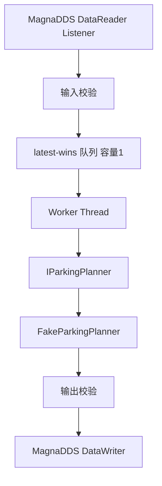

# 执行计划书：ValetParkingStageParking 适配 MagnaDDS

- 项目名称：ValetParkingStageParking MagnaDDS MVP
- 工作区：`E:\APA\DDS\feature_integration\feature_integration_workspace`
- 原始代码参考：`E:\APA\DDS\TempAPA_Code`
- standalone 参考：`E:\APA\DDS\parking_algorithm_standalone`
- MagnaDDS SDK 参考：`E:\APA\DDS\MagnaDDS-SDK-v0.0.4`
- 当前日期：2026-07-26
- 当前状态：执行阶段（MVP 快跑优先）

---

## 0. 总目标

在 `feature_integration_workspace` 中新增一个可独立拆仓的泊车入位 MagnaDDS 适配工程，首版只实现骨架：

1. 生成 m57 平台可编译、可安装、可打包的共享库：`libvalet_parking.so`。
2. 基于 MagnaDDS 订阅输入 Topic `/selected_slot`。
3. 基于 MagnaDDS 发布输出 Topic `/planning/trajectory`。
4. 输入可先由 mock publisher 造一个假车位。
5. 输出可先由 fake planner 造一条确定性假轨迹。
6. 输出轨迹字段结构尽量与原始泊车算法使用的 `ADCTrajectory` 轨迹相关字段保持一致，为后续逐步接入真实算法留接口。
7. 每个阶段都有明确交付物、验收标准、状态快照和决策记录，方便中断、换电脑、换 AI 后继续。

## 0.1 MVP 快跑执行口径（优先级覆盖）

你提出的“过度设计”判断成立。为对齐“先出 `.so`、先通通信”的目标，执行口径调整为：

- **若本节与后文详版流程冲突，以本节为准**；
- 先完成可运行骨架，再补齐量产级治理；
- 文档工作占比控制在 **≤20%**，编码与构建验证占比 **≥80%**。

MVP 快跑只保留 4 个硬门禁：

1. 产出 `libvalet_parking.so`（m57 可编译、可打包）。
2. `/selected_slot` 可被真实 MagnaDDS 订阅。
3. `/planning/trajectory` 可被真实 MagnaDDS 发布。
4. 提供最小可交接状态（`STATUS.yaml` + 快照 + 必要决策记录）。

## 0.2 最小文档集（MVP 期间）

MVP 期间只强制维护以下文档，其余文档可延后到硬化阶段：

1. `STATUS.yaml`（当前阶段、blocker、唯一 next_action）。
2. `status_snapshots/`（每个里程碑一份，不要求长文）。
3. `decision_records/`（仅当偏离计划或改协议策略时新增）。

延后项（MVP 后补）：完整验证报告、迁移手册、扩展依赖审计细项等。

---

## 1. 范围锁定

### 1.1 首版必须完成

| 编号 | 内容 | 说明 |
|---|---|---|
| M1 | 文档计划和交接机制 | 本计划书、交接方案、状态快照、决策记录模板 |
| M2 | Topic 契约冻结 | `/selected_slot` 输入、`/planning/trajectory` 输出的 IDL/字段矩阵 |
| M3 | MagnaDDS 类型生成 | 用官方 SDK 的 `idlparser` 生成 Topic 类型代码，生成结果纳入版本控制 |
| M4 | `libvalet_parking.so` | 稳定 C ABI，内部使用 C++ 实现，m57 release 可编译 |
| M5 | 假车位输入工具 | `selected_slot_mock_publisher`，发布一个确定性假车位 |
| M6 | 假轨迹输出验证工具 | `planning_trajectory_mock_subscriber`，订阅并验证输出字段 |
| M7 | runner 工具 | `valet_parking_runner`，加载并启动 `libvalet_parking.so` |
| M8 | m57 静态验收 | ELF 架构、依赖、RPATH、导出符号、打包内容检查 |
| M9 | 状态沉淀 | 每阶段输出带序号的 `项目状态快照_xxx.md` |

### 1.2 首版明确不做

| 内容 | 不做原因 |
|---|---|
| 完整 `ValetParkingStageParking` 状态机 | 依赖车辆状态、定位、底盘、障碍物、Freespace、AVP 命令等真实 Topic，首版不具备 |
| Hybrid A* / NLP / SpeedOptimizer 完整算法 | 依赖链复杂，standalone 中仍有 Protobuf/IPOPT/glog/gflags/Abseil 等风险 |
| x86 正式产物 | 用户已确认首版只做 m57 |
| 板端 DDS 通信通过结论 | 当前无 m57 板，只能交付脚本，状态标记为 `BLOCKED_NO_M57_BOARD` |
| 修改 `compile/` 和 `thirdparty/` | 首版不动基础构建和第三方库，避免影响其他模块 |
| 使用 ROS2/SOA-DDS/CycloneDDS | 目标中间件是 MagnaDDS |
| 把 SDK `.so` 打进产品包 | 产品只能链接 workspace `thirdparty` 中的 MagnaDDS |

### 1.3 MVP 最小交付清单（替代前置重流程）

| 编号 | 必须交付 | 验收方式 |
|---|---|---|
| MVP-1 | `libvalet_parking.so` | m57 release 构建成功，产物存在 |
| MVP-2 | 输入 Topic 打通 | mock publisher 发 `/selected_slot`，组件可收包 |
| MVP-3 | 输出 Topic 打通 | 组件发 `/planning/trajectory`，mock subscriber 可收包 |
| MVP-4 | 最小契约闭环 | `PROTO_GAP_LIST.md` + `idl/valet_parking_topics.idl` 可追溯 |
| MVP-5 | 可交接 | `STATUS.yaml` + 最新快照 + （如有）DR 记录 |

说明：MVP 阶段不再把“完整文档集合”作为进入编码前置门禁。

---

## 2. 总体技术路线

### 2.1 第一阶段策略

首版采用“真实中间件 + 假算法”的方式：


其中：

- MagnaDDS 接入必须是真实的。
- `.so` 生命周期接口必须是真实的。
- m57 编译、链接、打包必须是真实的。
- 停车位输入数据可以是假数据。
- 轨迹计算可以是假算法，但字段、单位、枚举和后续替换缝要认真设计。

### 2.2 后续算法迁移策略

不从原始工程或 standalone 中一口气复制所有规划代码，而是逐层纵向切片：

1. Topic / contract / adapter 层。
2. 内部数据模型和转换层。
3. 车辆几何、泊车 ROI、粗路径生成。
4. PathProvider / PathPartition。
5. 平滑器和 IPOPT 依赖处理。
6. SpeedOptimizer。
7. 原始 `ValetParkingStageParking` 状态机。

每一层必须单独验收，不能因为下一层要做而破坏已稳定的 MagnaDDS 契约。

---

## 3. 目录规划

首版建议新增以下目录，不修改已有 `math/`、`sort/` 示例：

```text
feature_integration_workspace/
  Doc/
    valet_parking_magnadds/
      00_执行计划书_ValetParkingStageParking_MagnaDDS.md
      01_换机中断交接与防偏离方案.md
      STATUS.yaml
      status_snapshots/
      decision_records/
      templates/
  applications/
    config/
      valet_parking_mvp_bom.yaml
    source/
      valet_parking/
        CMakeLists.txt
        README.md
        idl/
          valet_parking_topics.idl
        generated/
        include/
          valet_parking_c_api.h
        src/
        scripts/
        docs/
      valet_parking_tools/
        CMakeLists.txt
        selected_slot_mock_publisher/
        planning_trajectory_mock_subscriber/
        valet_parking_runner/
```

说明：

- `Doc/valet_parking_magnadds` 是项目级计划和交接目录，先创建。
- `applications/source/valet_parking/docs` 是后续代码模块内部文档，可在实现阶段同步生成。
- 若后续单独拆仓，`Doc/valet_parking_magnadds` 和 `applications/source/valet_parking*` 都可迁移。

---

## 4. 阶段划分总览

| 阶段 | 名称 | 是否允许写业务代码 | 主要交付物 | 阶段门禁 |
|---|---|---:|---|---|
| Fast-0 | 执行入口与基线快照（≤0.5天） | 否 | `STATUS.yaml`、快照 001 | 明确当前分支/目录/允许改动范围 |
| Fast-1 | Proto 最小闭环（≤1天） | 少量 | `PROTO_GAP_LIST.md`、`valet_parking_topics.idl` 草案 | 仅覆盖 `/selected_slot` 与 `/planning/trajectory` 必需字段 |
| Fast-2 | `.so` + DDS 骨架（≤1.5天） | 是 | `libvalet_parking.so`、runner、mock pub/sub | 可订阅输入并发布输出（允许 FakePlanner） |
| Fast-3 | m57 构建打包（≤1天） | 是 | BOM、m57 产物包、静态验收记录 | AArch64/依赖/RPATH/C API 导出通过 |
| Fast-4 | 最小交接归档（≤0.5天） | 文档为主 | 快照、`STATUS.yaml`、必要 DR | 任意 AI 可按 next_action 继续 |

说明：原 Phase 5~8 的量产级细化要求保留为“后续硬化计划”，不再阻塞 MVP 快跑。

---

## 5. Phase 0：文档计划与基线冻结

### 5.1 阶段目标

先创建 `Doc` 目录和超详细执行计划，不急于写业务代码。确保项目从第一天开始就有可交接、可追溯、可验收的状态沉淀。

### 5.2 输入

| 输入 | 来源 |
|---|---|
| 用户需求和领导任务 | 当前需求描述 |
| 原始代码路径 | `TempAPA_Code` |
| standalone 路径 | `parking_algorithm_standalone` |
| 当前集成工程路径 | `feature_integration_workspace` |
| MagnaDDS SDK 路径 | `MagnaDDS-SDK-v0.0.4` |
| 已讨论的技术决策 | 当前会话总结与本地文档 |

### 5.3 主要任务

1. 创建 `Doc/valet_parking_magnadds`。
2. 创建《执行计划书》。
3. 创建《换机中断交接与防偏离方案》。
4. 创建 `STATUS.yaml`。
5. 创建首份 `项目状态快照_000_计划文档创建.md`。
6. 创建初始决策记录 `DR-000_初始范围锁定.md`。
7. 等待用户确认后再进入 Phase 1。

### 5.4 输出/交付物

| 交付物 | 路径 |
|---|---|
| 执行计划书 | `Doc/valet_parking_magnadds/00_执行计划书_ValetParkingStageParking_MagnaDDS.md` |
| 交接防偏离方案 | `Doc/valet_parking_magnadds/01_换机中断交接与防偏离方案.md` |
| 当前状态文件 | `Doc/valet_parking_magnadds/STATUS.yaml` |
| 首份状态快照 | `Doc/valet_parking_magnadds/status_snapshots/000_项目状态快照_计划文档创建.md` |
| 初始决策记录 | `Doc/valet_parking_magnadds/decision_records/DR-000_初始范围锁定.md` |

### 5.5 验收标准

- [ ] `Doc/valet_parking_magnadds` 已存在。
- [ ] 计划书包含阶段划分、输入、输出、验收标准、风险点。
- [ ] 交接方案明确换电脑/中断后第一步看什么。
- [ ] 状态快照明确当前阶段、下一步、阻塞项、禁止动作。
- [ ] 用户确认计划后才允许进入 Phase 1。

### 5.6 风险点

| 风险 | 影响 | 缓解 |
|---|---|---|
| 只在聊天里讨论，不落文档 | 换 AI 后无法接续 | 所有状态写入本目录 |
| 计划过粗 | 后续容易跑偏 | 每阶段定义交付物和验收门禁 |
| 过早写代码 | 可能方向错误 | Phase 0 禁止业务代码改动 |

---

## 6. Phase 1：代码库基线与环境审计

### 6.1 阶段目标

弄清当前 workspace 的真实状态，记录哪些仓库有未提交改动、构建工具链是否可用、MagnaDDS 资产是否一致。避免在脏状态或错误 Thirdparty 上盲目开发。

### 6.2 输入

| 输入 | 来源 |
|---|---|
| Phase 0 用户确认 | 状态快照 000 |
| workspace 目录 | `feature_integration_workspace` |
| 子仓目录 | `applications`、`compile`、`thirdparty`、`feature_integration` |
| SDK 目录 | `MagnaDDS-SDK-v0.0.4` |

### 6.3 主要任务

1. 分别记录四个子仓的分支、HEAD、`git status --short`。
2. 确认 `applications/source` 当前已有模块，不覆盖现有文件。
3. 检查 m57 工具链路径是否存在。
4. 检查 CMake、Python、PyYAML、zip、`readelf`、`nm`、`sha256sum` 是否可用。
5. 审计 workspace Thirdparty MagnaDDS 与 SDK demo/idlparser 的关系。
6. 记录 SDK 仅用于生成，不进入产品包。
7. 更新 `STATUS.yaml` 和状态快照。

### 6.4 输出/交付物

| 交付物 | 内容 |
|---|---|
| 基线审计记录 | 分支、commit、dirty 文件、未跟踪文件 |
| 环境审计记录 | 工具链和基础工具是否可用 |
| MagnaDDS 资产记录 | SDK、Thirdparty 库和头文件位置 |
| 状态快照 001 | 当前基线是否可继续 |

### 6.5 验收标准

- [ ] 明确哪些目录允许改，哪些目录禁止改。
- [ ] 明确是否存在历史 `apollo_parking` 残留产物，且不把它作为成功依据。
- [ ] 确认首版产品库只链接 `thirdparty/m57/magnadds`。
- [ ] 若工具链缺失，记录为 blocker，不通过改 `compile/` 绕过。
- [ ] 输出 `001_项目状态快照_基线环境审计.md`。

### 6.6 风险点

| 风险 | 影响 | 缓解 |
|---|---|---|
| 外层 `.repo` 状态误导 | 把 repo 工具内部文件当成业务变更 | 分子仓记录状态 |
| 混用 SDK `.so` 和 workspace `.so` | ABI 风险，板端不可控 | 明确 SDK 只用于生成 |
| 本机没有 m57 工具链 | 无法完成静态验收 | 标记 blocker，等待环境补齐 |

---

## 7. Phase 2：Topic 契约冻结

### 7.1 阶段目标

先确定输入输出 Topic 的字段结构和来源，避免后续为了编译方便删字段、改语义。

### 7.2 输入

| 输入 | 来源 |
|---|---|
| 原始输入 Proto | `TempAPA_Code/proto/perception/perception_parking_lot.proto` |
| 原始轨迹点 Proto | `TempAPA_Code/proto/common/pnc_point.proto` |
| 原始规划输出 Proto | `TempAPA_Code/proto/planning/planning.proto` |
| standalone 转换参考 | `parking_algorithm_standalone/proto_convert/*` |
| 已确认用户偏好 | 输入可假，输出轨迹字段尽量保持一致 |

### 7.2.1 Proto 处理策略（核心回答）

本项目 Proto 采用“三层分离”策略：

1. **权威语义层（Source of Truth）**：
  只认 `TempAPA_Code/proto/**` 原始 `.proto` 作为字段语义、枚举值、单位和默认值来源。
2. **线协议层（Wire Protocol）**：
  MagnaDDS 实际发布/订阅不直接传 Protobuf Message，而是使用 `idl/valet_parking_topics.idl` 生成的 Topic 类型。
3. **内部模型层（In-Memory Model）**：
  可复用 `parking_algorithm_standalone/proto_convert/*` 作为 C++ 结构和适配层，但必须经过“字段对齐修订”，不能原样信任。

结论：

- `proto_convert` **可以复用**，但定位是“内部模型/转换层”；
- DDS 线上契约仍以 IDL 为准；
- 所有字段定义最终必须回溯到原始 `.proto`。

### 7.2.2 `proto_convert` 复用矩阵（基于当前核查）

| 文件 | 复用建议 | 必要修订 |
|---|---|---|
| `proto_convert/parking_lot_convert.h` | 可作为 `/selected_slot` 输入模型起点 | `Header` 目前为简化版，需按 `common/header.proto` 明确保留字段策略；`ParkStatus` 的 `UNKOWN/UNKNOWN` 命名需做别名兼容并固定数值；字段顺序/类型/单位按原始 proto 校核 |
| `proto_convert/pnc_point_convert.h` | 可作为轨迹点模型起点 | `PathPoint` 需补 `lane_id`；`TrajectoryPoint` 需确保包含 `gaussian_info`；`GaussianInfo` 需补 `area_probability`，并将 `ellipse_theta` 对齐为 `theta_a`（可保留兼容别名）；禁止以新增 `steer_rate` 破坏首版对齐语义 |
| `proto_convert/planning_internal_convert.h` | 仅作内部调试/状态辅助 | 不作为首版 DDS 线协议；仅在 Task3/Task4 内部状态跟踪时按需使用 |
| `proto_convert/header_convert.h` | 不直接用于线协议 | 字段命名与原始 `header.proto` 差异较大（如 `sequence_num/timestamp_sec`），首版应以原始 Header 语义为准 |
| `parking_algorithm_standalone/proto/**/*.pb.*` | 不直接复用到本工程产品链路 | 该套生成代码含 `protoc 3.12.x` 版本约束，而当前工程 Thirdparty 为 `protobuf-3.5.1`，存在直接不兼容风险 |

### 7.2.3 首版执行口径（避免误解）

- **不把 `proto_convert` 当成最终协议定义**；
- **不把 standalone 的 `*.pb.*` 直接搬进当前工程**；
- **先做字段矩阵（原始 proto → proto_convert 现状 → IDL）再写代码**；
- 当 `proto_convert` 与原始 proto 冲突时，**以原始 proto 为准**，并写入决策记录。

### 7.3 输入 Topic 设计

- Topic 名：`/selected_slot`
- 首版语义：感知侧选中的泊车位数组。
- 结构策略：完整镜像 `ParkingLotOutArray` 及其依赖类型。
- 数据策略：mock publisher 只填一个有效车位，但结构不删字段。

### 7.4 输出 Topic 设计

- Topic 名：`/planning/trajectory`
- 首版语义：规划轨迹。
- 字段策略：只镜像 `ADCTrajectory` 中与轨迹输出直接相关的 allowlist，不声称是完整 `ADCTrajectory`。

输出 allowlist：

| 字段 | 首版状态 |
|---|---|
| `header` | 保留 |
| `total_path_length` | 保留 |
| `total_path_time` | 保留 |
| `trajectory_point` | 保留 |
| `is_replan` | 保留 |
| `replan_type` | 保留 |
| `replan_reason` | 保留 |
| `longitudinal_diff` | 保留 |
| `lateral_diff` | 保留 |
| `gear` | 保留 |
| `estop` | 保留 |
| `trajectory_type` | 保留 |
| FunctionManager/HMI/routing/decision/debug/latency | `DEFERRED`，不属于首版 |

必须完整保留的嵌套结构：

| 类型 | 必含字段 |
|---|---|
| `PathPoint` | `x/y/z/theta/kappa/s/l/dkappa/ddkappa/lane_id/x_derivative/y_derivative` |
| `TrajectoryPoint` | `path_point/v/a/relative_time/da/steer/gaussian_info` |
| `GaussianInfo` | `sigma_x/sigma_y/correlation/area_probability/ellipse_a/ellipse_b/theta_a` |

### 7.5 主要任务

1. 从原始 Proto 提取字段矩阵。
2. 对照 `parking_algorithm_standalone/proto_convert` 做逐字段 gap 分析（缺字段、多字段、命名差异、枚举差异、单位差异）。
3. 标注字段来源、类型、单位、是否首版保留。
4. 标注 `DEFERRED` 字段和原因。
5. 设计 IDL 命名和类型映射。
6. 确定字符串、数组、轨迹点数量上限。
7. 输出 Topic 契约文档。

### 7.6 输出/交付物

| 交付物 | 内容 |
|---|---|
| `TOPIC_MATRIX.csv` | 字段来源、类型、状态、单位、备注 |
| `PROTO_GAP_LIST.md` | 原始 Proto 与 `proto_convert` 差异清单及修订动作 |
| `TOPIC_CONTRACT.md` | Topic 名、QoS、字段解释、默认值、异常行为 |
| `valet_parking_topics.idl` 草案 | 输入输出 Topic 的唯一线协议源 |
| 状态快照 002 | 契约冻结状态 |

### 7.7 验收标准

- [ ] 每个首版字段都有原始来源。
- [ ] `proto_convert` 与原始 proto 的差异已清单化并形成修订动作。
- [ ] 每个暂不实现字段都标记 `DEFERRED` 并说明原因。
- [ ] 不存在“同名不同义”的字段。
- [ ] 输入结构不因 mock 数据而裁剪。
- [ ] 输出不冒充完整 `ADCTrajectory`。
- [ ] 用户或负责人确认契约后才进入 Phase 3。

### 7.8 风险点

| 风险 | 影响 | 缓解 |
|---|---|---|
| 为了省事删字段 | 后续接真实算法又要大改 Topic | 契约先冻结，字段矩阵追溯 |
| 输出字段和原始单位不一致 | 下游误用轨迹 | 文档写明单位和坐标系 |
| Proto optional 直接映射不当 | DDS 端语义不清 | 首版采用字段总是存在、默认值确定 |
| `proto_convert` 与原始 proto 漂移 | 迁移后隐藏 bug 或字段丢失 | 先做 `PROTO_GAP_LIST.md`，按原始 proto 修订后再接入 |

---

## 8. Phase 3：MagnaDDS 代码生成验证

### 8.1 阶段目标

用官方 SDK 的 IDL 生成器生成 MagnaDDS 数据类型代码，并证明生成结果能在当前 workspace 的 m57 Thirdparty 下编译，不依赖 SDK 库。

### 8.2 输入

| 输入 | 来源 |
|---|---|
| IDL 草案 | Phase 2 |
| SDK idlparser | `MagnaDDS-SDK-v0.0.4/tool/idlparser` |
| MagnaDDS Thirdparty 头文件/库 | `thirdparty/m57/magnadds` |
| SDK demo | `MagnaDDS-SDK-v0.0.4/demo/hello_world` |

### 8.3 主要任务

1. 先做最小 IDL 能力探针：struct、enum、sequence、string、嵌套类型。
2. 验证生成代码 include 路径和 namespace。
3. 生成正式 `generated/` 代码。
4. 增加 `scripts/regenerate_idl.sh`，用于重生成并比对差异。
5. 静态检查生成代码没有手改漂移。
6. 如果 IDL 生成器不支持某种写法，先写决策记录，再调整 IDL 设计。

### 8.4 输出/交付物

| 交付物 | 内容 |
|---|---|
| `idl/valet_parking_topics.idl` | 正式 IDL |
| `generated/` | 生成的数据类和 TopicDataType |
| `scripts/regenerate_idl.sh` | 重生成脚本 |
| `docs/DEPENDENCY_AUDIT.md` | SDK 与 Thirdparty 使用边界 |
| 状态快照 003 | 生成验证结果 |

### 8.5 验收标准

- [ ] 生成代码纳入版本控制，普通构建不依赖本机 SDK。
- [ ] SDK `.so` 不进入产品包。
- [ ] 若重跑 `regenerate_idl.sh`，生成结果无非预期 diff。
- [ ] 生成代码可以包含在 m57 编译中。
- [ ] ABI 或生成器限制都写入决策记录。

### 8.6 风险点

| 风险 | 影响 | 缓解 |
|---|---|---|
| IDL parser 对 bounded sequence 支持有限 | 运行时超限风险 | 业务层校验 + QoS/resource 限制 + 文档说明 |
| 生成代码告警导致 `-Werror` 失败 | 编译失败 | 优先调整 IDL，必要时仅对生成文件做局部处理 |
| SDK 与 Thirdparty ABI 不一致 | 链接或运行风险 | 产品只链接 Thirdparty，SDK 仅生成；保留审计记录 |

---

## 9. Phase 4：`.so` 骨架与稳定 C ABI

### 9.1 阶段目标

创建 `valet_parking` 模块，生成 `libvalet_parking.so`，对外只暴露稳定 C ABI，内部实现可迭代替换。

### 9.2 输入

| 输入 | 来源 |
|---|---|
| generated Topic 类型 | Phase 3 |
| 构建宏和安装规则 | `compile/cmake/macros.cmake` 只读参考 |
| Thirdparty MagnaDDS target | `thirdparty/packages_cmake/magnadds.cmake` 只读参考 |
| C ABI 设计 | 本计划 |

### 9.3 C ABI 初稿

对外建议暴露以下函数：

| 函数 | 作用 |
|---|---|
| `valet_parking_get_api_version` | 获取 ABI 版本 |
| `valet_parking_create` | 创建实例 |
| `valet_parking_start` | 启动 DDS 和 worker |
| `valet_parking_stop` | 停止线程并释放 DDS 资源 |
| `valet_parking_get_last_error` | 获取最近错误信息 |
| `valet_parking_destroy` | 销毁实例 |

配置项至少包含：

- Domain ID。
- 输入 Topic 名。
- 输出 Topic 名。
- QoS depth。
- 假车辆初始位姿。
- 安全上限：车位数量、角点数量、轨迹点数量、字符串长度。

### 9.4 主要任务

1. 新建 `applications/source/valet_parking`。
2. 编写 `CMakeLists.txt`，目标为 `add_library(... SHARED ...)`。
3. 链接 `thirdparty::magna-dds-core` 和必要系统库。
4. 设置隐藏 C++ 符号，只导出 C API。
5. 实现生命周期骨架：create/start/stop/destroy。
6. 增加错误字符串和线程安全状态机。

### 9.5 输出/交付物

| 交付物 | 内容 |
|---|---|
| `libvalet_parking.so` 源码骨架 | C ABI + 内部 C++ 类 |
| `include/valet_parking_c_api.h` | 对外接口头文件 |
| `src/` | 组件生命周期实现 |
| 状态快照 004 | `.so` 骨架实现状态 |

### 9.6 验收标准

- [ ] `libvalet_parking.so` 可以被 m57 构建系统发现。
- [ ] 只导出约定 C API，不暴露大量内部 C++ 符号。
- [ ] start/stop 可重复调用，不崩溃。
- [ ] destroy 会自动 stop。
- [ ] 错误信息可诊断。
- [ ] 不修改 `compile/` 和 `thirdparty/`。

### 9.7 风险点

| 风险 | 影响 | 缓解 |
|---|---|---|
| ABI 暴露 C++ 类型 | 后续拆仓和升级困难 | 使用 opaque handle 和 C ABI |
| 生命周期不清晰 | stop/destroy 崩溃 | 明确状态机和线程 join |
| 构建系统安装规则不匹配 | 包里没有 `.so` | 按现有 module 风格和 `default_install()` 实现 |

---

## 10. Phase 5：DDS 收发与 FakePlanner

### 10.1 阶段目标

让 `libvalet_parking.so` 真正创建 MagnaDDS Participant、Subscriber、Publisher、Reader、Writer，实现 `/selected_slot` 到 `/planning/trajectory` 的闭环。

### 10.2 输入

| 输入 | 来源 |
|---|---|
| C ABI 骨架 | Phase 4 |
| generated Topic 类型 | Phase 3 |
| MagnaDDS API | Thirdparty 头文件和 SDK demo |
| Topic 契约 | Phase 2 |

### 10.3 组件内部结构



### 10.4 FakePlanner 行为

| 项 | 规则 |
|---|---|
| 输入 | 取第一个有效泊车位 |
| 输出点数 | 21 个轨迹点 |
| 时间 | `relative_time` 从 0.0 到 2.0，步长 0.1s |
| 路径 | 从配置的假车辆位姿插值到车位中心附近 |
| 速度/加速度 | 使用确定性默认值或简单插值 |
| gear | 固定为倒车或文档约定枚举 |
| trajectory_type | 固定为泊车轨迹类型或文档约定枚举 |
| estop | 有效输入为 false；非法输入输出显式 estop |
| GaussianInfo | 填充确定性默认值，所有浮点有限 |

### 10.5 异常行为

| 输入异常 | 输出行为 |
|---|---|
| 空车位数组 | 发布显式 estop 轨迹或错误状态，不能发布旧正常轨迹 |
| 超过上限 | 拒绝该包，输出 estop 或记录错误 |
| NaN/Inf | 拒绝该包，输出 estop |
| 几何退化 | 拒绝该包，输出 estop |
| DDS 创建失败 | start 返回错误，runner 打印原因 |

### 10.6 输出/交付物

| 交付物 | 内容 |
|---|---|
| DDS adapter | Participant/Topic/Reader/Writer 封装 |
| Input validator | 输入合法性检查 |
| FakeParkingPlanner | 可替换规划接口和假实现 |
| Output builder | 轨迹输出构造 |
| 状态快照 005 | DDS + FakePlanner 实现状态 |

### 10.7 验收标准

- [ ] Reader listener 不阻塞重计算。
- [ ] Worker 独立线程处理规划。
- [ ] Writer 能发布输出 Topic。
- [ ] 无效输入不会复用旧正常轨迹。
- [ ] 所有浮点输出有限。
- [ ] Topic 名、Domain ID、QoS depth 可配置。

### 10.8 风险点

| 风险 | 影响 | 缓解 |
|---|---|---|
| DDS 回调中直接做规划 | 阻塞中间件线程 | listener 只入队，worker 处理 |
| latest 数据竞争 | 崩溃或错发 | mutex/condition_variable 管理 |
| 异常输入输出旧轨迹 | 安全风险 | 明确 estop 行为和验证工具 |

---

## 11. Phase 6：验证工具与 m57 构建打包

### 11.1 阶段目标

提供最小三进程验证工具和 m57 构建打包配置，使领导能看到 `.so` 和 mock Topic 的完整交付包。

### 11.2 输入

| 输入 | 来源 |
|---|---|
| `libvalet_parking.so` | Phase 4/5 |
| Topic generated 类型 | Phase 3 |
| 构建脚本 | `build_app.sh`、`compile/build.sh` 只读参考 |
| BOM 机制 | 当前 applications 构建体系 |

### 11.3 工具列表

| 工具 | 作用 |
|---|---|
| `valet_parking_runner` | 加载 `.so` 并启动组件，处理 SIGINT/SIGTERM |
| `selected_slot_mock_publisher` | 发布一个确定性假车位，也可发布非法场景 |
| `planning_trajectory_mock_subscriber` | 订阅轨迹并逐字段校验 |

### 11.4 构建策略

- 新增 `applications/config/valet_parking_mvp_bom.yaml`。
- BOM 只包含四个目标：
  1. `valet_parking`
  2. `valet_parking_runner`
  3. `selected_slot_mock_publisher`
  4. `planning_trajectory_mock_subscriber`
- 不使用 `ALL`，避免把 `math/sort` 示例混入交付包。

### 11.5 输出/交付物

| 交付物 | 内容 |
|---|---|
| `valet_parking_mvp_bom.yaml` | 产品 BOM |
| 三个验证工具 | m57 executable |
| `run_m57_smoke.sh` | 板端运行脚本 |
| m57 release package | zip 或框架默认包 |
| manifest | SHA-256、ELF、依赖清单 |
| 状态快照 006 | 构建打包状态 |

### 11.6 验收标准

- [ ] m57 release 构建成功。
- [ ] 产物包含 `libvalet_parking.so`。
- [ ] 产物包含三个验证工具。
- [ ] `file/readelf` 显示 AArch64 ELF。
- [ ] `nm -D` 可看到约定 C API。
- [ ] `readelf -d` 没有工作机绝对路径。
- [ ] 依赖不包含 Protobuf、ROS2、SOA-DDS、CycloneDDS、IPOPT。
- [ ] 打包产物不包含 SDK `.so`。
- [ ] 无 m57 板时，runtime 标记为 `BLOCKED_NO_M57_BOARD`。

### 11.7 风险点

| 风险 | 影响 | 缓解 |
|---|---|---|
| BOM 配错 | 产物混入示例或漏工具 | BOM 白名单只列四个模块 |
| RPATH 错误 | 板端找不到库 | 使用 `$ORIGIN` 相对路径 |
| 本机静态验收误当板端通过 | 交付结论失真 | 明确 static pass 和 runtime blocked |

---

## 12. Phase 7：文档归档与交接快照

### 12.1 阶段目标

将所有执行证据、决策、风险、下一步固化到本地文档，使任意 AI 或开发者可继续，不依赖聊天上下文。

### 12.2 输入

| 输入 | 来源 |
|---|---|
| 所有阶段状态快照 | `status_snapshots/` |
| 决策记录 | `decision_records/` |
| 构建和验收日志 | build output / manifest |
| 当前源码状态 | git status / commit |

### 12.3 输出/交付物

| 交付物 | 内容 |
|---|---|
| `docs/VERIFICATION.md` | 构建、静态验收、板端待测记录 |
| `docs/HANDOFF.md` | 最终交接说明 |
| `docs/ALGORITHM_MIGRATION.md` | 后续真实算法迁移路线 |
| `status_snapshots/` | 每阶段带序号快照 |
| `decision_records/` | 每个关键决策一条记录 |
| `STATUS.yaml` | 最终当前状态和唯一下一步 |

### 12.4 验收标准

- [ ] 每个阶段都有状态快照。
- [ ] 每个偏离计划的动作都有决策记录。
- [ ] `STATUS.yaml` 能回答当前阶段、最后成功命令、当前 blocker、下一步。
- [ ] 新 AI 只看本目录就能知道下一步。
- [ ] 没有把未完成事项写成已完成。

### 12.5 风险点

| 风险 | 影响 | 缓解 |
|---|---|---|
| 文档滞后于代码 | 接手者误判状态 | 每阶段结束必须更新快照 |
| 决策不记录 | 后续 AI 推翻合理决策 | 所有变更写 DR 记录 |
| 下一步不唯一 | 接手者乱跳阶段 | `STATUS.yaml` 只允许一个 `next_action` |

---

## 13. Phase 8：后续真实算法迁移路线

> 本阶段不属于首版 MVP 实现，只作为后续路线记录。

### 13.1 迁移原则

1. 不批量复制 standalone 全部代码。
2. 每次只迁移一个可验证的纵向切片。
3. 每层迁移前先列依赖，不允许偷偷引入 Thirdparty 之外的库。
4. 原始 Proto 语义优先，standalone 改造代码仅作参考。
5. 每次算法迁移都必须不破坏已冻结的 DDS Topic 契约。

### 13.2 建议顺序

| 顺序 | 迁移内容 | 前置条件 | 验收 |
|---|---|---|---|
| A1 | 内部 contract/model adapter | Topic 契约稳定 | mock 输入输出仍通过 |
| A2 | 车辆几何和坐标转换 | 车辆参数来源明确 | 单元测试通过 |
| A3 | 泊车 ROI | 输入车位字段完整 | ROI 几何可视/数值验证 |
| A4 | Hybrid A* 粗路径 | ROI 可用 | 简单场景生成路径 |
| A5 | PathPartition | 粗路径可用 | 分段结果稳定 |
| A6 | Path smoothing/NLP | IPOPT 或替代方案入库 | 平滑轨迹合法 |
| A7 | SpeedOptimizer | 路径稳定 | 时间/速度曲线合法 |
| A8 | Stage 状态机 | 车辆/底盘/定位/障碍物 Topic 就绪 | 场景级闭环 |

### 13.3 standalone 复用判断

| 文件/目录 | 建议 | 原因 |
|---|---|---|
| `main/apps/parking_pipeline.cpp` | 参考编排，不原样复制 | 可以帮助理解流程，但依赖和错误需复查 |
| `proto_convert/parking_lot_convert.h` | 可参考输入模型 | 需按新 IDL 和原 Proto 修订 |
| `proto_convert/pnc_point_convert.h` | 可参考轨迹点转换 | 必须删除多余字段、补齐缺失字段 |
| 生成的 `*.pb.*` | 不直接复用 | standalone Protobuf 版本与当前 Thirdparty 可能不兼容 |
| IPOPT/glog/gflags/Abseil 相关代码 | 不直接引入 | Thirdparty 中未确认具备正式版本 |

---

## 14. 阶段执行规则

### 14.1 每阶段开始前必须做

1. 读取 `Doc/valet_parking_magnadds/STATUS.yaml`。
2. 读取最新一份 `status_snapshots/xxx_项目状态快照_*.md`。
3. 确认当前阶段和唯一 `next_action`。
4. 对照本计划的阶段输入是否齐全。
5. 若输入不齐，先记录 blocker，不跳阶段。

### 14.2 每阶段结束前必须做

1. 对照本计划的验收标准逐项检查。
2. 更新 `STATUS.yaml`。
3. 输出新的带序号状态快照。
4. 若有计划外改动，创建决策记录。
5. 明确下一个阶段的唯一 `next_action`。
6. 若要暂停，确保新 AI 只看文档也能继续。

### 14.3 禁止动作

- 禁止未确认计划就开始写业务代码。
- 禁止为了编译通过删除 Topic 字段。
- 禁止把 SDK demo 成功当作本工程成功。
- 禁止把 x86 历史产物当作 m57 验收结果。
- 禁止混用 SOA-DDS/CycloneDDS/ROS2。
- 禁止私自修改 `compile/` 或 `thirdparty/` 绕过问题。
- 禁止把无 m57 板端验证写成“已通过”。

---

## 15. 卡住处理总则

当执行卡住时，不要盲目改代码，先分类：

| 卡住位置 | 优先检查 | 禁止动作 |
|---|---|---|
| IDL 生成 | SDK 路径、parser 权限、IDL 语法、最小探针 | 禁止手改 generated 后不记录 |
| CMake 配置 | module 名、BOM、target 名、include 路径 | 禁止改 `compile/` 逃避问题 |
| 编译 | 第一条 error、生成代码告警、头文件路径 | 禁止批量删除字段 |
| 链接 | MagnaDDS target、AArch64 库、RPATH、符号 | 禁止混入 SDK `.so` |
| 打包 | install 规则、BOM、产物路径 | 禁止用 `ALL` 混入其他模块 |
| 板端通信 | 板端环境、库路径、Topic 名、Domain ID、QoS | 无板时禁止写已通过 |

每次卡住后必须更新：

- `STATUS.yaml` 的 `blockers`。
- 当前阶段状态快照。
- 若改变方案，则新增 `decision_records/DR-xxx_*.md`。

---

## 16. 用户确认点

进入源码实现前，需要用户确认以下事项：

- [ ] 同意先创建文档和状态沉淀体系。
- [ ] 同意首版只做 MagnaDDS 骨架，不接完整算法。
- [ ] 同意首版只做 m57，不做 x86 正式产物。
- [ ] 同意输入 Topic `/selected_slot` 结构完整但数据可 mock。
- [ ] 同意输出 Topic `/planning/trajectory` 只保留轨迹相关字段，不冒充完整 `ADCTrajectory`。
- [ ] 同意无 m57 板时 runtime 状态标记为 `BLOCKED_NO_M57_BOARD`。
- [ ] 同意后续每阶段结束必须输出状态快照。

---

## 17. 当前下一步

当前只完成计划文档创建。下一步不是写代码，而是：

1. 用户审阅本计划。
2. 若有修改意见，先改计划和决策记录。
3. 用户确认后，进入 Phase 1：代码库基线与环境审计。
