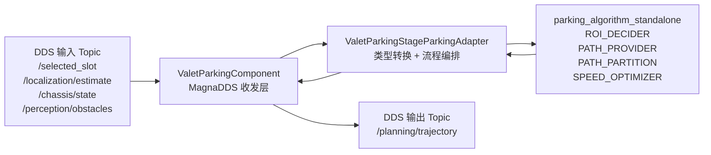

# 本地泊车算法接入 MagnaDDS 中间件说明

- 文档编号：DOC-004
- 日期：2026-07-28
- 对应阶段：NEXT-032 后的说明文档
- 代码入口：`source/valet_parking`
- 本地算法目录：`source/valet_parking/algorithm/parking_algorithm_standalone`

## 1. 先说结论

这次适配不是把 MagnaDDS 代码写进 `parking_algorithm_standalone` 里面。

更准确的做法是：

```text
MagnaDDS 负责收信和发信
ValetParkingStageParkingAdapter 负责翻译和串流程
parking_algorithm_standalone 负责真正计算泊车路径和轨迹
```

也就是说，`parking_algorithm_standalone` 是“算法发动机”，MagnaDDS 是“通信管道”，中间的 Adapter 是“翻译员和流程调度员”。

这样做的好处是：以后真实车端 Topic、IDL 或 DDS API 变了，优先改 DDS 外壳和 Adapter，不要到处改算法源码。

## 2. 当前代码分层

当前 `source/valet_parking` 下面大致分成这几层：

| 层 | 文件或目录 | 作用 |
|---|---|---|
| DDS 线协议 | `idl/valet_parking_topics.idl` | 定义 DDS 里传什么类型，例如 `SelectedSlot`、`PlanningTrajectory`、`LocalizationEstimate` |
| IDL 生成代码 | `generated/valet_parking_topics.*`、`generated/valet_parking_topicsTopicDataType.*` | 由 MagnaDDS `idlparser` 生成，提供 typed DDS 的 C++ 类型和序列化支持 |
| DDS 组件层 | `src/valet_parking_component.cpp` | 创建 DomainParticipant、Topic、DataReader、DataWriter，收 `SelectedSlot`，发 `PlanningTrajectory` |
| 业务适配层 | `src/valet_parking_stage_parking_adapter.cpp` | 把 DDS 类型转换成泊车算法类型，执行 ROI/PATH/PARTITION/SPEED 链路，再转回 DDS 输出 |
| 本地算法层 | `algorithm/parking_algorithm_standalone` | 保存当前 MVP 实际编译需要的泊车算法源码最小闭包 |
| C API | `include/valet_parking_c_api.h` | 给 runner 或后续工程集成调用，用于创建、启动、停止 `.so` |

可以把它想成四个盒子：



## 3. 为什么要把算法源码本地化

本地化前，构建依赖外部目录：

```text
E:\APA\DDS\parking_algorithm_standalone
```

这会带来一个问题：只拿到 `applications` Git 仓库时，代码不完整，换电脑或交接给别人后可能编译不过。

本地化后，当前 MVP 需要的源码放在：

```text
source/valet_parking/algorithm/parking_algorithm_standalone
```

这样 `applications` 仓库自己就带着当前版本需要的算法基线。后续继续适配时，也能清楚看到“DDS 适配代码”和“当前算法源码基线”之间的关系。

注意：这里不是完整复制外部 standalone 工程，而是只复制当前构建真正需要的最小闭包。

当前已复制的主要内容包括：

| 算法阶段 | 本地源码来源 |
|---|---|
| ROI_DECIDER | `planning/tasks/deciders/open_space_decider/*` 和 `common/math/*` |
| PATH_PROVIDER | `planning/tasks/optimizers/open_space_path_generation/*`、`planning/open_space/coarse_path_generator/*` |
| PATH_PARTITION | `planning/tasks/optimizers/open_space_path_partition/*` |
| SPEED_OPTIMIZER | `planning/tasks/optimizers/open_space_speed_optimizer/*`、`planning/common/speed/*`、`planning/common/trajectory/*` |
| proto 替代结构 | `proto_convert/*` |

明确没有复制：

- `proto/**/*.pb.*`
- ROS2 节点
- demo
- launch
- out/build 产物
- 完整 standalone 大工程

## 4. CMake 是怎么接上本地算法的

关键文件是：

```text
source/valet_parking/CMakeLists.txt
```

现在 CMake 通过本地路径定位算法源码：

```cmake
get_filename_component(STANDALONE_PARKING_ROOT
    "${CMAKE_CURRENT_SOURCE_DIR}/algorithm/parking_algorithm_standalone"
    ABSOLUTE
)
```

这说明构建 `libvalet_parking.so` 时，不再去外部 `E:\APA\DDS\parking_algorithm_standalone` 找源码。

CMake 里把算法源码按阶段分组：

```text
STANDALONE_ROI_SOURCES
STANDALONE_PATH_PROVIDER_SOURCES
STANDALONE_PATH_PARTITION_SOURCES
STANDALONE_SPEED_OPTIMIZER_SOURCES
```

最后这些源码和 DDS 组件代码一起编进同一个共享库：

```text
libvalet_parking.so
```

也就是说，当前 `.so` 里面同时包含：

- MagnaDDS 收发封装
- IDL 生成类型
- Adapter 适配逻辑
- 本地泊车算法源码

`target_link_libraries` 仍然链接 workspace 里的 MagnaDDS 库：

```text
thirdparty::magna-dds-core
thirdparty::magna-dds-impl
```

算法源码本身不直接依赖 MagnaDDS，它只是被编译进这个 DDS 组件库里。

## 5. IDL 在这里做什么

`idl/valet_parking_topics.idl` 是 DDS 世界里的“消息格式说明书”。

它定义了当前 MVP 需要的 typed DDS 数据结构，例如：

| IDL 类型 | 用途 |
|---|---|
| `SelectedSlot` | 输入，表示上游选中的车位列表、目标车位序号、车位角点等 |
| `ParkingLot` | `SelectedSlot` 里的单个车位 |
| `LocalizationEstimate` | 可选辅助输入，表示车辆定位 |
| `ChassisState` | 可选辅助输入，表示底盘速度、加速度、挡位 |
| `ObstacleArray` | 可选辅助输入，表示感知障碍物列表 |
| `PlanningTrajectory` | 输出，表示泊车规划轨迹 |

MagnaDDS 的 `idlparser` 会根据 IDL 生成 C++ 代码。`ValetParkingComponent` 使用这些生成代码注册 DDS 类型、创建 Topic、读样本、写样本。

简单讲：

```text
IDL 文件：告诉 DDS “包裹里有哪些字段”
generated 文件：让 C++ 代码真的能读写这些包裹
```

## 6. DDS 组件层做了什么

关键文件：

```text
source/valet_parking/src/valet_parking_component.cpp
```

它的职责是 MagnaDDS 中间件相关的事情：

1. `DomainParticipantFactory::get_instance()`
2. `create_participant(domain_id)`
3. `register_type(...)`
4. `create_topic(...)`
5. `create_subscriber(...)`
6. `create_publisher(...)`
7. `create_datareader(...)`
8. `create_datawriter(...)`
9. worker loop 中循环读取输入并发布输出

当前默认 Topic：

| 方向 | Topic | 类型 |
|---|---|---|
| 输入 | `/selected_slot` | `SelectedSlot` |
| 输出 | `/planning/trajectory` | `PlanningTrajectory` |
| 可选辅助输入 | `/localization/estimate` | `LocalizationEstimate` |
| 可选辅助输入 | `/chassis/state` | `ChassisState` |
| 可选辅助输入 | `/perception/obstacles` | `ObstacleArray` |

`ValetParkingComponent` 不直接写泊车算法细节。它收到 `SelectedSlot` 后，调用：

```cpp
stage_parking_adapter_.Process(input_sample, output_sample, status_reason)
```

这一步把工作交给 Adapter。

## 7. Adapter 是怎么把 DDS 输入变成算法输入的

关键文件：

```text
source/valet_parking/src/valet_parking_stage_parking_adapter.cpp
```

Adapter 主要做三类事情。

第一类：把 DDS 类型转换成算法类型。

例如：

| DDS/IDL 类型 | 算法侧类型 |
|---|---|
| `ParkingLot` | `TL::perception::ParkingLotOut` |
| `PsPoint` | `TL::perception::PSPoint` |
| `LocalizationEstimate` / fake vehicle | `TL::common::VehicleState` |
| `ObstacleArray` | `SimpleStaticObstacle` / `SimpleMovingObstacle` |
| 算法输出轨迹 | `PlanningTrajectory` |

第二类：做输入边界检查。

例如：

- `SelectedSlot.is_valid=false` 时直接输出 `estop`
- 没有车位列表时输出 `estop`
- `opt_parking_seq` 找不到时退回第一个车位
- 车位角点不足或几何退化时输出 `estop`
- 外部定位和车位明显不在同一局部区域时输出 `estop`
- 障碍物数量、尺寸、坐标异常时拒绝进入 PATH_PROVIDER

第三类：串起泊车流程。

当前主链路是：

```text
SelectedSlot
  -> ConvertParkingLot
  -> BuildVehicleState
  -> ROI_DECIDER
  -> PATH_PROVIDER_PRECHECK
  -> PATH_PROVIDER
  -> PATH_PARTITION
  -> SPEED_OPTIMIZER
  -> PlanningTrajectory
```

## 8. ROI_DECIDER 是怎么接进来的

Adapter 先从 DDS 输入里选中目标车位：

```text
SelectedSlot.opt_parking_seq -> ParkingLot.parking_seq
```

然后把这个 `ParkingLot` 转成算法侧的 `TL::perception::ParkingLotOut`。

接着创建本地算法类：

```cpp
TL::planning::OpenSpaceRoiDecider roi_decider(
    TL::planning::LoadEP30VehicleParam(),
    TL::planning::RoiDeciderConfig::GetDefault());
```

并调用：

```cpp
roi_decider.Process(parking_lot, vehicle_state, &roi_output);
```

ROI_DECIDER 输出的 `roi_output` 是后面路径规划的基础，里面包含：

- 泊车场景类型
- 目标位姿 `end_pose`
- ROI 原点和旋转角
- `xy_bounds`
- 目标区域多边形
- 障碍物和可行空间信息

可以理解为：ROI_DECIDER 先把“我要停哪个车位”变成“路径搜索应该在哪个小地图里算”。

## 9. PATH_PROVIDER 是怎么接进来的

当前没有直接搬完整原车 `OpenSpacePathProvider` 大类，而是接入了它最核心的路径生成能力：

```cpp
TL::planning::OpenSpacePathGenerator
```

Adapter 自己补了一个轻量运行态：

```text
PathProviderRuntimeState
```

它保存：

- 上一帧路径
- 上一帧目标位姿
- `parking_seq/path_id`
- 障碍物签名
- warm start 相关信息
- generated/reused 计数

这样做的原因是，完整 `OpenSpacePathProvider` 原本依赖原车工程里的 `Frame`、`DependencyInjector`、线程管理、history、NLP smoother 等大结构。当前 MVP 先把核心路径生成跑通，不把整套车端框架一次性搬进来。

PATH_PROVIDER 的输入由 Adapter 组装：

```text
ROI 输出
+ 当前车辆状态
+ 静态/动态障碍物
+ 历史路径状态
+ 重规划原因
```

然后调用本地算法里的 `OpenSpacePathGenerator` 生成粗路径。

当前已经支持的重规划判断包括：

| 情况 | 行为 |
|---|---|
| 第一帧没有历史路径 | `replan=NO_VALID_PATH`，重新生成 |
| 目标位姿变化 | `replan=TARGET_UPDATE`，重新生成 |
| `parking_seq/path_id` 变化 | `replan=TARGET_UPDATE`，重新生成 |
| 障碍物签名变化 | `replan=BLOCK_BY_STATIC_OBSTACLE`，重新生成 |
| 起点偏离历史路径 | `replan=TRACE_REPLAN`，尝试 history warm start |
| 目标、起点、障碍物都稳定 | `history=reused`，复用上一帧路径 |

这就是为什么 smoke 日志里能看到：

```text
history=generated
history=reused
replan=TARGET_UPDATE
warm_start=history_splice
trace_adjust=true
```

## 10. PATH_PARTITION 和 SPEED_OPTIMIZER 是怎么接进来的

PATH_PROVIDER 生成的是一组粗路径，通常还带有挡位信息。后面还有两步。

第一步是 PATH_PARTITION：

```cpp
TL::planning::OpenSpacePathPartition::Execute(...)
```

它把 PATH_PROVIDER 的路径拆成当前应该执行的片段，输出 `chosen_partitioned_path`。

第二步是 SPEED_OPTIMIZER：

```cpp
TL::planning::OpenSpaceSpeedOptimizer::Execute(...)
```

它给路径点补上速度、加速度和时间，生成可发布的轨迹。

Adapter 里还保存了 SPEED_OPTIMIZER 需要的运行态，例如：

- 上一帧时间
- 上一帧速度规划碰撞信息
- 上一帧发布挡位
- 是否由速度层触发重规划
- 当前路径是否存在碰撞风险

这样后续帧不是每次都像第一帧一样从零开始。

## 11. 输出 PlanningTrajectory 的策略

Adapter 最终必须输出 DDS 的 `PlanningTrajectory`。

当前有几种输出路径：

| 情况 | 输出方式 |
|---|---|
| 输入无效 | `BuildEstopTrajectory`，发布 `estop=true` |
| ROI 成功但 PATH_PROVIDER 失败 | `BuildTrajectoryToTarget`，退回到 ROI 目标种子轨迹 |
| PATH_PROVIDER 成功但 PATH_PARTITION 失败 | `BuildTrajectoryFromPathProvider` |
| PATH_PARTITION 成功但 SPEED_OPTIMIZER 失败 | `BuildTrajectoryFromPathPartition` |
| SPEED_OPTIMIZER 成功 | `BuildTrajectoryFromSpeedOptimizer` |

所以当前系统不是“一失败就崩”，而是按层级回退。

但要注意：回退轨迹是为了当前 MVP 能持续发布可观察结果，不等于真实车端最终控制策略已经完整闭环。

## 12. proto_convert 和 compat 是什么

原始泊车算法曾经依赖大量 protobuf 生成文件，例如 `*.pb.h`。

当前适配目标是先编出 x86/m57 的 `libvalet_parking.so`，并且不把完整 proto 体系搬进来。因此本地算法目录里有：

```text
proto_convert/*
```

这些文件把原来依赖 proto 的一些类型，用普通 C++ struct 或轻量枚举替代。

例如：

- `planning_internal_convert.h`
- `open_space_types_convert.h`
- `open_space_path_partition_config_convert.h`
- `open_space_speed_optimizer_config_convert.h`
- `parking_lot_convert.h`
- `vehicle_state_convert.h`

另外，`source/valet_parking/src/compat` 下还有少量兼容头，用来满足当前最小构建需要。

原则是：

```text
当前阶段不复制 proto/**/*.pb.*
能用 proto_convert/compat 支撑的，就保持轻量替代
```

## 13. 为什么算法源码里不直接调用 DDS

这是一个重要设计点。

如果把 DDS reader/writer 写进 `OpenSpaceRoiDecider`、`OpenSpacePathGenerator` 或 `OpenSpaceSpeedOptimizer`，算法会变得很难复用：

- 换 DDS Topic 要改算法
- 换测试输入要改算法
- 离线单元测试会变困难
- 以后接真实车端协议时风险会扩散到算法核心

所以当前选择是：

```text
DDS 只存在于 Component 层
业务类型转换只存在于 Adapter 层
算法层只看算法结构体
```

这也是比较专业、可维护的中间件适配方式。

## 14. 当前已经验证到什么程度

NEXT-032 后已经验证：

| 平台 | 结果 |
|---|---|
| x86 构建 | PASS，生成 x86-64 `libvalet_parking.so` |
| x86 smoke | PASS，默认 valid、`parking-seq-changes`、all-valid 辅助输入均通过 |
| m57 交叉编译 | PASS，生成 ARM aarch64 `libvalet_parking.so` |
| m57 MagnaDDS 依赖检查 | PASS，可看到 `libmagna-dds-core.so.1` 和 `libmagna-dds-impl.so` 依赖 |
| m57 板端运行 | 尚未执行，不能标记为通过 |

关键结论：

```text
本地算法源码 + MagnaDDS typed API + Adapter 当前可以编译成 x86/m57 两个平台的 libvalet_parking.so。
```

## 15. 当前没有做的事情

为了避免误解，当前还没有完成这些内容：

- 没有完整接入原车 `OpenSpacePathProvider` 大类
- 没有完整搬迁 `Frame/DependencyInjector`
- 没有接入 NLP smoother
- 没有对齐真实车端最终 Topic 协议
- 没有完成 m57 板端运行验证
- 没有把所有泊车算法源码完整复制到 applications

当前完成的是 MVP 需要的轻量链路：

```text
SelectedSlot
  -> ROI_DECIDER
  -> PATH_PROVIDER 核心路径生成
  -> PATH_PARTITION
  -> SPEED_OPTIMIZER
  -> PlanningTrajectory
```

## 16. 后续如果继续扩展，应该怎么做

以后如果某个算法阶段需要更多 standalone 源码，建议按这个顺序做：

1. 先确认新功能到底需要哪个算法类或函数。
2. 只复制该功能编译所需的最小源码和头文件闭包。
3. 不复制 `proto/**/*.pb.*`、ROS、demo、out、launch。
4. 优先用 `proto_convert` 或 `compat` 解决轻量类型依赖。
5. 在 `CMakeLists.txt` 里把新增 `.cc` 加入对应阶段分组。
6. 跑 x86 构建和 smoke。
7. 跑 m57 交叉编译和 ELF/依赖检查。
8. 更新 `STATUS.yaml`、README 或状态快照。
9. Git 提交并推送。

如果未来要完整接入原车 `OpenSpacePathProvider` 大类，需要单独立项，因为那会引入更大的上下文：

- 原车 `Frame`
- history 管理
- 线程模型
- DependencyInjector
- 更完整的 PreCheck
- path strategy
- NLP smoother

这不是简单复制一个 `.cc/.h` 就能稳定完成的事情。

## 17. 一句话交接

当前 MagnaDDS 适配的核心方案是：

```text
用 MagnaDDS IDL 定义输入输出消息；
用 ValetParkingComponent 建 DDS 读写管道；
用 ValetParkingStageParkingAdapter 把 DDS 消息翻译成 standalone 算法输入；
用本地化 parking_algorithm_standalone 执行 ROI/PATH/PARTITION/SPEED；
再由 Adapter 把算法结果翻译回 DDS 的 PlanningTrajectory。
```

这就是当前 `parking_algorithm_standalone` 被用于适配 MagnaDDS 中间件的方式。
